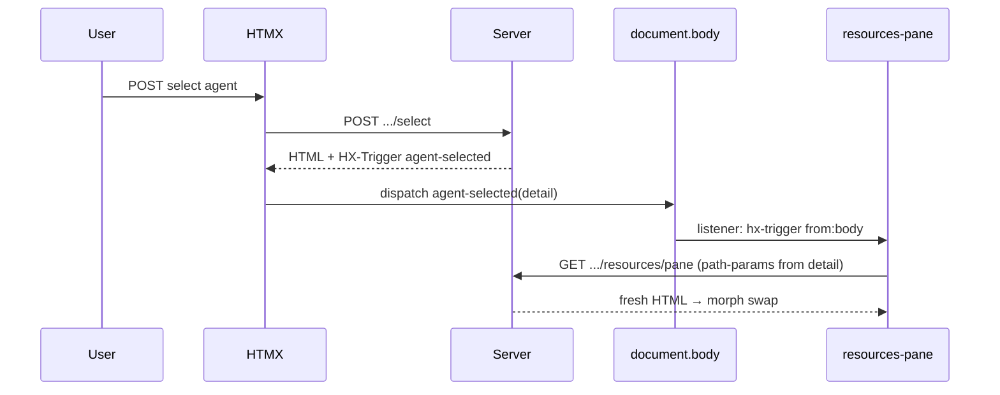
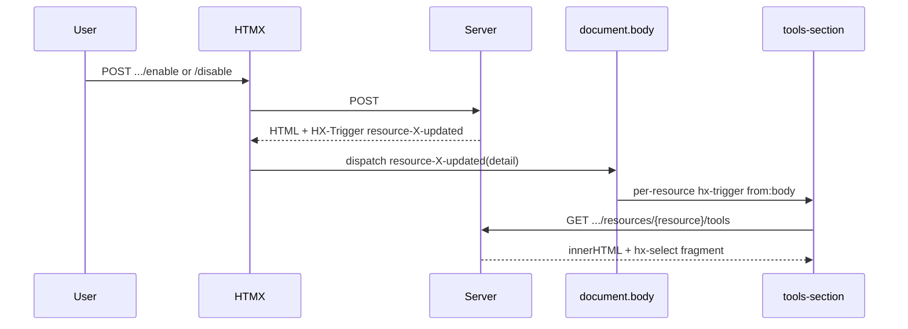

# HTMX: Event-driven reloads across views

**Created**: 2026-03-26  
**Last Updated**: 2026-03-26  
**Related**: [htmx-path-params rule](../rules/htmx-path-params.mdc) · HTMX [`hx-trigger`](https://htmx.org/attributes/hx-trigger/) · [`HX-Trigger` response header](https://htmx.org/headers/hx-trigger/)

## Overview

In the policies dashboard, many fragments do **not** know their `agent` / `version` (and sometimes `resource`) only from their initial HTML. Instead, when something changes elsewhere (user selects an agent, connects a resource, toggles enable/disable), the **server sends a custom event** on the response. Other regions listen on **`document.body`** for that event, read **`event.detail`**, and issue a GET with **path-params** filled from that detail.

That gives you:

- **Decoupled panes**: the sidebar does not need to know the DOM id of the resources list.
- **Stable URLs**: `hx-get` uses placeholders like `agents/{agent}/versions/{version}/...`, not duplicated template literals.
- **One source of truth** for “what changed”: the handler that performed the mutation sets the trigger payload.

## Prerequisites

1. **`hx-ext="path-params"`** on a parent (for this app, **`body`** in `srv/render/index.tsx`). That replaces `{agent}`, `{version}`, `{resource}`, etc. in `hx-get` URLs using values from `hx-vals`.
2. **Kebab-case custom event names** in HTML (`agent-selected`, `resource-updated`) so they match what HTMX dispatches from `HX-Trigger` (DOM attributes are lowercased).

## How a response “publishes” an event

After a successful POST (or any response), the server sets:

```http
HX-Trigger: {"agent-selected":{"agent":"<id>","version":"<ref>"}}
```

HTMX parses this and dispatches **`agent-selected`** on `document` with **`event.detail`** = `{ agent, version }`.

### Where this is done in the repo

| Action | File | Header | Event name(s) |
|--------|------|--------|----------------|
| User picks an agent | `srv/policies-cap/handler.agents.list.tsx` | `HX-Trigger` | `agent-selected` |
| Agent list needs follow-up highlight | Same file | `HX-Trigger-After-Settle` | `selectAgent` (camelCase; used by selector button) |
| New resource connected | `srv/policies-cap/handler.resources.connect.tsx` | `HX-Trigger` | `resource-updated` |
| Resource enabled / disabled | `srv/policies-cap/handler.resources.tsx` | `HX-Trigger` | `resource-enabled` / `resource-disabled` plus per-resource `resource-<name>-updated` |

**Payload shape**: use the same property names your listeners expect in `hx-vals`, typically `agent`, `version`, and optionally `resource`.

### Merging multiple events in one header

HTMX accepts **one JSON object** with **multiple keys**—each key becomes one dispatched event:

```json
{
  "resource-disabled": { "agent": "a1", "version": "main", "resource": "MyMcp" },
  "resource-MyMcp-updated": { "agent": "a1", "version": "main", "resource": "MyMcp" }
}
```

Prefer a **single** `HX-Trigger` (or `setHeader` once with this merged object). Calling `setHeader("HX-Trigger", ...)` twice often **overwrites** the previous value, so the first trigger never fires.

Other useful response headers (same HTMX docs):

- **`HX-Trigger-After-Swap`** — after DOM swap completes.
- **`HX-Trigger-After-Settle`** — after extensions/animations settle (e.g. list highlight in `LIST` when `agentId` is present).

## How another region “subscribes” and replaces its content

### 1. Listen on `body` for the custom event

Events from `HX-Trigger` are not guaranteed to originate from the element that should reload. Use the **`from:body`** modifier:

```text
hx-trigger="agent-selected from:body, resource-updated from:body"
```

### 2. Pass path parameters from `event.detail`

Use **`hx-vals`** with `js:{ ... }` so evaluation runs when the event fires:

```tsx
hx-get="agents/{agent}/versions/{version}/resources/pane"
hx-vals="js:{ version: event?.detail?.version, agent: event?.detail?.agent }"
hx-trigger="agent-selected from:body, resource-updated from:body"
hx-swap="morph:outerHTML"
```

When `resource-updated` fires with `{ agent, version }`, HTMX fills `{agent}` and `{version}` and GETs the pane URL.

**Examples in code:**

- Resources pane: `srv/policies-cap/handler.resources.tsx` — `#resources-pane` (`RESOURCES_PANE`).
- Test tab tools shell (initial load on agent change): `srv/policies-cap/handler.agents.test.tsx` — `#tools-section` with `agent-selected`.
- Per-resource tools fragment: `srv/policies-cap/handler.resources.tools.tsx` — `Tools` listens for `resource-${resource.name}-updated from:body` and uses `event.detail.resource`.

### 3. Choose how the response replaces the DOM

| Goal | Typical pattern |
|------|------------------|
| Replace **entire** element (keep `id` for morph) | `hx-swap="morph:outerHTML"` or `outerHTML` |
| Replace **inner** HTML only | `hx-swap="innerHTML"` |
| Response is **larger** than the slot; extract a fragment | `hx-select="#tools-section"` so only that subtree is swapped in |

Example (**innerHTML + select**): the `Tools` fragment returns a full `#tools-section` wrapper; the trigger swaps **inner** HTML but **selects** `#tools-section` from the response so nested structure stays correct.

```tsx
hx-swap="innerHTML"
hx-select="#tools-section"
```

## End-to-end flows (mental model)





## Per-resource events

For fine-grained updates (only the tools list for **one** MCP), the server can emit an event whose **name includes the resource id**, e.g. `resource-MyServer-updated`. The listening element must use the **same** name in `hx-trigger`.

**Caveat**: resource names with spaces or exotic characters can produce awkward or invalid event names. Prefer **slug-safe** names or a stable id field when designing new events.

## client-side alternative: `htmx.trigger`

You can dispatch the same flow from script:

```js
htmx.trigger(document.body, 'resource-updated', { agent: 'a1', version: 'main' });
```

Use the same `detail` shape as in `HX-Trigger` JSON values so `hx-vals="js:{ agent: event?.detail?.agent, ... }"` keeps working.

## Checklist for new features

1. Define a **kebab-case** event name and a **stable `detail`** object shape.
2. On the mutating response, set **`HX-Trigger`** once with all needed keys (merged JSON).
3. On consumers, use **`event-name from:body`**, **`hx-vals`** from `event.detail`, and **`{placeholder}`** URLs if using path-params.
4. Pick **`hx-swap` / `hx-select`** so the response shape matches what the slot expects.

## File index

| Concern | Primary file |
|---------|----------------|
| Agent selection + `agent-selected` | `srv/policies-cap/handler.agents.list.tsx` |
| Resources pane reload | `srv/policies-cap/handler.resources.tsx` (`RESOURCES_PANE`) |
| Resource connect + `resource-updated` | `srv/policies-cap/handler.resources.connect.tsx` (`ADD_RESOURCE`) |
| Enable/disable + per-resource triggers | `srv/policies-cap/handler.resources.tsx` (`RESOURCES_ENABLE` / `RESOURCES_DISABLE`) |
| Test tab shell | `srv/policies-cap/handler.agents.test.tsx` |
| Per-resource tools (`/resources/{name}/tools`) | `srv/policies-cap/handler.resources.tools.tsx` |
| Path-params on page | `srv/render/index.tsx` (`body` + extensions) |
