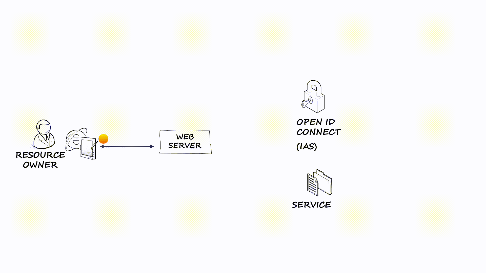
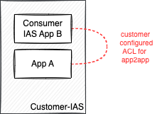
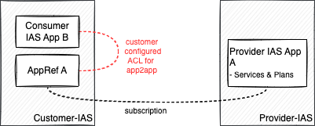

# Using IAS as OAuth Server

Identity Kernel Service provides applications with functionalities for authentication, authorization and user provisioning.
Focus of this document is integration based on OAuth, such as the Open ID Connect (OIDC) protocol for named user authentication or client credential tokens for technical communication.

<!-- TOC -->
* [Using IAS as OAuth Server](#using-ias-as-oauth-server)
  * [Authenticating Web Applications](#authenticating-web-applications)
    * [Authenticating users using OIDC](#authenticating-users-using-oidc)
    * [Server application](#server-application)
      * [Samples](#samples)
    * [Single Page Applications](#single-page-applications)
      * [Samples](#samples-1)
    * [Multi-Tenancy](#multi-tenancy)
      * [Integrations](#integrations)
      * [DC setup & IAS tenants](#dc-setup--ias-tenants)
    * [Authorizations](#authorizations)
    * [Other Samples](#other-samples)
  * [Exposing APIs](#exposing-apis)
    * [BTP based services using Open Service Broker and BTP Service Manager](#btp-based-services-using-open-service-broker-and-btp-service-manager)
      * [Samples](#samples-2)
    * [(BTP & non-BTP) App-to-App communication](#btp--non-btp-app-to-app-communication)
      * [Provider: Defining services](#provider-defining-services)
      * [Consumer: Consuming services](#consumer-consuming-services)
        * [Service flows](#service-flows)
      * [Samples](#samples-3)
<!-- TOC -->

## Authenticating Web Applications
Typical UI5 applications consist of a server providing the HTML content and one or more application serving REST APIs used by the application. 

During authentication, a user or application proves their identity by providing valid credentials. Users can authenticate against the IAS user store - or more typical for customers - integrate with a corporate IdP such as Azure/Entra ID. IAS supports  open industry standards like OIDC and SAML to authenticate. 

### Authenticating users using [OIDC](https://openid.net/specs/openid-connect-core-1_0.html)


Web application use the OAuth Authorization Code Flow for interactive
authentication:
1. A user accesses the web application using a browser or mobile device
2. The web application (in typical SAP Cloud Platform applications, this is an application router) acts as OAuth client and redirects to the OAuth server for authorization
3. Upon authentication, the web application uses the code issued by the authorization server to request an access token
4. The web application uses the access token to request data from the OAuth resource server. The OAuth resource server validates the token using online or offline validation.

To delegate authentication to the identity kernel service, web application need to support 
the OAuth authorization code flow. As a popular protocol, this is supported by many web servers.


### Server application
In many cases, web applications are server applications that can hold a credential such a client secret for authenticating as application at IAS. When obtaining a token from IAS, the application will use this credential when obtaining a token from IAS.

A credential can be ([documentation](https://help.sap.com/docs/identity-authentication/identity-authentication/dev-configure-secrets-for-api-authentication?locale=en-US)):

- **[Client Secret](https://help.sap.com/docs/identity-authentication/identity-authentication/dev-configure-secrets-for-api-authentication?locale=en-US)**: Although not preferred from security side it is for many the easiest credential to get started with. Secrets are locked in case of incorrect secrets (see [unlock](https://help.sap.com/docs/identity-authentication/identity-authentication/dev-unlock-client-id?locale=en-US) and [disable locking](https://help.sap.com/docs/identity-authentication/identity-authentication/dev-disable-client-id-locking?locale=en-US)).
- **[Client Certificate](https://help.sap.com/docs/identity-authentication/identity-authentication/dev-configure-certificates-for-api-authentication?locale=en-US)**: Recommended credential for most scenarios using mTLS for authentication.
- **[jwt-token](https://help.sap.com/docs/identity-authentication/identity-authentication/dev-configure-jwt-for-oauth-client-authentication?locale=en-US)**: When scenarios are not suited to mTLS, jwt token is an alternative. This is supported for integration with Azure/Entra ID. private_key_jwt with self-signed tokens will also be added to IAS soon.

#### Samples
| Feature                                                                      | Technology           | Info                                |
|------------------------------------------------------------------------------|----------------------|-------------------------------------|
| [Single tenant, Spring](./samples/single-tenant/plain-spring-oidc/README.MD) | Plain-vanilla Spring | Single tenant using standard Spring |
| [BTP Approuter](./samples/single-tenant/approuter/README.MD)                 | BTP Approuter        | Authenticating Approuter with IAS   |


### Single Page Applications
In some cases a web application can not hold a secret, e.g. when running on a mobile device or when embedding in public web pages. In those cases applications can register in IAS as public client.
Public clients will use PKCE and obtain a restricted token which only contains a single audience.

**Note-1:** In IAS a client can be public and additionally have credentials. Credentials are used for e.g. App2App token exchanges or can a token containing all configured audiences.

**Note-2:** Mobile application should check the configuration of [refresh-tokens](https://help.sap.com/docs/identity-authentication/identity-authentication/token-policy-configuration-for-applications?locale=en-US) to avoid authentication failures due to network connectivity or mobile devices running out of battery.
#### Samples
| Feature                                                                      | Technology           | Info                                        |
|------------------------------------------------------------------------------|----------------------|---------------------------------------------|
| [Public client](.samples/single-tenant/public-client/README.MD)         | HTML5                | Authenticating using PKCE  from an HTML app |


### Multi-Tenancy

IAS supports multi tenancy. IAS applications declared as multi tenant can be replicated by a subscription process to a customer IAS tenant. 


In a customers IAS tenant it will appear as _managed application_ with restricted customizing options, e.g. the customer can configure settings such as:
- corporate IdP
- attributes
- subject name
- redirect URIs for supporting custom domains
- API Dependencies for App2App configuration

Other settings like credentials are inherited and can only be changed by the application provider.

Subscribed application have the following configurations:
- **Client id:** All subscriptions share the same tenant identifier
- **Application tenant id:** Upon subscription, an application defines an application specific tenant identifier. IAS will include claim `app_tid` with the value. IAS makes no guarantee on uniqueness, it is in the applications responsibility to ensure uniqueness.
- **Credentials:** Credentials are inherited to all subscriptions. Recommendation is to use mTLS, secrets are not supported.
- **Redirect URIs:** Redirect URIs are replicated. Applications may use a wildcard when addressing tenants by hostname, e.g. `https://*.myapp.com/login`
- **API Permission Groups:** All permission groups are inherited. IAS does not support provider-only permission groups.
- **Authorizations:** When using AMS for authorizations, these are inherited with a subscription (currently restricted to BTP based subscriptions)
- **Attributes:** Attribute definitions are inherited and can be adopted. Customers may define additional attributes.
- **Subject Name identifier:** The subject Name identifier is inherited, but customers may change it. Application relying on a specific SNI, should define a customer attribute (e.g. Global User Identifier).


#### Integrations
SCI supports integration for multi tenancy with BTP (using SMS), SPC and Unified Service Manager.

#### BTP
Please check the samples below and the [documentation](https://controlcenter.ondemand.com/index.html#/knowledge_center/articles/7961284168e848efb9e0462e38b4075d).

| Feature                                                                                         | Technology        | Info                                                              |
|-------------------------------------------------------------------------------------------------|-------------------|-------------------------------------------------------------------|
| [Approuter](./samples/multi-tenant/sci-spring-simple/README.MD)                                 | Approuter+Backend | Using BTP SMS for multi-tenancy                                   |
| [Web application migrated from xsuaa](./samples/multi-tenant/sci-migration-using-sms/README.MD) | Approuter+Backend | Tenant-by-tenant migration of an existing xsuaa-based application |

#### SPC
Please reach out to [Martijn de Boer](https://github.wdf.sap.corp/D039113)

#### USM
See [Unified Service documentation](https://pages.github.tools.sap/atom-cfs/atom-docs/docs/business-use-cases/security/)

#### DC setup & IAS tenants
Please check [Integration.MD](integration%2FIntegration.MD) on recommendations on how to obtain IAS tenants and choose the right DC setup.

### Authorizations

Applications can handle their own authorizations or rely on [AMS](https://github.wdf.sap.corp/pages/CPSecurity/AMS/Overview/AMS_basics/) for this.

### Other Samples
- [AMS node.js and Java](https://github.wdf.sap.corp/CPSecurity/cloud-authorization-samples)
- [node.js, multi tenant](https://github.wdf.sap.corp/d035752/cfIASHelloWorld)
- [Java](https://github.com/SAP/cloud-security-xsuaa-integration/tree/master/samples/java-security-usage-ias)

## Exposing APIs

### BTP based services using Open Service Broker and BTP Service Manager
For BTP based services, the standard approach is to integrate reuse services with BTP service manager. For this, BTP based services 
implement the [open service broker API](https://www.openservicebrokerapi.org). 

Services using SCI can directly define the service catalog in their identity instance registered with BTP service manager. 

#### Samples

  | Feature                                                                                  | Technology | Info                                        |
  |------------------------------------------------------------------------------------------|------------|---------------------------------------------|
  | [reuse-service sample](samples/multi-tenant/reuse-service-ias/README.MD)                 | OSB        | Reuse Service                               |
  | [xsuaa-migration reuse-service](samples/single-tenant/reuse-service-migration/README.MD) | OSB        | Hybrid reuse Service supporting xsuaa & IAS |

### (BTP & non-BTP) App-to-App communication

App-to-App communication is an option provided by SCI for exposing APIs using JWT tokens. Is can be used in scenarios where all parties
share the same IAS tenant and accept JWT tokens for authentication. In contrast to integrations through service manager, it also 
works for applications not following the BTP tenancy model as service consumer and service provider may use different tenant
identifier, it is e.g. also usable between BTP and non-BTP applications.

#### Provider: Defining services
Services define the exposed APIs. For SCI, these are names and SCI does not have any further knowledge. 
When using [Identity broker](https://github.wdf.sap.corp/CPSecurity/Knowledge-Base/blob/master/08_Tutorials/iasbroker/README.md#preconditions), this is e.g.:

```
	"provided-apis": [{
		"name": "write-access",
		"description": "grants access to write APIs"
	}]
```

#### Consumer: Consuming services

APIs exposed via App-to-App communication are available in the tenant providing the IAS application or in any IAS tenant 
to which this tenant is subscribed. OIDC based application in the same IAS tenant can decide to consume services by
adding them as consumed service.



**Example 1**: App B consumes a service defined in App A. App A and App B reside in the same IAS tenant. 




**Example 2**: App B consumes a service defined in App A. App B is an application defined in the customer IAS tenant, App A
a subscription into the customer IAS tenant.

##### Service flows
See [app2app-service-flows.MD](app2app-service-flows.MD) for supported flows.

#### Samples

  | Feature                                                                   | Technology         | Info                                     |
  |---------------------------------------------------------------------------|--------------------|------------------------------------------|
  | [app-to-app using a rest client](./samples/app-to-app-rest/README.MD)     | App-to-App         | Back to basics. Getting tokens with curl |
  | [app-to-app using Java](samples/multi-tenant/sci-spring-simple/README.MD) | App-to-App, Spring | IAS App2App flow                         |

