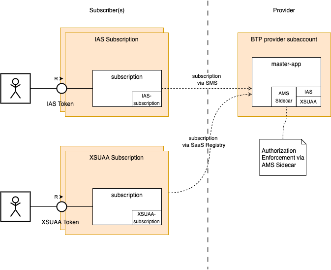
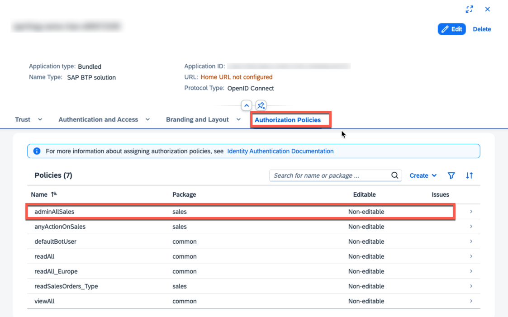
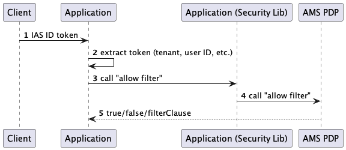
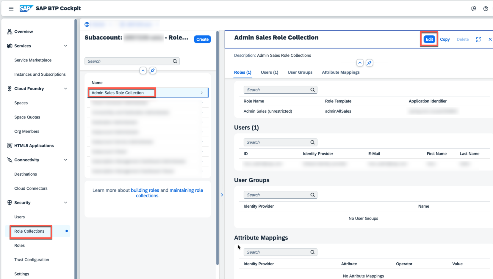
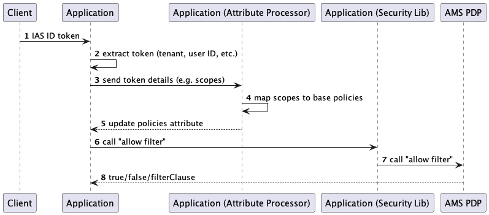

# AMS as Authorization Server for Hybrid Mode
This sample is built based on this concept: [ADR](https://github.wdf.sap.corp/CPSecurity/Knowledge-Base/blob/master/06_Architecture/Architecture%20Decision%20Records/done/20240130-hybrid-sci-xsuaa.md).
## Overview



As can be seen from the diagram, the provider application has binding to both XSUAA and IAS instance. Additionally, for the authorization enforcement an AMS sidecar is bound to the application (OPA buildpack).

Important components:
* [mta.yaml](mta.yaml)
  
  To deploy the application setup as shown in provider side of the overview diagram.
* [xs-security.json](xs-security.json)

  Defines the new scope [`AMS_POLICY.sales.AdminAllSales`](xs-security.json#L21) representing the AMS policy [`sales.AdminAllSales`](service/src/main/resources/sales/sales.dcl#L5) and will be mapped into AMS base policy.
* [AMS DCL](service/src/main/resources/sales)

  The definition of the AMS DCL, required for the policy enforcement.
* Attribute Processor [Configuration](service/src/main/resources/META-INF/services/com.sap.cloud.security.ams.api.AttributesProcessor) and [Implementation](service/src/main/java/sample/spring/security/migration/XsuaaScopes2AttributesProcessor.java)

  Mapping of XSUAA scope to AMS base policy. This 
* Policy/Authorization Enforcement in [SalesOrderController](service/src/main/java/sample/spring/security/SalesOrderController.java)

  Instead of using `@PreAuthorize("hasAuthority('SalesOrder')")` (for XSUAA), the controller uses `@PreAuthorize("forResourceAction('salesOrders', 'read')")`. This enforcement would be applied for both IAS token and XSUAA token.

## Setup
### Deploy the application in a provider subaccount
A trust configuration to an IAS tenant in the provider subaccount is required. Please check this guide to create the trust config: [Trust Config](../sci-spring-simple/README.MD#preparation---trust-configuration-for-provider-subaccount)

Before building the projects, you need to ensure that you have deployed  this dependency in your maven local repository: [hybrid-auth-mapper](./hybrid-auth-mapper)
```shell
cd hybrid-auth-mapper
mvn clean install
```

After that you could go back to the project you want to build and deploy.
```shell
mbt build
cf deploy mta_archives/hybrid-ams_1.0.0.mtar
```

### Test IAS based subscription in subscriber subaccount
#### 1. Create trust configuration to an IAS tenant
See [this](../sci-spring-simple/README.MD#preparation---trust-configuration-for-provider-subaccount) for details on how to create a trust configuration on the subscriber subaccount

#### 2. Map Route for the subscriber subaccount
```
# Map routes as needed (see the URL of the subscription for the route to map)
# assumption: running in Canary EU12 (application domain: cfapps.eu12.hana.ondemand.com)

cf map-route hybrid-ams-approuter  cfapps.eu12.hana.ondemand.com -n <subscriber-subdomain>-<provider-orgName>-<provider-space>-sci-spring-approuter
```

#### 3. Subscribe
Subscribe IAS based subscription in your subscriber subaccount: `hybrid-ams-sms-${provider-org}-${provider-space}`.

#### 4. Assign the required AMS policy
Assign the policy `adminAllSales` of IAS App hybrid-ams-${org}-${space} to the user to be used for testing the subscription.



#### 5. Test the application
Go to the subscription URL using a browser, which will forward you to the IAS login page. 
After login, select 'Sales Order' from the menu.
* If you login with the user assigned to the required policy, you would get a text: `Read-protected salesOrders resource accessed!`
* If you login with any other users, you would get an error 403

__NOTE:__ If you change the policy later, please wait for 1-2 minutes, before the changes will be effective. AMS refreshes/updates the policy bundles regularly from the policy assignments.

#### How it works
As can be seen from the DCL file for [sales](service/src/main/resources/sales/sales.dcl), the policy `adminAllSales` contains `GRANT` on instance `salesOrder`.

Assigning the policy to a user means, the user is granted access to the given instance(s) for the given action(s).

Therefore, the authorization enforcement on action `read` for instance `salesOrder` (see [enforcement code](service/src/main/java/sample/spring/security/SalesOrderController.java#L22) will succeed for users having the policy `adminAllSales`.




### Test XSUAA based subscription in subscriber subaccount
#### 1. Map Route for the subscriber subaccount
```
# Map routes as needed (see the URL of the subscription for the route to map)
# assumption: running in Canary EU12 (application domain: cfapps.eu12.hana.ondemand.com)

cf map-route hybrid-ams-approuter  cfapps.eu12.hana.ondemand.com -n <subscriber-subdomain>-<provider-orgName>-<provider-space>-sci-spring-approuter
```

#### 2. Subscribe
Subscribe IAS based subscription in your subscriber subaccount: `hybrid-ams-saas-${provider-org}-${provider-space}`.

#### 3. Assign the required Role Collection
Assign the role collection `Admin RC` to the user to be used for testing the subscription.


#### 5. Test the application
Go to the subscription URL using a browser, which will forward you to the XSUAA login page.
After login, select 'Sales Order' from the menu.
* If you login with the user assigned to the required role collection, you would get a text: `Read-protected salesOrders resource accessed!`
* If you login with any other users, you would get an error 403

#### How it works
As can be seen from the [xs-security.json](xs-security.json), the role collection `Admin Role Collections` contains the scope `adminAllSales`.

Assigning the role collection to the user means, the scope will be contained in the XSUAA user token, which will be consumed by the application.

The attribute processor [XsuaaScopes2AmsPolicyAttributesProcessor](service/src/main/java/sample/spring/security/migration/XsuaaScopes2AmsPolicyAttributesProcessor.java) will be executed when an endpoint was requested. It will map all the relevant (contains xsappname) scopes in the token into AMS policies.

The request will be handled as if it was requested using IAS token with the assigned policies. The authorization will then be enforced by AMS.
Therefore, the authorization enforcement on action `read` for instance `salesOrder` (see [enforcement code](service/src/main/java/sample/spring/security/SalesOrderController.java#L22) will succeed for the request.


