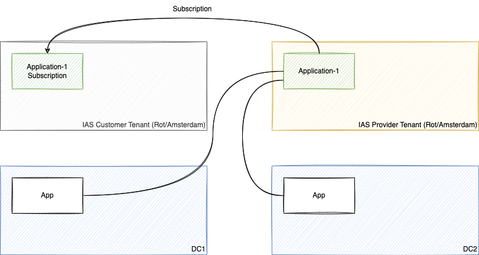
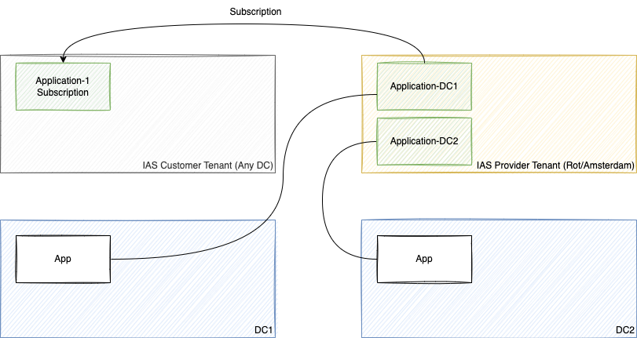
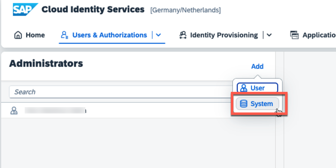
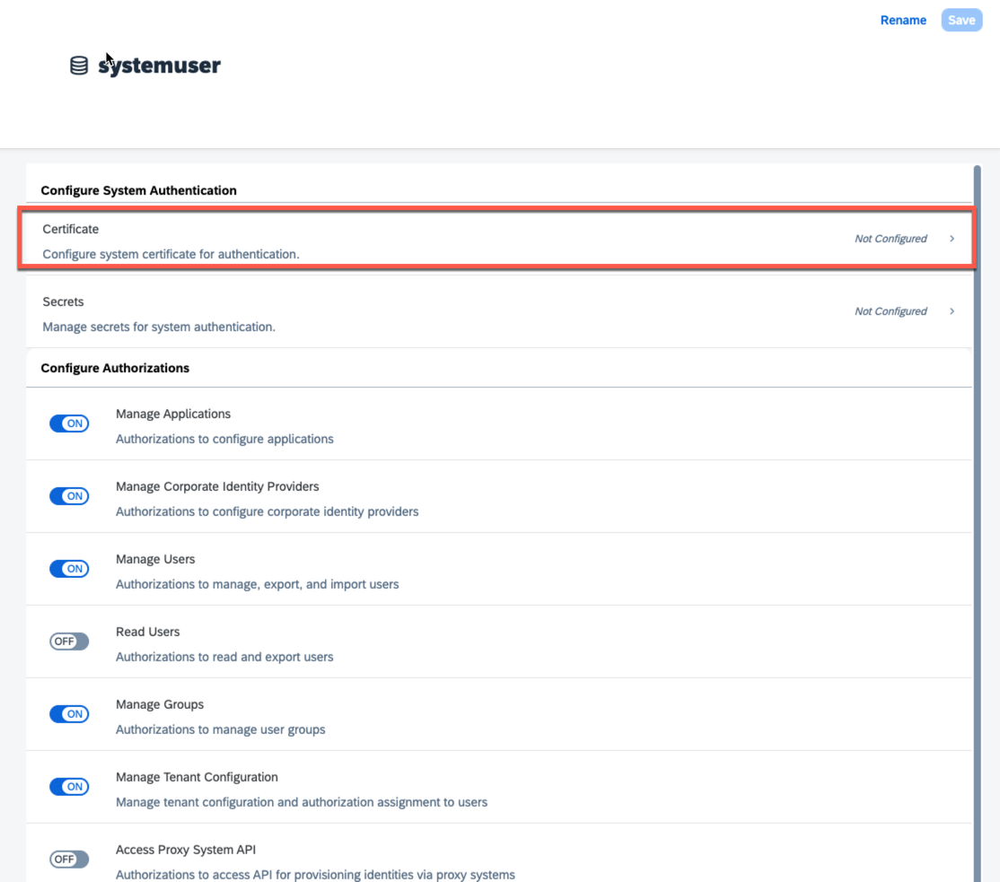
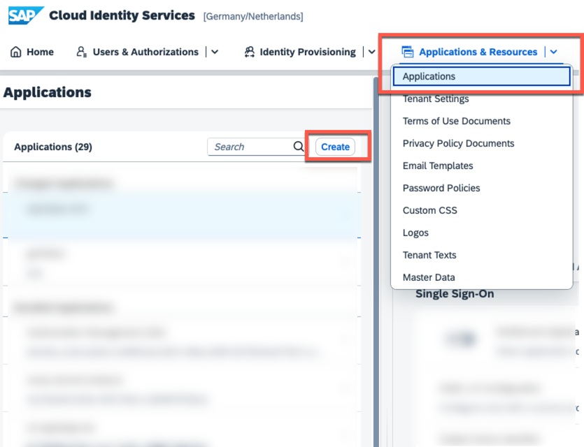
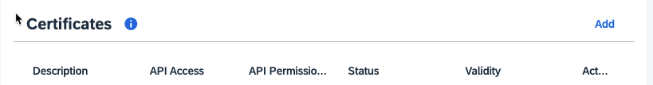

## Integration guide for Multi-Tenant SCI applications

## Introduction
Identity Kernel Service provides applications with functionalities for authentication, authorization and user 
provisioning. Focus of this document is integration based on OAuth, such as the Open ID Connect (OIDC) protocol for 
named user authentication or client credential tokens for technical communication.

This guide gives architects recommendations on how to integrate multi-tenant IAS applications.

## Multi Tenant applications 


### IAS provider IAS tenants
Multi-tenant applications have a provider IAS tenant in the Rot/Amsterdam data center. When they are flagged as
multi-tenant, their definition is replicated into all other data centers and through tools like SPC, BTP Subscription
Management Service or Unified Service Manager subscriptions can be created.

Each application needs to have a provider IAS tenant. See [requesting an ias tenant](./request-ias.MD) on how to request 
an IAS tenant.

### Data center setup
Typically, applications are provided in different data centers. This gives applications two options:
#### Sharing the master application
Applications may decide to share the same master application between different DCs. 

**Pro**
- This makes sense for global applications.
- Customer sees a single application for accessing different DCs. This is e.g. used by BTP cockpit.

**Contra**
- DCs should have a common update slot as otherwise dependencies between the app before the 
update and after the update may interfere. This is usually the setup that is difficult to test.


#### One master per application data center
Applications may decide to use one master application per deployment but use the same IAS provider tenant.

**Pro**
- Simple model with clear dependencies.
- Updates can be handled on a DC-per-DC basis.

**Contra**
- In case a customer uses an app in multiple DCs, the customer gets multiple subscriptions.



## Registering IAS applications
There are 3 ways to create master application(s) in the IAS tenant:
1. Using Identity Broker

In BTP environment, you could create IAS application by creating a service instance from an [Identity Broker](https://github.wdf.sap.corp/CPSecurity/Knowledge-Base/blob/master/06_Architecture/Identity_Service/IAS-Broker.MD). The tutorial for Identity Broker can be found here: https://github.wdf.sap.corp/CPSecurity/Knowledge-Base/tree/master/08_Tutorials/iasbroker

2. Using IAS API: https://api.sap.com/api/SCI_Application_Directory/path/createApplication

To access the API, you need to create a system admin user in the IAS Admin UI: `User & Authorizations` -> `Administrators` -> `Add` -> `System`.



After creating the system admin user, create a certificate to be used to access the IAS API to create IAS applications



3. Manual Creation using IAS Admin UI

To create an IAS application, you could choose the followings in the Admin UI: `Applications & Resources` -> `Applications` -> `Create`



## Managing certificates
Multi tenant applications require certificates for obtaining tokens.
SAP SCI ensure SAP Cloud Root CA and Digicert CAs are accepted in all customers IAS tenants.
Customer may request additional CAs for their IAS tenants, but this will  be a customer specific configuration.

Recommendation is to use certificates obtained by SAP Cloud Root CA.

### For test purposes
For testing, you can go to the IAS admin console and have a certificate generated for you:
For this go to Application APIs>Client Authentication


In the Certificate section, choose Add and Generate certificate. Once the cert has been generated, press the "Add"
button to map the certificate.

This will generate a certificate and download cert & private key using a PKCS#12 (.p12) file.
Once you have it, use it with mTLS. This is an example using curl:

```shell
curl --cert-type P12 --cert <path to cert.p12 file>:<p12 password> <ias tenant>/oauth2/token  -d "grant_type=client_credentials&client_id=<client id>"
```

### For production

For production, you need to automate certificate generation. This can either happen using BTP certificate service or you
integrate with Identity Broker. Both will require a BTP account for the provider but will not require BTP accounts for customers.

As alternative, you can integrate with IAS to proxy requests to BTP certificate service and
use the API of IAS https://wiki.one.int.sap/wiki/display/idservice/Certificate+Service+API
This will proxy your requests to BTP certificate service.

## Configure Subscriptions

You can use either SPC or USM to configure the subscription for the IAS applications.
The parameter `app_tid` could be configured in this step.

As of now, to manage subscriptions in the QA landscape, please contact [Martijn de Boer](https://github.wdf.sap.corp/D039113) and [Patrick Firnkes](https://github.wdf.sap.corp/D063627)
