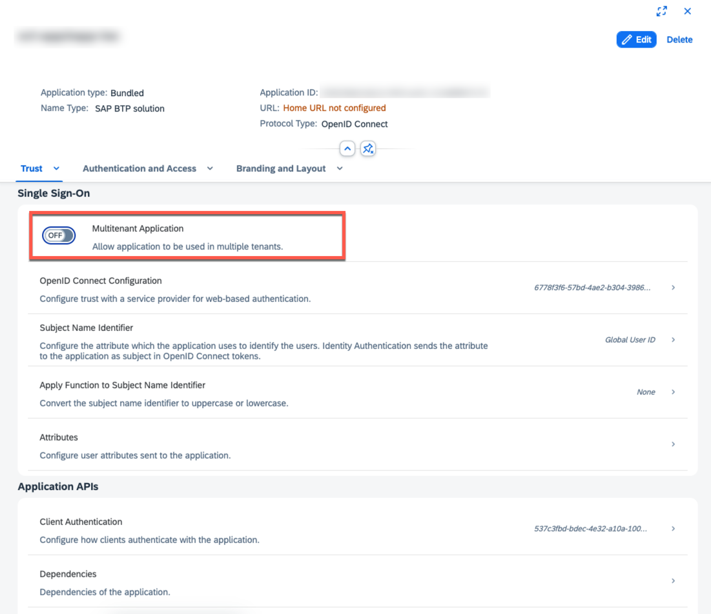

## Request an IAS Tenant
To create multi-tenant applications, which are required for subscriptions or reuse services, the IAS tenant must be enabled for multi-tenancy. The tenant must reside in Europe (landscape: QA (Europe) / Productive (Europe)) and the multi-tenant checkbox must be enabled when requesting it on https://tenants.ias.only.sap . In case you want to change an existing tenant please create a BCP ticket on BC-IAM-IDS.

To check whether tenant has been configured for multi tenancy, you can check in the application inside the IAS tenant. If the IAS tenant is multi-tenant-enabled, then you will see an option to enable/disable the multitenant application flag as you can see in the following screenshot.

__Note:__ the customer/subscriber tenants can be anywhere, and do not necessarily be in the same landscape or data center as the IAS tenants of the applications.

