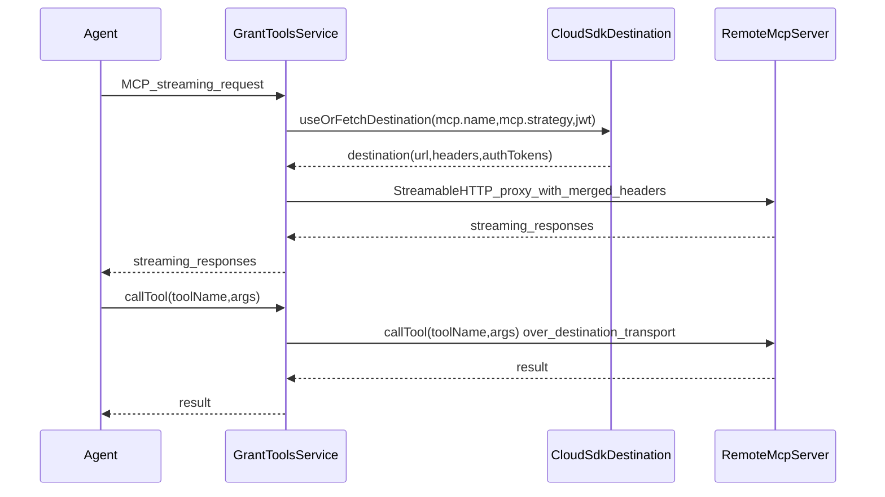

# Agent MCP destinations (Phase 1: 1 destination per agent)

## Goal

Enable each agent to stream MCP requests through GrantToolsService to **exactly one** remote MCP server reachable via **SAP Destination**.

- **Phase 1**: one agent → **one** MCP destination/server (streaming proxy + tool discovery + call forwarding).
- **Later**: introduce an **aggregator MCP** that fans out to multiple destinations and performs aggregations. This plan explicitly does **not** implement aggregation.

## Key reference example (use as guidance, not “known working”)

Primary reference for how to proxy/stream to a destination-backed MCP server:

- [srv/grant-tools-service/handler.proxy.tsx](/Users/I347305/aspire-proxy/agent-grants/srv/grant-tools-service/handler.proxy.tsx)

What to copy conceptually:

- **Destination → StreamableHTTPClientTransport** using `destination.url`.
- Merge headers in this order (so destination wins):
  - forwarded inbound headers (excluding `content-length`)
  - `destination.headers` (if any)
  - `destination.authTokens[].http_header` (if any)
- Preserve streaming/session continuity:
  - read `mcp-session-id` and pass as `sessionId`
  - forward `last-event-id`
- Bidirectional transport binding (server transport ↔ client transport) with JSON-RPC error responses on upstream send failures.

## Important constraint: Debug Destination service is NOT a dependency

- The debug destination service under `srv/debug-service/*` is valuable to **understand/test/debug** destination resolution.
- **But the GrantToolsService runtime path MUST NOT depend on it** (no internal calls to its endpoints, no required projections).
- Destination resolution for MCP proxying/discovery happens directly via Cloud SDK (`useOrFetchDestination`) inside GrantToolsService.

## Agent MCP configuration (Phase 1)

Replace `mcpServerName` / `mcpDestination` with a single `mcp` config object.

In [db/discovery.cds](/Users/I347305/aspire-proxy/agent-grants/db/discovery.cds), each `Agent` has:

- `mcp.kind`: string, default `"destination"` (Phase 1 only supports destination)
- `mcp.name`: string, the SAP Destination name (e.g. `"MY_MCP_DEST"`)
- `mcp.strategy`: enum controlling destination selection strategy:
  - `alwaysProvider`
  - `alwaysSubscriber`
  - `subscriberFirst` (default)

Expose the `mcp` config via:

- [srv/grant-tools-service/grant-tools-service.cds](/Users/I347305/aspire-proxy/agent-grants/srv/grant-tools-service/grant-tools-service.cds)

Phase 1 semantics:

- Exactly **one** destination per agent: `mcp.name`.
- Tools are exposed with their **native MCP tool names** (no `<dest>/` prefix), because each agent always has exactly one MCP destination in Phase 1.

## Runtime design (Phase 1)

## Testing approach and workflow (must follow)

Use these existing tests as the reference style for how to run CAP + MCP client flows in this repo:

- [test/mcp-service.test.js](/Users/I347305/aspire-proxy/agent-grants/test/mcp-service.test.js): end-to-end MCP listTools + tool call + consent, with `cds.test()` and MCP SDK client transport.
- [test/grant-tools.test.js](/Users/I347305/aspire-proxy/agent-grants/test/grant-tools.test.js): end-to-end GrantToolsService flow including DB upserts, MCP tool call (`push-authorization-request`), consent submission, and grant query assertions.

Execution order (explicit):

- **Update CDS model first** (introduce the `Agents.mcp` config shape).
- **Write tests next** that exercise the new “single destination-backed MCP” behavior (start red).
- **Update the model if necessary** only when tests expose mismatches/constraints.
- **Implement incrementally** (transport helper → discovery → proxy execution), keeping tests green as each piece is completed.

### A) Destination-backed MCP transport helper (in GrantToolsService)

Implement a local helper (kept in the same handler file(s), not a new “service layer”) that:

- Resolves destination:
  - `useOrFetchDestination({ destinationName: mcp.name, jwt: req.user?.authInfo?.token?.jwt, selectionStrategy: <from mcp.strategy> })`
- Builds headers exactly like the reference proxy handler:
  - forward inbound headers (exclude `content-length`)
  - merge `destination.headers`
  - merge `destination.authTokens[].http_header`
  - destination wins
- Creates:
  - `new StreamableHTTPClientTransport(new URL(`${destination.url}/mcp/streaming`), { sessionId, requestInit: { headers } })`

### B) Streaming proxy endpoint

Implement a GrantToolsService-side streaming proxy that mirrors `handler.proxy.tsx`:

- Accept incoming StreamableHTTP server transport
- Bind to the destination-backed client transport
- Forward messages both ways
- Close both transports safely on disconnect

### C) Tool discovery (single destination)

Update:

- [srv/grant-tools-service/handler.tools.tsx](/Users/I347305/aspire-proxy/agent-grants/srv/grant-tools-service/handler.tools.tsx)

Behavior:

- Keep existing DB tool loading.
- If the agent has `mcp.kind === 'destination'` and a `mcp.name`:
  - connect to remote MCP server via destination-backed client transport
  - call `listTools` (support `nextCursor`)
  - add tools into `req.data.tools` using the remote/native tool name:
    - `toolName = remoteTool.name`
  - store proxy metadata for execution:
    - `destinationName = mcp.name`, `strategy = mcp.strategy`, `remoteToolName`, `inputSchema`

### D) Tool execution proxy (callTool)

Update:

- [srv/grant-tools-service/handler.mcp.tsx](/Users/I347305/aspire-proxy/agent-grants/srv/grant-tools-service/handler.mcp.tsx)

Behavior:

- Register proxy tools for discovered remote tools using their **native** tool names (no namespacing).
- When invoked:
  - forward `callTool` to remote MCP server over destination-backed transport (always uses the agent’s single configured `mcp.name`)
- Ensure robust close/cleanup for transport/client.

## Optional debug/test helpers (non-dependency)

If needed to speed development:

- Add debug/test endpoints that directly exercise `useOrFetchDestination` and/or the MCP streaming connection **within GrantToolsService**.
- These endpoints are for manual validation and do not create a dependency on `srv/debug-service`.

## Mermaid: Phase 1 flow

## Acceptance criteria (Phase 1)

- Each agent has exactly one MCP config: `mcp.kind === 'destination'`, `mcp.name`, `mcp.strategy`.
- GrantToolsService exposes remote tools using their **native tool names** (no namespacing).
- Destination selection respects `mcp.strategy` (`alwaysProvider|alwaysSubscriber|subscriberFirst`).
- Streaming proxy uses merged headers + preserves `mcp-session-id` / `last-event-id`.
- Proxy errors surface as JSON-RPC errors (not silent disconnects).

## Known tradeoff (Phase 1)

- **Tool-name collisions**: without namespacing, remote tool names may collide with existing local/DB tool names. Phase 1 assumes this won’t happen for a given agent; if it does, we’ll need either namespacing again or a deterministic conflict policy.

## Future work (out of scope)

- Aggregator MCP:
  - multiple destinations per agent
  - fan-out listTools/callTool
  - aggregation/merging policies