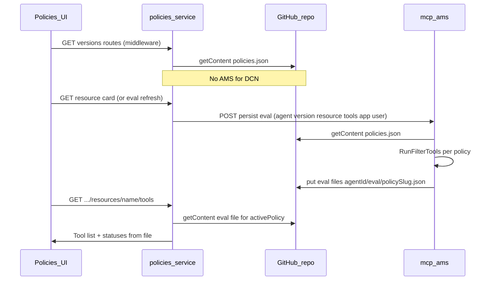

# Git-first DCN, persisted AMS eval, tools from Git

## Current behavior (what changes)

- `[middleware.policy.tsx](srv/policies-service/middleware.policy.tsx)` tries **mcp-ams** `GET .../policies/dcn` first, then falls back to Octokit for `{agentId}/policies.json`.
- `[handler.resources.tools.tsx](srv/policies-service/handler.resources.tools.tsx)` POSTs to mcp-ams `/policies/{ref}/evaluate` with **inline `dcn`** from the request (live eval on every tools fragment load).
- `[tools/mcp-ams/internal/api/handlers/decision/policies_ref_eval.go](tools/mcp-ams/internal/api/handlers/decision/policies_ref_eval.go)` POST builds `**byPolicy` from mocks** (`byPolicyMockResults`); only `**active`** uses real `RunFilterTools`.

## Target architecture

## 1. Middleware: always read DCN from Git

**File:** `[srv/policies-service/middleware.policy.tsx](srv/policies-service/middleware.policy.tsx)`

- Remove the `fetch(amsUrl .../policies/dcn)` path, `AMS_POLICIES_FETCH_MS`, `scheduleAmsEchoProbeAfterDcnFail`, and related imports from `[ams-env.ts](srv/policies-service/ams-env.ts)` if nothing else needs the DCN probe (keep `getAmsUrl` / `getAmsPoliciesEvaluateUrl` only if still used elsewhere after step 3).
- Keep branch resolution (`listBranches` + `policies.json`) and `octokit.rest.repos.getContent` for `{agentId}/policies.json` at `ref`, then `ensureDcnContainer(raw)` as today.

## 2. mcp-ams: Git-only policy load for eval + write `eval/` artifacts

**New GitHub write helper** in `[tools/mcp-ams/internal/githubpolicies/](tools/mcp-ams/internal/githubpolicies/)` (e.g. `write.go`):

- `PutJSONFile(agentID, ref, path string, content []byte, message string)` mirroring CAP’s `createOrUpdateFileContents` (GET contents for `sha` when updating, same `Owner`/`Repo`/`Token`/`APIBase` as `[fetch.go](tools/mcp-ams/internal/githubpolicies/fetch.go)`).

**Eval document shape** (single file per policy, multiple resources merged over time):

- Path: `{agentId}/eval/{policySlug}.json` where `policySlug` matches a safe encoding of `[PolicyQualifiedName](tools/mcp-ams/internal/githubpolicies/normalize.go)` (e.g. replace `/` and other unsafe chars; dots allowed).
- Suggested JSON: `{ "policy": "<qualified>", "ref": "<branch>", "updatedAt": "<ISO8601>", "resources": { "<resourceName>": { "tools": [ ... ToolOut ... ] } } }`.
- On each persist for `(policy, resourceName)`, read existing file if present, merge `resources[resourceName]`, update `updatedAt`, write back.

**New HTTP handler** (cleaner than overloading evaluate):

- e.g. `POST /sap/scai/v1/authz/agents/{agentID}/versions/{versionRef}/resources/{resourceName}/eval/persist` (or shorter path under same `v1` prefix as existing `[server.go](tools/mcp-ams/internal/api/server.go)`).
- Body: `env`, `user`, `input: { app, tools }` (same tool shape as today). **Do not accept `dcn` in body** for this endpoint—always `FetchPoliciesRaw` + `ParseAndNormalizeContainer` for Git truth.
- Logic:
  - Load full DCN from Git at `versionRef`.
  - For **each** policy in `full.Policies`, compute `PolicyQualifiedName`, run `SelectPoliciesForEval(full, thatName)` (or equivalent single-policy selection using existing helpers), then `RunFilterTools(...)` with the request’s `app` + `tools` and merged `env`/`user` (same as `[policiesRefEvaluatePOST](tools/mcp-ams/internal/api/handlers/decision/policies_ref_eval.go)`).
  - Persist each policy’s tool rows into the corresponding `eval/{slug}.json` under that resource key.
- Optional but useful: fix `**byPolicy` in `policiesRefEvaluatePOST`** to use the same real per-policy loop (for consistency/debugging); tools UI will not depend on that once CAP reads from Git.

**Auth:** same Git token as today (`MCP_AMS_GITHUB_TOKEN` / bindings).

## 3. CAP: trigger persist from MCP card context

**File:** `[srv/policies-service/handler.resources.tsx](srv/policies-service/handler.resources.tsx)` (`RESOURCES_CARD`)

- `resourcesMiddleware` already loads the full YAML via `[fetchResourceById](srv/policies-service/middleware.resources.tsx)` when the route includes a resource name, so `req.data.resource` can include `tools` and `_meta` even though the card UI does not show them yet.
- Add a **fire-and-forget** HTMX hook on the card root, e.g. `hx-get` to a new action `evalPersist` on `resources`, `hx-trigger="load"` (or `revealed` if you prefer viewport-based), `hx-swap="none"`, so opening a card kicks off persistence without blocking paint. Alternatively perform the AMS `fetch` inside the handler before render if you accept added latency (simpler but slower).

**New handler** (same file or `[handler.resources.tools.tsx](srv/policies-service/handler.resources.tools.tsx)` if you want eval+tools colocated):

- `GET .../resources/{name}/evalPersist`: read `agentId`, `version`/`ref`, `resource` from `req.data`; build JSON body matching AMS; `POST` to the new mcp-ams URL (add helper next to `[getAmsPoliciesEvaluateUrl](srv/policies-service/ams-env.ts)`); log errors; return empty 200 or minimal comment for HTMX.

**Staleness:** after add/remove rule, existing eval files may be wrong until the user opens the card again (or you later add `policy-updated` → re-trigger eval). Document or add a follow-up trigger if needed.

## 4. CAP tools fragment: read from Git only

**File:** `[handler.resources.tools.tsx](srv/policies-service/handler.resources.tools.tsx)`

- Remove `evaluateTools`’s `fetch` to `/policies/{ref}/evaluate` and **stop sending `dcn`** anywhere for tools.
- Add `loadToolDecisionsFromEval(octokit, agentId, ref, activePolicy, resourceName, liveTools)`:
  - Resolve **policy file slug** the same way as Go (duplicate small helper: qualified name from `activePolicy` string is the key; slug = safe path segment).
  - `getContent` `{agentId}/eval/{slug}.json` at `ref`; parse `resources[resourceName].tools`.
  - Map each **live** tool (from `resource.tools`) to `ToolDecision` by name: match row → `granted` / `denied` / `conditional`; missing row → `unevaluated` with note like `not in persisted eval`.
  - If file missing or `activePolicy` empty / unknown → show unevaluated with a short hint (“Open the resource card to refresh evaluation”).
- Keep `dcn` on `req.data` only for optional messaging (e.g. “no policies”) still sourced from middleware Git load.

## 5. Docs and tests

- Update `[tools/mcp-ams/README.md](tools/mcp-ams/README.md)`: middleware no longer calls `policies/dcn`; document `eval/` layout and new persist route.
- Adjust `[srv/policies-service/handler.agents.test.tsx](srv/policies-service/handler.agents.test.tsx)` or any test that assumed AMS-first DCN or live eval, if present.

## Out of scope / follow-ups

- **Cron** re-evaluation (user flow is card-triggered).
- **Deleting** stale eval files when policies are removed (optional cleanup job).

