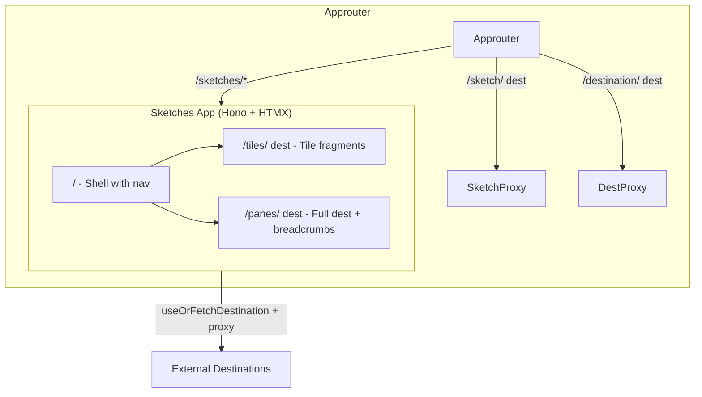

# Sketches Standalone App Plan

## Overview

Extract sketches into a standalone containerized app (`app/sketches`), add Helm deployment, route from approuter to it, and implement shell + tiles/panes routes with HTML base rewriting and breadcrumb navigation.

## Architecture



## 1. Create Sketches App (`app/sketches`)

New standalone Node app with Hono + HTMX:

- **Entry**: `app/sketches/server.js` - Hono app, `node --import tsx`
- **Routes**:
  - `GET /` - Shell with navigation (tile grid + nav to panes)
  - `GET /tiles/:dest` - Fetch from destination, rewrite HTML base to `/sketches/panes/{dest}/`, return fragment for hx-get
  - `GET /panes/:dest` - Fetch from destination, rewrite base, wrap in breadcrumb shell (links to other sketches)

- **Dependencies**: hono, @hono/node-server, @sap-cloud-sdk/connectivity, tsx
- **Proxy logic**: Port `app/router/sketch-proxy.js` `rewriteHtmlBase` and `createSketchMiddleware` into sketches app; base path becomes `/sketches/panes/{dest}/` for panes, `/sketches/tiles/{dest}/` for tiles
- **Config**: `app/sketches/sketches-destinations.json` (copy from `app/router/sketches-destinations.json`)
- **Destinations**: Sketches app needs `destination` binding (same as approuter) for `useOrFetchDestination`

## 2. Containerize

Add to `containerize.yaml`:

```yaml
- name: grant-management/sketches
  build-parameters:
    commands:
      - docker buildx build --platform linux/amd64 -t ${repo}/grant-management/sketches:${tag} -f app/sketches/Dockerfile .
```

Create `app/sketches/Dockerfile` (Node image, copy app, npm install, CMD with tsx).

## 3. Helm Chart

**Chart.yaml** - Add web-application subchart alias `sketches`:

```yaml
dependencies:
  - name: web-application
    alias: sketches
    version: ">0.0.0"
```

**values.yaml** - Add sketches block:

```yaml
sketches:
  replicaCount: 1
  bindings:
    destination:
      serviceInstanceName: destination
  image:
    repository: grant-management/sketches
  health:
    liveness:
      path: /
    readiness:
      path: /
```

**backendDestinations** - Add sketches service destination for approuter:

```yaml
sketches:
  service: sketches
  forwardAuthToken: false
  preserveHostHeader: true
```

## 4. Approuter Changes

**Remove** from `custom-server.js`:
- Sketches Hono middleware (`/sketches`)
- Keep `/sketch` proxy (as requested)

**xs-app.json** - Add route before catch-all:

```json
{
  "source": "^/sketches(.*)$",
  "target": "$1",
  "destination": "sketches",
  "csrfProtection": false,
  "authenticationType": "none"
}
```

**Remove** from app/router:
- `app/router/sketches/` folder
- `app/router/sketches-destinations.json`
- Sketch-related imports from custom-server

## 5. Sketches App Routes Detail

| Route | Purpose |
|-------|---------|
| `GET /` | Shell: nav bar, tile grid (hx-get to /tiles/{dest}), data sources list |
| `GET /tiles/:dest` | Proxy to dest `/{path}`, rewrite base to `/sketches/panes/{dest}/`, return fragment |
| `GET /panes/:dest` | Proxy to dest `/{path}`, rewrite base to `/sketches/panes/{dest}/`, wrap in breadcrumb shell |

**Base tag**: For panes, `<base href="/sketches/panes/{dest}/">` so embedded app assets resolve.

**Breadcrumb shell** (panes): Header with "Sketches" link (→ `/`) and current dest name; iframe or hx-get target for destination content.

## 6. Build Pipeline

- **cds build**: Add rsync for `app/sketches` → `gen/chart/sketches/` in package.json build
- Chart expects `gen/chart/sketches/` with Dockerfile build context

## 7. File Changes Summary

| Action | Path |
|--------|------|
| Create | app/sketches/package.json |
| Create | app/sketches/server.tsx |
| Create | app/sketches/proxy.ts |
| Create | app/sketches/sketches-destinations.json |
| Create | app/sketches/Dockerfile |
| Create | app/sketches/tsconfig.json |
| Update | containerize.yaml |
| Update | chart/Chart.yaml |
| Update | chart/values.yaml |
| Update | app/router/xs-app.json |
| Update | app/router/custom-server.js |
| Delete | app/router/sketches/ |
| Delete | app/router/sketches-destinations.json |
| Update | package.json (build script for sketches) |
