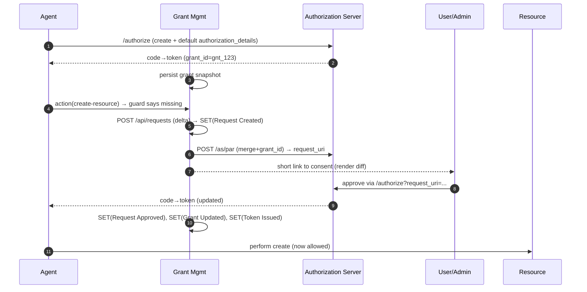

# MDC — Authorization Requests (Create & Merge) + Agent Flow & PAR

> Additive to the other MDC docs: this file shows concrete **authorization requests** for **create** and **merge**, how the **agent flow** works (APIs + events), and how we use **Pushed Authorization Requests (PAR)** to produce short consent links. Types for `authorization_details` are open‑ended (e.g., `mcp-tools`, `fs`, `api`, or custom). Validation is done by the **consuming side**; this service provides secure grant lifecycle and consent rendering.

---

## 1) Quick visual

**Create** (initial grant):

**Merge** (ask for more later):

---

## 2) Authorization Requests

### 2.1 Initial authorization (create)

Client requests defaults (e.g., view cloud resources + application logs). The **grant** returned in the token response carries a `grant_id` and `authorization_details` snapshot persisted by our service.

**Readable ********`authorization_details`******** JSON**

```json
[
  { "type": "mcp-tools", "server": "https://mcp.example.net", "tools": ["cloud.view","logs.view"], "actions": ["run"], "locations": ["eu1"] },
  { "type": "fs", "root": "/workspace", "resources": ["/workspace/logs/*"], "actions": ["read"] },
  { "type": "api", "resources": ["urn:svc:cloud"], "actions": ["read"] }
]
```

**Front‑channel (GET /authorize) example**

```http
GET /authorize?response_type=code&client_id=client-123&redirect_uri=https%3A%2F%2Fapp.example.com%2Fcb
  &scope=openid%20grant_management_query
  &grant_management_action=create
  &authorization_details=%5B%7B%22type%22%3A%22mcp-tools%22%2C%22server%22%3A%22https%3A%2F%2Fmcp.example.net%22%2C%22tools%22%3A%5B%22cloud.view%22%2C%22logs.view%22%5D%2C%22actions%22%3A%5B%22run%22%5D%2C%22locations%22%3A%5B%22eu1%22%5D%7D%2C%7B%22type%22%3A%22fs%22%2C%22root%22%3A%22%2Fworkspace%22%2C%22resources%22%3A%5B%22%2Fworkspace%2Flogs%2F*%22%5D%2C%22actions%22%3A%5B%22read%22%5D%7D%2C%7B%22type%22%3A%22api%22%2C%22resources%22%3A%5B%22urn%3Asvc%3Acloud%22%5D%2C%22actions%22%3A%5B%22read%22%5D%7D%5D
```

**Token response (excerpt)**

```json
{ "access_token": "…", "refresh_token": "…", "grant_id": "gnt_123" }
```

### 2.2 Expanding later (merge)

When the security guard detects the agent tries to **create** a new resource (not covered by the current grant), it triggers a **merge**.

**Delta authorization we ask for**

```json
[
  { "type": "mcp-tools", "server": "https://mcp.example.net", "tools": ["cloud.create"], "actions": ["run"], "locations": ["eu1"] },
  { "type": "api", "resources": ["urn:svc:cloud:resource"], "actions": ["create","write"] }
]
```

**Front‑channel (GET /authorize) merge**

```http
GET /authorize?response_type=code&client_id=client-123&redirect_uri=https%3A%2F%2Fapp.example.com%2Fcb
  &scope=openid%20grant_management_query
  &grant_id=gnt_123
  &grant_management_action=merge
  &authorization_details=%5B%7B%22type%22%3A%22mcp-tools%22%2C%22server%22%3A%22https%3A%2F%2Fmcp.example.net%22%2C%22tools%22%3A%5B%22cloud.create%22%5D%2C%22actions%22%3A%5B%22run%22%5D%2C%22locations%22%3A%5B%22eu1%22%5D%7D%2C%7B%22type%22%3A%22api%22%2C%22resources%22%3A%5B%22urn%3Asvc%3Acloud%3Aresource%22%5D%2C%22actions%22%3A%5B%22create%22%2C%22write%22%5D%7D%5D
```

**Token response (excerpt)**

```json
{ "access_token": "…", "refresh_token": "…", "grant_id": "gnt_123" }
```

> Use **replace** instead of merge to *narrow* the set (authoritative reset). See the Protocol‑Aligned Flows doc for semantics.

### 2.3 PAR (pushed authorization request)

For short, tamper‑proof consent links, push the same payload to the AS first, then redirect with the returned `request_uri`.

**POST /as/par (create)**

```http
POST /as/par
Content-Type: application/x-www-form-urlencoded

response_type=code&client_id=client-123&redirect_uri=https%3A%2F%2Fapp.example.com%2Fcb&
code_challenge=…&code_challenge_method=S256&
grant_management_action=create&
authorization_details=[{"type":"mcp-tools","server":"https://mcp.example.net","tools":["cloud.view","logs.view"],"actions":["run"],"locations":["eu1"]}]
```

**201** `{ "request_uri": "urn:…:request_uri:abc", "expires_in": 90 }`

**Redirect**

```http
GET /authorize?client_id=client-123&request_uri=urn%3A…%3Arequest_uri%3Aabc
```

**POST /as/par (merge)**

```http
POST /as/par
Content-Type: application/x-www-form-urlencoded

response_type=code&client_id=client-123&redirect_uri=https%3A%2F%2Fapp.example.com%2Fcb&
code_challenge=…&code_challenge_method=S256&
grant_id=gnt_123&grant_management_action=merge&
authorization_details=[{"type":"api","resources":["urn:svc:cloud:resource"],"actions":["create","write"]}]
```

**Short link pattern** (nice UX): `https://auth.example.com/c/abc` → resolves to the `request_uri` flow.

---

## 3) End‑to‑end Agent Flow (story)

1. **Bootstrap** — Agent signs in and performs **create** with default tools (view cloud, view logs). Token contains `grant_id=gnt_123`. Our service stores the grant and `authorization_details` snapshot.
2. **Operate** — Agent calls MCP tools and APIs that are **covered** (view/read). OK.
3. **Guard check** — Agent attempts **create** (e.g., provision resource). Security guard compares intent vs current `authorization_details` and finds **missing** capability.
4. **Stage request** (optional HITL) — `POST /api/requests` (delta). We send SET **Request Created** and render a **consent screen** showing the diff.
5. **PAR** — We push the merge request to `/as/par` → `request_uri`, generate a **short link** and notify the user/admin UI.
6. **Decision** — Approve → we complete authorization with **merge** using the same `grant_id`.
7. **Persist & notify** — We update stored grant view and emit **Grant Updated (merge)** + OAuth **Token Issued**. (If denied/expired: send matching events.)
8. **Resume** — Agent retries the action; now it’s permitted.

---

## 4) Events (what we emit)

* **SET envelope** for all events; one URI per `events` claim.
* **Request lifecycle**: `request-created`, `request-approved|denied|expired` (our namespace)
* **Grant lifecycle**: `grant-created|updated|replaced|revoked` (our namespace)
* **Token lifecycle**: `token-issued`, `token-revoked`, `tokens-revoked` (OAuth Event Types)
* **Consent (optional)**: a consent event payload including a `consentUri` list that references the approved terms/diff.

*Minimal examples are in the Events MDC; reuse them here with the delta payloads for merge.*

---

## 5) `authorization_details` types (open set)

Grant Management is **type‑agnostic**. Common patterns:

* `mcp-tools` — fields: `server`, `tools[]`, `actions[]`, `locations[]`
* `fs` — fields: `root`, `resources[]` (globs/URNs), `actions[]` (`read`, `write`, `create`, `delete`)
* `api` — fields: `resources[]` (URNs or URLs), `actions[]`, optional `verbs[]`, `audience`
* **custom** — any domain schema; consumers validate and enforce.

> Consumers (MCP servers, file systems, APIs, Security Gaurds) are responsible for **enforcement**. This service ensures **secure lifecycle, audit, and consent UX**.

---

## 6) REST surface (this repo)

* **Grant endpoint**: `GET /api/grants/{grant_id}`; `DELETE /api/grants/{grant_id}`
* **Request staging**: `POST /api/requests`, `GET /api/requests/{id}`, `POST /api/requests/{id}/approve|deny`
* **Discovery** (metadata): include grant mgmt actions supported; expose PAR capability via AS metadata (out of scope for this service, but we read it).

---

## 7) Mermaid (agent + PAR happy path)



---

## 8) Security notes

* Treat `grant_id` / `request_id` as non‑secrets; **never** leak tokens via these APIs.
* Prefer hashed token identifiers in SET payloads; sign all SETs; encrypt when PII present.
* Ensure merge requests display a **clear diff** in consent UI.
* For **replace**, consider token revocation cascade.

---

## 9) Checklist

*
