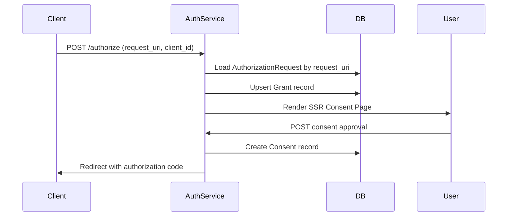

# Authorization Service: Actions and CAP Entities

**Created**: 2025-11-30
**Last Updated**: 2025-11-30
**Category**: [ARCHITECTURE] [OAUTH]
**Timeline**: 01 of 05 - Core Service Documentation

## Overview

The **Authorization Service** (`sap.scai.grants.AuthorizationService`) implements an OAuth 2.0 Authorization Server with support for:

- **Rich Authorization Requests (RAR)** - RFC 9396
- **Pushed Authorization Requests (PAR)** - RFC 9126  
- **Grant Management** - OAuth 2.0 Grant Management extension
- **PKCE** - Proof Key for Code Exchange
- **On-Behalf-Of (OBO)** - Actor delegation patterns

This service is the **entry point** for OAuth authorization flows, handling consent UI, authorization code generation, and token issuance.

---

## Service Definition

```cds
// srv/authorization-service/authorization-service.cds
@path: '/oauth-server'
@impl: './authorization-service.tsx'
@protocol: 'rest'
service AuthorizationService {
    entity AuthorizationRequests as projection on grants.AuthorizationRequests;
    entity Consents as projection on grants.Consents;
    
    action authorize(...) returns String;
    function authorize_dialog(...) returns String;
    function callback(grant_id: String) returns String;
    action par(...) returns { request_uri: String; expires_in: Integer; };
    action token(...) returns { access_token: String; ... };
    action metadata() returns { ... };
}
```

### Why REST Protocol?

The service uses `@protocol: 'rest'` instead of OData because:

1. **OAuth 2.0 compliance** - Standard OAuth endpoints expect REST semantics
2. **Custom response formats** - Token responses, PAR responses use OAuth-specific JSON
3. **HTML rendering** - The `authorize` action returns server-rendered HTML
4. **Standard integration** - OAuth clients expect standard REST endpoints, not OData

---

## Core Actions

### 1. `authorize` - Authorization Endpoint

**Purpose**: Display consent UI and initiate authorization flow

**Signature**:
```typescript
action authorize(
    request_uri: String,  // PAR request URI (urn:ietf:params:oauth:request_uri:...)
    client_id: String     // OAuth client identifier
) returns String;         // Returns HTML (SSR consent page)
```

**Flow**:



**Implementation Highlights**:

```typescript
// srv/authorization-service/handler.authorize.tsx
export default async function authorize(req) {
  const { request_uri } = req.data;
  const id = request_uri.split(":").pop();
  
  // Load authorization request
  const request = await this.read(AuthorizationRequests, id);
  
  // Upsert grant (create or merge)
  const grant = await grantManagement.upsert({
    id: request.grant_id,
    client_id: request.client_id,
    risk_level: request.risk_level,
    actor: request.requested_actor,
    subject: request.subject,
  }).into(Grants);
  
  // Render SSR consent page with HTMX form
  return htmlTemplate(
    renderToString(<ConsentForm request={request} grant={grant} />)
  );
}
```

**Key Features**:

- **Server-Side Rendering (SSR)** - Returns full HTML page with React components
- **HTMX integration** - Form submission without full page reload
- **Grant lifecycle management** - Supports create/merge/replace operations
- **Rich Authorization Details** - Displays requested tools/permissions visually

---

### 2. `par` - Pushed Authorization Request

**Purpose**: Pre-register authorization parameters before redirecting user

**Signature**:
```typescript
action par(
    response_type: String,
    client_id: String,
    redirect_uri: String,
    scope: String,
    state: String,
    code_challenge: String,
    code_challenge_method: String,
    grant_management_action: String,  // create/merge/replace
    grant_id: String,                  // For merge/replace operations
    authorization_details: String,     // JSON array (RAR)
    requested_actor: String,           // OBO actor URN
    subject_token_type: String,
    subject_token: String,
    subject: String
) returns {
    request_uri: String;  // urn:ietf:params:oauth:request_uri:...
    expires_in: Integer;  // 90 seconds
};
```

**Why PAR?**

1. **Security** - Prevents authorization parameter tampering
2. **Large payloads** - RAR authorization_details can be large (e.g., tool lists)
3. **Privacy** - Sensitive data not exposed in browser URL
4. **Best practice** - Recommended by OAuth 2.0 Security BCP

**Implementation**:

```typescript
// srv/authorization-service/handler.requests.tsx
export default async function par(req) {
  const { authorization_details, grant_management_action, ...params } = req.data;
  
  // Parse authorization_details JSON
  const parsedDetails = JSON.parse(authorization_details || "[]");
  
  // Generate grant_id for new grants
  const grant_id = params.grant_id || `grant_${ulid()}`;
  
  // Store authorization request
  const request = await this.create(AuthorizationRequests, {
    ...params,
    grant_id,
    grant_management_action,
    authorization_details,
    access: parsedDetails,  // Parsed for easy CDS querying
    expires_at: Date.now() + 90000,
    status: 'pending'
  });
  
  return {
    request_uri: `urn:ietf:params:oauth:request_uri:${request.ID}`,
    expires_in: 90
  };
}
```

---

### 3. `token` - Token Exchange Endpoint

**Purpose**: Exchange authorization code for access token

**Signature**:
```typescript
action token(
    grant_type: String,        // "authorization_code"
    client_id: String,
    code: String,              // Authorization code
    code_verifier: String,     // PKCE verifier
    redirect_uri: String
) returns {
    access_token: String;
    token_type: String;        // "Bearer"
    expires_in: Integer;       // 3600
    scope: String;
    grant_id: String;          // Grant Management extension
    actor: String;             // OBO actor
    authorization_details: array of AuthorizationDetailRequest;
};
```

**Implementation**:

```typescript
// srv/authorization-service/handler.token.tsx
export default async function token(req) {
  const { grant_type, code } = req.data;
  
  if (grant_type !== "authorization_code") {
    return req.error(400, "unsupported_grant_type");
  }
  
  // Read authorization request (code = request ID)
  const { grant_id } = await this.read(AuthorizationRequests, code);
  
  // Fetch grant details (bypass UI handlers)
  const grantRecord = await cds.run(
    cds.ql.SELECT.one.from(Grants).where({ id: grant_id })
  );
  
  // Fetch authorization details
  const authorization_details = await cds.run(
    cds.ql.SELECT.from(AuthorizationDetails)
      .where({ consent_grant_id: grant_id })
  );
  
  // Issue token with grant_id
  return {
    access_token: `at_${ulid()}:${grant_id}`,
    token_type: "Bearer",
    expires_in: 3600,
    scope: grantRecord.scope,
    grant_id,
    authorization_details,
    actor: grantRecord.actor
  };
}
```

**Why Direct DB Queries?**

Notice the use of `cds.run(cds.ql.SELECT...)` instead of `this.read(Grants, ...)`:

- **Avoid UI handler triggers** - `this.read()` would trigger GET handlers that render HTML
- **Performance** - Direct DB access is faster for token endpoint
- **Control** - Explicit control over data fetching without side effects

---

### 4. `callback` - Default Redirect Handler

**Purpose**: Handle authorization completion when no redirect_uri specified

**Signature**:
```typescript
function callback(grant_id: String) returns String;
```

**Use Case**:

When `redirect_uri = "urn:scai:grant:callback"`, the service renders a success page instead of redirecting:

```typescript
// srv/authorization-service/handler.callback.tsx
export default async function callback(req) {
  const grant = await this.read(Grants, req.data.grant_id);
  
  return render(req, (
    <div className="success-page">
      <h1>✅ Authorization Granted</h1>
      <p>Grant ID: {grant.id}</p>
      <a href="/grants-management/Grants">View Your Grants</a>
    </div>
  ));
}
```

---

### 5. `metadata` - Authorization Server Metadata

**Purpose**: RFC 8414 - OAuth 2.0 Authorization Server Metadata

**Returns**:
```json
{
  "issuer": "https://host",
  "authorization_endpoint": "https://host/oauth-server/authorize",
  "token_endpoint": "https://host/oauth-server/token",
  "pushed_authorization_request_endpoint": "https://host/oauth-server/par",
  "authorization_details_types_supported": ["mcp", "fs", "database", "api"],
  "grant_types_supported": ["authorization_code"],
  "response_types_supported": ["code"],
  "code_challenge_methods_supported": ["S256"]
}
```

---

## CAP Entities

### 1. `AuthorizationRequests`

**Purpose**: Store PAR parameters and track authorization state

**Schema**:

```cds
entity AuthorizationRequests: cuid, managed {
  // OAuth parameters
  client_id: String;
  redirect_uri: String;
  request_uri: String;         // urn:ietf:params:oauth:request_uri:...
  scope: String;               // Space-separated scopes
  state: String;
  code_challenge: String;      // PKCE
  code_challenge_method: String; // S256
  
  // Rich Authorization Requests (RAR)
  authorization_details: String; // JSON array
  access: array of AuthorizationDetailRequest; // Parsed
  
  // Grant Management
  grant_management_action: String; // create/merge/replace
  
  // On-Behalf-Of (OBO)
  requested_actor: String;     // urn:agent:finance-v1
  subject_token_type: String;
  subject_token: String;
  subject: User;
  
  // Lifecycle
  expires_at: String;
  expires_in: Integer;
  status: String;              // pending/used/expired
  risk_level: String;          // low/medium/high
  
  // Associations
  grant: Association to Grants;
  consent: Association to Consents;
}
```

**Key Design Decisions**:

1. **Dual storage of authorization_details**:
   - `authorization_details` (String) - Original JSON from client
   - `access` (array) - Parsed for CDS querying and UI rendering

2. **request_uri as primary identifier** - Used in authorize flow

3. **Short expiration** - 90 seconds, forces clients to use PAR immediately

---

### 2. `Consents`

**Purpose**: Record user consent decisions

**Schema**:

```cds
entity Consents: cuid, managed {
  key grant_id: String;
  grant: Association to Grants;
  request: Association to AuthorizationRequests;
  
  // Consent data
  client_id: String;
  scope: String;
  subject: User;
  actor: String;
  
  // Composition
  authorization_details: Composition of many AuthorizationDetails;
  
  // History tracking
  previous_consent: Association to Consents;
  duration: Timespan;
  
  // Calculated
  redirect_uri: String = request.redirect_uri;
}
```

**Why Composition for authorization_details?**

- **Data integrity** - Authorization details belong to consent
- **Cascade delete** - Deleting consent removes authorization details
- **Querying** - Easy to fetch all details with `$expand=authorization_details`

---

## Event Handlers

### Before Handlers

```typescript
// Normalize consent payloads before validation
this.before("CREATE", Consents, async (req) => {
  const d = req.data;
  
  // Resolve grant_id from Promise/object
  if (d.grant_id?.then) d.grant_id = await d.grant_id;
  if (typeof d.grant_id === "object") {
    d.grant_id = d.grant_id.ID || d.grant_id.id;
  }
  
  // Resolve from AuthorizationRequest if missing
  if (!d.grant_id && d.request_ID) {
    const reqRec = await this.read(AuthorizationRequests, d.request_ID);
    d.grant_id = reqRec.grant_id;
  }
  
  // Normalize associations
  if (d.request_ID && !d.request) {
    d.request = { ID: d.request_ID };
  }
});
```

**Why This Complexity?**

- **Flexible input** - Supports various client formats (tests, UI, API)
- **Type safety** - Ensures grant_id is always a string
- **Association handling** - CDS requires structured foreign keys

---

### After Handlers

```typescript
this.on("CREATE", Consents, async (req, next) => {
  const consent = await next(req);
  const request = await this.read(AuthorizationRequests, consent.request_ID);
  
  // Handle default callback URN
  if (request.redirect_uri === "urn:scai:grant:callback") {
    return await callback.call(this, req);
  } else {
    // Standard OAuth redirect with authorization code
    req.http.res.redirect(301, 
      `${request.redirect_uri}?code=${consent.request_ID}`
    );
  }
  
  return consent;
});
```

---

## Design Patterns

### 1. REST Actions for OAuth Compliance

```cds
@protocol: 'rest'
action authorize(...) returns String;
```

- OAuth clients expect standard REST endpoints
- Token responses have specific JSON structure
- HTML rendering for consent pages

### 2. Server-Side Rendering (SSR)

```typescript
return htmlTemplate(
  renderToString(<ConsentPage {...props} />)
);
```

**Benefits**:
- No client-side JavaScript required
- Fast initial page load
- SEO-friendly (if public pages added)
- HTMX for progressive enhancement

### 3. Rich Authorization Requests (RAR)

```json
{
  "authorization_details": [
    {
      "type": "mcp",
      "server": "filesystem",
      "tools": { "read_file": true, "write_file": false },
      "locations": ["/workspace"]
    }
  ]
}
```

**Advantages**:
- Fine-grained permissions
- Tool-specific authorization
- Better consent UI
- Extensible for new resource types

### 4. Grant Management Integration

```typescript
// Token response includes grant_id
{
  "access_token": "at_...",
  "grant_id": "grant_01HXG..."  // ← Enables grant query/revoke
}
```

**Enables**:
- Query grant status via Grant Management API
- Revoke grants programmatically
- Merge/update permissions without re-consent

---

## Security Considerations

### 1. PKCE (Proof Key for Code Exchange)

```cds
code_challenge: String;
code_challenge_method: String;  // S256
```

- **Prevents authorization code interception**
- Required for public clients (SPAs, mobile apps)
- S256 = SHA-256 hash of code_verifier

### 2. PAR (Pushed Authorization Requests)

- **Prevents parameter tampering**
- **Short expiration (90s)** - Reduces attack window
- **Server-side validation** before user sees consent

### 3. Risk Assessment

```cds
risk_level: String;  // low/medium/high
```

- Calculated based on requested permissions
- Displayed prominently in consent UI
- Can trigger additional verification flows

---

## Integration Points

### 1. Grant Management Service

```typescript
const grantManagement = await cds.connect.to(GrantsManagementService);
const grant = await grantManagement.upsert(...).into(Grants);
```

- **Loose coupling** - Services communicate via CDS APIs
- **Grant lifecycle** - Authorization Service creates, Grant Management queries/revokes

### 2. User Authentication

```typescript
subject: User;  // From cds.context.user
```

- Relies on upstream authentication (IAS, XSUAA)
- Authorization Service focuses on **authorization**, not **authentication**

### 3. Destination Service (Future)

- Token exchange with destination service
- Inject logging/monitoring
- Wrap IAS OAuth flows

---

## API Endpoints

| Endpoint | Method | Purpose |
|----------|--------|---------|
| `/oauth-server/par` | POST | Push authorization request |
| `/oauth-server/authorize` | GET/POST | Display consent UI |
| `/oauth-server/authorize_dialog` | GET | Alternative consent dialog |
| `/oauth-server/callback` | GET | Handle default redirect |
| `/oauth-server/token` | POST | Exchange code for token |
| `/oauth-server/metadata` | GET | Server metadata (RFC 8414) |

---

## Example Flow

### Complete Authorization Flow

```bash
# 1. Client pushes authorization request (PAR)
POST /oauth-server/par
{
  "response_type": "code",
  "client_id": "mcp-client",
  "redirect_uri": "https://client.app/callback",
  "scope": "filesystem_read filesystem_write",
  "code_challenge": "E9Melhoa2OwvFrEMTJguCHaoeK1t8URWbuGJSstw-cM",
  "code_challenge_method": "S256",
  "authorization_details": "[{\"type\":\"fs\",\"locations\":[\"/workspace\"]}]"
}

# Response:
{
  "request_uri": "urn:ietf:params:oauth:request_uri:01HXG...",
  "expires_in": 90
}

# 2. Client redirects user to authorize endpoint
GET /oauth-server/authorize?request_uri=urn:...&client_id=mcp-client
# → User sees SSR consent page

# 3. User approves consent
POST /oauth-server/AuthorizationRequests/{id}/consent
{
  "grant_id": "grant_01HXG...",
  "subject": "user@example.com",
  "scope": "filesystem_read filesystem_write"
}

# → Redirect: https://client.app/callback?code=01HXG...

# 4. Client exchanges code for token
POST /oauth-server/token
{
  "grant_type": "authorization_code",
  "code": "01HXG...",
  "code_verifier": "dBjftJeZ4CVP-mB92K27uhbUJU1p1r_wW1gFWFOEjXk",
  "redirect_uri": "https://client.app/callback",
  "client_id": "mcp-client"
}

# Response:
{
  "access_token": "at_01HXG...:grant_01HXG...",
  "token_type": "Bearer",
  "expires_in": 3600,
  "scope": "filesystem_read filesystem_write",
  "grant_id": "grant_01HXG...",
  "authorization_details": [
    {
      "type": "fs",
      "locations": ["/workspace"],
      "permissions": { "read": true, "write": true }
    }
  ]
}
```

---

## Testing Considerations

### Unit Tests

```typescript
// test/oauth-basic-flow.test.ts
test("should complete OAuth authorization flow", async () => {
  // 1. PAR
  const { request_uri } = await POST("/oauth-server/par", { ... });
  
  // 2. Authorize (returns HTML)
  const html = await GET(`/oauth-server/authorize?request_uri=${request_uri}`);
  expect(html).toContain("Grant Consent");
  
  // 3. Consent
  await POST(`/oauth-server/AuthorizationRequests/${id}/consent`, { ... });
  
  // 4. Token exchange
  const token = await POST("/oauth-server/token", { ... });
  expect(token.grant_id).toBeDefined();
});
```

---

## Future Enhancements

1. **Refresh tokens** - Long-lived access
2. **Token revocation endpoint** - RFC 7009
3. **Device authorization grant** - RFC 8628
4. **OAuth 2.1 compliance** - Latest best practices
5. **SETs (Security Event Tokens)** - Token lifecycle events

---

## Related Documentation

- [02_GRANT_MANAGEMENT_SERVICE.md](./02_GRANT_MANAGEMENT_SERVICE.md) - Grant query/revoke APIs
- [03_SSR_AND_HTMX.md](./03_SSR_AND_HTMX.md) - Server-side rendering patterns
- [04_TOKEN_APIS_AND_IAS_WRAPPING.md](./04_TOKEN_APIS_AND_IAS_WRAPPING.md) - Token exchange details
- [05_DEBUGGING_AND_LOGGING.md](./05_DEBUGGING_AND_LOGGING.md) - Debugging patterns

---

## References

- **OAuth 2.0 Core** - RFC 6749
- **PKCE** - RFC 7636
- **PAR** - RFC 9126
- **RAR** - RFC 9396
- **OAuth 2.0 Grant Management** - Draft specification
- **Authorization Server Metadata** - RFC 8414
