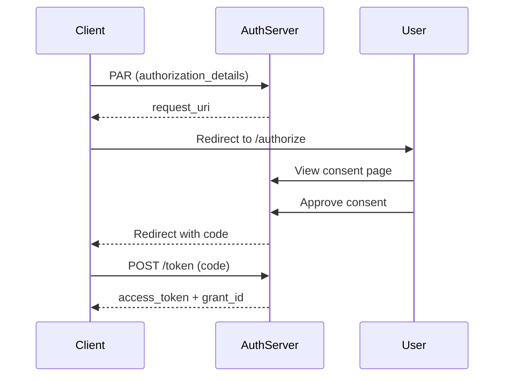
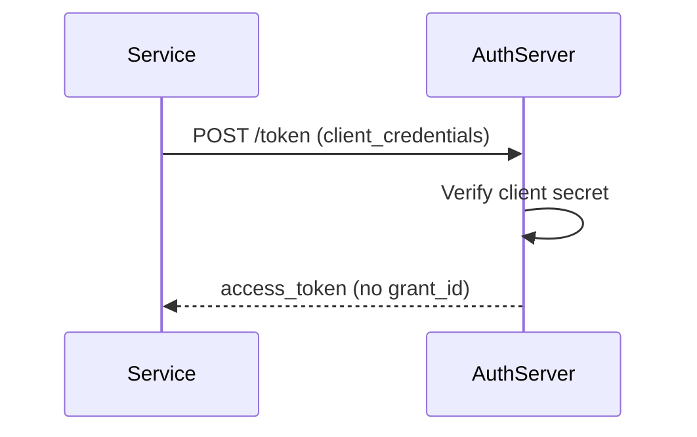
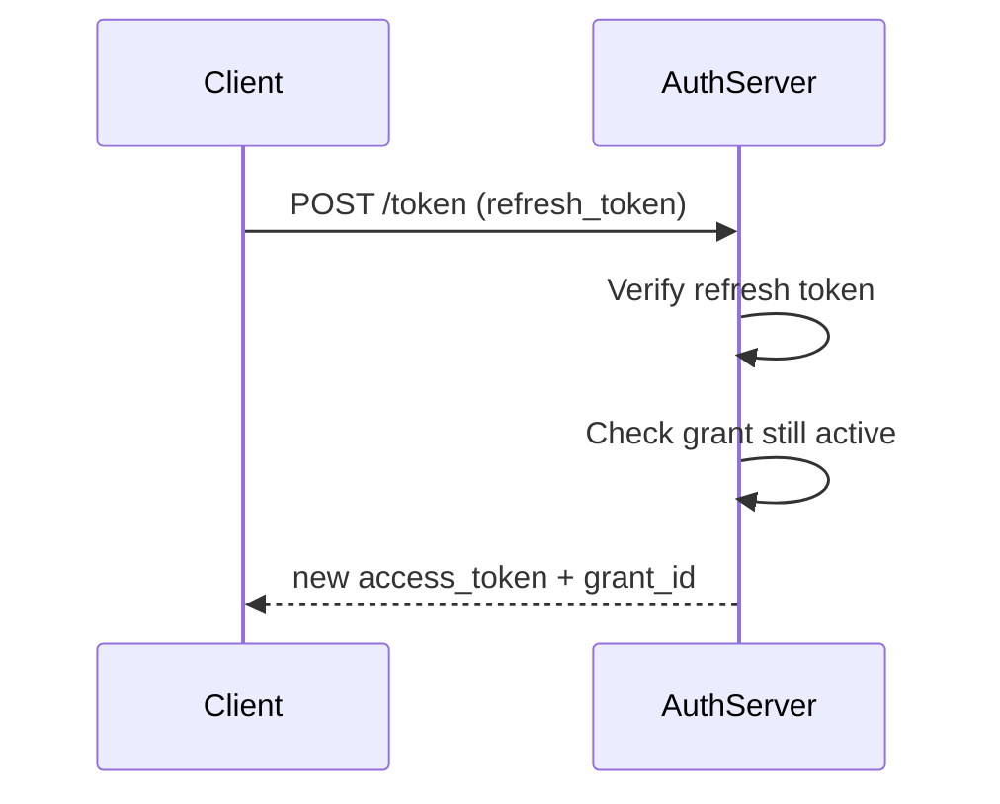
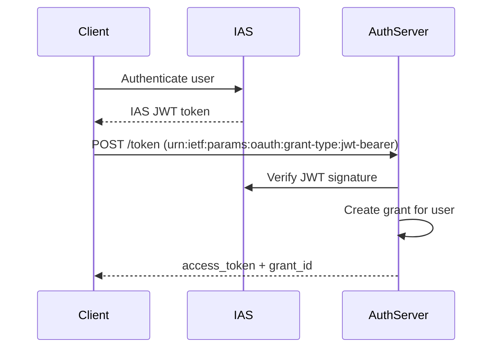
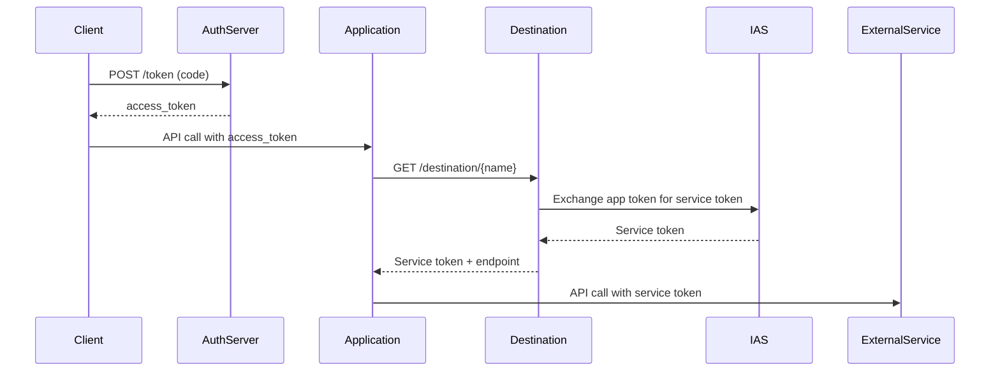

# Token APIs and IAS Service Wrapping

**Created**: 2025-11-30
**Last Updated**: 2025-11-30
**Category**: [ARCHITECTURE] [OAUTH] [TOKENS] [IAS]
**Timeline**: 04 of 05 - Token Management Documentation

## Overview

This document covers:

1. **Token endpoint implementation** - OAuth 2.0 token exchange
2. **Grant types supported** - authorization_code, client_credentials, etc.
3. **IAS (Identity Authentication Service) wrapping** - Token exchange with external identity provider
4. **Destination Service integration** - Token exchange for service-to-service communication
5. **Debugging and logging** - Observability patterns

---

## Token Endpoint Architecture

```
┌──────────────────────────────────────────────────────────────┐
│  OAuth Client                                                │
│  ┌────────────────────────────────────────────────────────┐ │
│  │  POST /oauth-server/token                              │ │
│  │  {                                                     │ │
│  │    "grant_type": "authorization_code",                │ │
│  │    "code": "01HXG...",                                │ │
│  │    "code_verifier": "...",                            │ │
│  │    "redirect_uri": "https://...",                     │ │
│  │    "client_id": "mcp-client"                          │ │
│  │  }                                                     │ │
│  └────────────────────────────────────────────────────────┘ │
└──────────────────────────────────────────────────────────────┘
                            │
                            ▼
┌──────────────────────────────────────────────────────────────┐
│  Authorization Service                                       │
│  ┌────────────────────────────────────────────────────────┐ │
│  │  handler.token.tsx                                     │ │
│  │                                                        │ │
│  │  1. Validate grant_type                               │ │
│  │  2. Verify authorization code                         │ │
│  │  3. Fetch grant details                               │ │
│  │  4. Fetch authorization_details                       │ │
│  │  5. Generate access token                             │ │
│  │  6. Return token response with grant_id               │ │
│  └────────────────────────────────────────────────────────┘ │
└──────────────────────────────────────────────────────────────┘
                            │
                            ▼
┌──────────────────────────────────────────────────────────────┐
│  Token Response                                              │
│  {                                                           │
│    "access_token": "at_01HXG...:grant_01HXG...",           │
│    "token_type": "Bearer",                                  │
│    "expires_in": 3600,                                      │
│    "scope": "filesystem_read filesystem_write",             │
│    "grant_id": "grant_01HXG...",                           │
│    "actor": "urn:agent:finance-v1",                        │
│    "authorization_details": [...]                           │
│  }                                                           │
└──────────────────────────────────────────────────────────────┘
```

---

## Token Endpoint Implementation

### Authorization Code Grant

**Most common OAuth flow** - Used after user consents

```typescript
// srv/authorization-service/handler.token.tsx
import cds from "@sap/cds";
import { ulid } from "ulid";

export default async function token(
  this: AuthorizationService,
  req: cds.Request<{ grant_type: string; code: string }>
) {
  console.log("🔐 Token request:", req.data);
  const { grant_type, code } = req.data;
  
  // 1. Validate grant type
  if (grant_type !== "authorization_code") {
    return req.error(400, "unsupported_grant_type");
  }
  
  // 2. Fetch authorization request (code = request ID)
  const { grant_id } = await this.read(AuthorizationRequests, code);
  
  if (!grant_id) {
    return req.error(400, "invalid_grant");
  }
  
  // 3. Fetch grant record (bypass UI handlers)
  const grantRecord = await cds.run(
    cds.ql.SELECT.one.from(Grants).where({ id: grant_id })
  );
  
  if (!grantRecord) {
    return req.error(400, "invalid_grant");
  }
  
  // 4. Fetch authorization details
  const authorization_details = await cds.run(
    cds.ql.SELECT.from(AuthorizationDetails)
      .where({ consent_grant_id: grant_id })
  );
  
  // 5. Extract grant data
  const scope = grantRecord.scope || "";
  const actor = grantRecord.actor;
  
  // 6. Generate access token
  const access_token = `at_${ulid()}:${grant_id}`;
  
  console.log("✅ Token response", {
    scope,
    grant_id,
    authorization_details: authorization_details.length,
    actor,
  });
  
  // 7. Return OAuth token response
  return {
    access_token,
    token_type: "Bearer",
    expires_in: 3600,
    scope,
    grant_id,              // Grant Management extension
    authorization_details, // Rich Authorization Requests
    actor,                 // On-Behalf-Of extension
  };
}
```

---

### Token Response Structure

#### Standard OAuth 2.0 Fields

```json
{
  "access_token": "at_01HXG123...:grant_01HXG456...",
  "token_type": "Bearer",
  "expires_in": 3600,
  "scope": "filesystem_read filesystem_write",
  "refresh_token": "rt_01HXG..." // (future)
}
```

#### Extensions

**Grant Management** (OAuth 2.0 Grant Management):

```json
{
  "grant_id": "grant_01HXG456..."
}
```

**Rich Authorization Requests** (RFC 9396):

```json
{
  "authorization_details": [
    {
      "type": "fs",
      "locations": ["/workspace"],
      "permissions": { "read": true, "write": true }
    }
  ]
}
```

**On-Behalf-Of** (Actor Token):

```json
{
  "actor": "urn:agent:finance-v1"
}
```

---

### Access Token Format

```
at_01HXG123456789ABCDEF:grant_01HXG456789ABCDEF012
│   │                    │
│   └─ ULID (sortable)   └─ Grant ID (for introspection)
└─ Token prefix
```

**Design Decisions**:

1. **ULID prefix** - Sortable, URL-safe, globally unique
2. **Grant ID suffix** - Enables token introspection without database lookup
3. **Colon separator** - Easy to parse
4. **No cryptographic signature** - Simple for demos, should use JWT in production

**Production considerations**:

```typescript
// Use JWT for production
const access_token = jwt.sign(
  {
    sub: grantRecord.subject,
    scope: grantRecord.scope,
    grant_id: grant_id,
    authorization_details: authorization_details,
    actor: grantRecord.actor,
  },
  process.env.JWT_SECRET,
  {
    expiresIn: "1h",
    issuer: "https://auth.example.com",
    audience: "https://api.example.com",
  }
);
```

---

## Grant Types Supported

### 1. Authorization Code (Implemented)

**Use case**: User authorizes application to access resources

**Flow**:



**Request**:

```http
POST /oauth-server/token
Content-Type: application/x-www-form-urlencoded

grant_type=authorization_code
&code=01HXG...
&code_verifier=dBjftJeZ4CVP...
&redirect_uri=https://client.app/callback
&client_id=mcp-client
```

---

### 2. Client Credentials (Future)

**Use case**: Service-to-service authentication (no user)

**Flow**:



**Request**:

```http
POST /oauth-server/token
Content-Type: application/x-www-form-urlencoded
Authorization: Basic base64(client_id:client_secret)

grant_type=client_credentials
&scope=service_read service_write
```

**Implementation** (placeholder):

```typescript
if (grant_type === "client_credentials") {
  // 1. Verify client credentials
  const client = await verifyClient(req.headers.authorization);
  
  // 2. Issue token without grant_id (no user consent)
  return {
    access_token: `at_${ulid()}`,
    token_type: "Bearer",
    expires_in: 3600,
    scope: req.data.scope,
  };
}
```

---

### 3. Refresh Token (Future)

**Use case**: Obtain new access token without user interaction

**Flow**:



**Request**:

```http
POST /oauth-server/token
Content-Type: application/x-www-form-urlencoded

grant_type=refresh_token
&refresh_token=rt_01HXG...
&client_id=mcp-client
```

**Implementation** (future):

```typescript
if (grant_type === "refresh_token") {
  const { refresh_token } = req.data;
  
  // 1. Verify refresh token
  const tokenRecord = await cds.run(
    cds.ql.SELECT.one.from(RefreshTokens)
      .where({ token_hash: sha256(refresh_token) })
  );
  
  if (!tokenRecord || tokenRecord.revoked) {
    return req.error(400, "invalid_grant");
  }
  
  // 2. Check grant still active
  const grant = await cds.run(
    cds.ql.SELECT.one.from(Grants)
      .where({ id: tokenRecord.grant_id })
  );
  
  if (grant.status !== "active") {
    return req.error(400, "invalid_grant");
  }
  
  // 3. Issue new access token
  return {
    access_token: `at_${ulid()}:${grant.id}`,
    token_type: "Bearer",
    expires_in: 3600,
    scope: grant.scope,
    grant_id: grant.id,
  };
}
```

---

### 4. Token Exchange (JWT Bearer) - IAS Integration

**Use case**: Exchange external token (IAS) for application token

**Flow**:



**Request**:

```http
POST /oauth-server/token
Content-Type: application/x-www-form-urlencoded

grant_type=urn:ietf:params:oauth:grant-type:jwt-bearer
&assertion=eyJhbGciOiJSUzI1NiIsInR5cCI6IkpXVCJ9...
&scope=filesystem_read
```

**Implementation** (future):

```typescript
if (grant_type === "urn:ietf:params:oauth:grant-type:jwt-bearer") {
  const { assertion } = req.data;
  
  // 1. Verify JWT (IAS token)
  const payload = await verifyIASToken(assertion);
  
  // 2. Create or find grant for user
  const grant = await cds.run(
    cds.ql.UPSERT.into(Grants).entries({
      id: `grant_${ulid()}`,
      subject: payload.sub,
      scope: req.data.scope,
      client_id: req.data.client_id,
    })
  );
  
  // 3. Issue application token
  return {
    access_token: `at_${ulid()}:${grant.id}`,
    token_type: "Bearer",
    expires_in: 3600,
    scope: req.data.scope,
    grant_id: grant.id,
  };
}
```

---

## IAS (Identity Authentication Service) Wrapping

### What is IAS?

**SAP Identity Authentication Service (IAS)** is SAP's cloud-based identity provider (IdP) supporting:

- SAML 2.0
- OpenID Connect (OIDC)
- OAuth 2.0
- User management
- Multi-factor authentication (MFA)

### Why Wrap IAS?

Our Authorization Service acts as a **facade/proxy** between MCP clients and IAS:

```
┌─────────────┐       ┌──────────────────┐       ┌─────────┐
│  MCP Client │ ←────→ │ Auth Service     │ ←────→ │   IAS   │
│             │  (1)   │ (Token Wrapper)  │  (2)   │  (IdP)  │
└─────────────┘       └──────────────────┘       └─────────┘
     OAuth 2.0              OAuth 2.0              OIDC/SAML
  + RAR + Grant Mgmt     Translation Layer      Standard IdP
```

**Benefits**:

1. **Protocol translation** - IAS → OAuth 2.0 with extensions
2. **Grant management** - IAS has no grant management API
3. **Authorization details** - IAS has no RAR support
4. **Logging/monitoring** - Centralized observability
5. **Custom flows** - On-behalf-of, grant merging
6. **Testing** - Mock IAS responses for development

---

### IAS Token Verification

```typescript
// srv/authorization-service/ias-integration.tsx
import { JWK, JWT } from "jose";

async function verifyIASToken(token: string) {
  // 1. Fetch IAS JWKS (JSON Web Key Set)
  const jwks = await fetch(
    "https://ias.cfapps.eu12.hana.ondemand.com/.well-known/jwks.json"
  ).then(res => res.json());
  
  // 2. Verify JWT signature
  const { payload } = await JWT.verify(token, jwks, {
    issuer: "https://ias.cfapps.eu12.hana.ondemand.com",
    audience: "your-client-id",
  });
  
  // 3. Validate claims
  if (!payload.sub) {
    throw new Error("Missing subject claim");
  }
  
  if (payload.exp < Date.now() / 1000) {
    throw new Error("Token expired");
  }
  
  return payload;
}
```

---

### IAS Token Exchange Pattern

**Scenario**: User authenticates with IAS, client needs application token

```typescript
// srv/authorization-service/handler.token.tsx
if (grant_type === "urn:ietf:params:oauth:grant-type:jwt-bearer") {
  const { assertion, scope } = req.data;
  
  // 1. Verify IAS token
  const iasPayload = await verifyIASToken(assertion);
  
  // 2. Extract user info
  const userId = iasPayload.sub;
  const email = iasPayload.email;
  
  // 3. Create grant
  const grantId = `grant_${ulid()}`;
  await cds.run(
    cds.ql.INSERT.into(Grants).entries({
      id: grantId,
      subject: userId,
      scope: scope,
      client_id: req.data.client_id,
      status: "active",
    })
  );
  
  // 4. Issue application token
  return {
    access_token: `at_${ulid()}:${grantId}`,
    token_type: "Bearer",
    expires_in: 3600,
    scope: scope,
    grant_id: grantId,
  };
}
```

---

## Destination Service Integration

### What is Destination Service?

**SAP Destination Service** manages connectivity configurations for service-to-service communication:

- API endpoints (URLs)
- Authentication (OAuth, Basic Auth, SAML)
- Token exchange
- Certificate management

### Token Exchange with Destination Service

**Use case**: Application needs to call external service with user context



---

### Implementation

```typescript
// srv/mcp-service/utils/destination.tsx
import {
  getDestinationFromServiceBinding,
  HttpDestination,
} from "@sap-cloud-sdk/connectivity";
import { SecurityContext } from "@sap/xssec";

/**
 * Get destination with token exchange
 * 
 * @param destinationName - Destination name from BTP cockpit
 * @param auth - User security context for token exchange
 */
export async function getDestination(
  destinationName: string,
  auth?: SecurityContext
): Promise<HttpDestination> {
  try {
    // Get user's JWT token from security context
    const jwt = auth?.getAppToken();
    
    // Fetch destination with automatic token exchange
    const dest = await getDestinationFromServiceBinding({
      destinationName,
      jwt: jwt, // ← Token exchange happens here
    });
    
    console.log(`[Destination] Resolved: ${dest.url}`);
    
    return dest;
  } catch (error) {
    console.error(
      `[Destination] Failed to resolve '${destinationName}':`,
      error
    );
    
    // Fallback to default (for local development)
    return {
      url: process.env.DEFAULT_SERVER || "https://default.example.com",
    };
  }
}
```

**Usage in service**:

```typescript
// srv/mcp-service/mcp-service.tsx
export default class McpService extends cds.ApplicationService {
  async callExternalService(req) {
    // Get user security context
    const auth = req.user?.authInfo;
    
    // Fetch destination with token exchange
    const destination = await getDestination("my-external-api", auth);
    
    // Call external service with exchanged token
    const response = await fetch(`${destination.url}/api/endpoint`, {
      headers: {
        Authorization: `Bearer ${destination.authTokens[0].value}`,
      },
    });
    
    return response.json();
  }
}
```

---

### Destination Configuration (BTP Cockpit)

```yaml
# Destination: my-external-api
Name: my-external-api
Type: HTTP
URL: https://external-api.example.com
Authentication: OAuth2UserTokenExchange

# OAuth Configuration
Token Service URL: https://ias.example.com/oauth2/token
Client ID: external-api-client
Client Secret: ********
```

**Token exchange flow**:

1. Application sends user's JWT to Destination Service
2. Destination Service exchanges JWT with IAS
3. IAS returns external service token
4. Destination Service returns token + endpoint to application
5. Application calls external service

---

## Debugging and Logging Infrastructure

### Token Endpoint Logging

```typescript
// srv/authorization-service/handler.token.tsx
export default async function token(req) {
  console.log("🔐 Token request:", {
    grant_type: req.data.grant_type,
    client_id: req.data.client_id,
    code: req.data.code?.substring(0, 8) + "...", // Redact
    timestamp: new Date().toISOString(),
  });
  
  // ... token logic ...
  
  console.log("✅ Token response", {
    scope,
    grant_id,
    authorization_details_count: authorization_details.length,
    actor: actor ? "present" : "none",
    token_prefix: access_token.substring(0, 10) + "...", // Redact
  });
  
  return { access_token, ... };
}
```

---

### Debug Service: Auth Info

**Endpoint**: `GET /auth/me`

**Purpose**: Inspect authenticated user's token and claims

```typescript
// srv/debug-service/auth-service.tsx
export default class AuthService extends cds.ApplicationService {
  public me(req) {
    const user = cds.context?.user;
    
    return {
      // User identity
      user: user?.id,
      roles: user?.roles,
      
      // Token info (redacted)
      token: {
        jwt: user?.authInfo?.token ? "[REDACTED]" : null,
        payload: user?.authInfo?.token?.payload,
        consumedApis: user?.authInfo?.token?.consumedApis,
      },
      
      // Authorization checks
      is: {
        anonymous: user?.is("anonymous"),
        authenticated: user?.is("authenticated"),
        admin: user?.is("admin"),
      },
      
      // Request info
      request: {
        method: req?.method,
        url: req?.url,
        headers: {
          authorization: req?.headers?.authorization 
            ? "Bearer [REDACTED]" 
            : null,
          "content-type": req?.headers?.["content-type"],
        },
      },
    };
  }
}
```

**Example response**:

```json
{
  "user": "user@example.com",
  "roles": ["authenticated-user"],
  "token": {
    "jwt": "[REDACTED]",
    "payload": {
      "sub": "user@example.com",
      "exp": 1732982400,
      "iss": "https://ias.example.com"
    }
  },
  "is": {
    "anonymous": false,
    "authenticated": true,
    "admin": false
  }
}
```

---

### Debug Service: Destination Introspection

**Endpoint**: `GET /debug/destinations/destination?name={name}`

**Purpose**: Test destination connectivity and token exchange

```typescript
// srv/debug-service/destination-service.tsx
export default class DestinationService extends cds.ApplicationService {
  async destination(req) {
    const { name } = req.data;
    const auth = req.user?.authInfo;
    
    try {
      const dest = await getDestination(name, auth);
      
      return {
        name,
        url: dest.url,
        authentication: dest.authentication,
        status: "success",
        tokens: dest.authTokens?.map(t => ({
          type: t.type,
          expiresIn: t.expiresIn,
          value: t.value ? "[REDACTED]" : null,
        })),
      };
    } catch (error) {
      return {
        name,
        status: "error",
        error: error.message,
      };
    }
  }
}
```

---

### Logging Best Practices

#### 1. Redact Sensitive Data

```typescript
// ❌ Bad
console.log("Token:", access_token);

// ✅ Good
console.log("Token:", access_token.substring(0, 10) + "...");
```

---

#### 2. Structured Logging

```typescript
// ❌ Bad
console.log("Token issued");

// ✅ Good
console.log("✅ Token issued", {
  grant_id,
  scope,
  expires_in: 3600,
  client_id,
  timestamp: new Date().toISOString(),
});
```

---

#### 3. Log Correlation

```typescript
// Generate correlation ID for tracing
const correlationId = ulid();

console.log(`[${correlationId}] Token request received`);
console.log(`[${correlationId}] Fetching grant: ${grant_id}`);
console.log(`[${correlationId}] Token issued successfully`);
```

---

#### 4. Error Logging

```typescript
try {
  const grant = await this.read(Grants, grant_id);
} catch (error) {
  console.error("❌ Failed to fetch grant", {
    grant_id,
    error: error.message,
    stack: error.stack,
    timestamp: new Date().toISOString(),
  });
  throw error;
}
```

---

### Monitoring Metrics

**Track token issuance**:

```typescript
// Prometheus-style metrics
metrics.counter("oauth_token_issued_total", {
  grant_type: "authorization_code",
  client_id: req.data.client_id,
}).inc();

metrics.histogram("oauth_token_duration_seconds", {
  grant_type: "authorization_code",
}).observe(duration);
```

---

## Testing Token Flows

### Unit Tests

```typescript
// test/oauth-basic-flow.test.ts
describe("Token Endpoint", () => {
  test("should issue token for authorization_code", async () => {
    // 1. Create authorization request
    const { request_uri } = await POST("/oauth-server/par", {
      response_type: "code",
      client_id: "test-client",
      scope: "read write",
    });
    
    // 2. Approve consent
    const id = request_uri.split(":").pop();
    await POST(`/oauth-server/AuthorizationRequests/${id}/consent`, {
      grant_id: "grant_test123",
      subject: "user@example.com",
    });
    
    // 3. Exchange code for token
    const token = await POST("/oauth-server/token", {
      grant_type: "authorization_code",
      code: id,
      client_id: "test-client",
    });
    
    expect(token.access_token).toMatch(/^at_/);
    expect(token.grant_id).toBe("grant_test123");
    expect(token.scope).toBe("read write");
  });
});
```

---

### Integration Tests with IAS

```typescript
describe("IAS Token Exchange", () => {
  test("should exchange IAS token for application token", async () => {
    // 1. Mock IAS authentication
    const iasToken = await mockIASLogin("user@example.com");
    
    // 2. Exchange for application token
    const token = await POST("/oauth-server/token", {
      grant_type: "urn:ietf:params:oauth:grant-type:jwt-bearer",
      assertion: iasToken,
      scope: "filesystem_read",
    });
    
    expect(token.access_token).toBeDefined();
    expect(token.grant_id).toBeDefined();
  });
});
```

---

## Security Considerations

### 1. PKCE Verification

```typescript
// Verify code_verifier against code_challenge
const challenge = base64url(sha256(req.data.code_verifier));
if (challenge !== request.code_challenge) {
  return req.error(400, "invalid_request", "PKCE verification failed");
}
```

---

### 2. Client Authentication

```typescript
// Verify client credentials
if (req.data.client_id !== request.client_id) {
  return req.error(400, "invalid_client");
}

// For confidential clients, verify client_secret
if (isConfidentialClient(req.data.client_id)) {
  await verifyClientSecret(req.headers.authorization);
}
```

---

### 3. Authorization Code Single Use

```typescript
// Mark code as used
await cds.run(
  cds.ql.UPDATE(AuthorizationRequests)
    .set({ status: "used" })
    .where({ ID: code })
);

// Reject if already used
if (request.status === "used") {
  return req.error(400, "invalid_grant", "Code already used");
}
```

---

### 4. Token Expiration

```typescript
// Check if grant still active
if (grant.status !== "active") {
  return req.error(400, "invalid_grant", "Grant revoked or expired");
}

// Check grant expiration
if (grant.expires_at && new Date(grant.expires_at) < new Date()) {
  return req.error(400, "invalid_grant", "Grant expired");
}
```

---

## Future Enhancements

### 1. Refresh Token Support

```typescript
// Store refresh token
await cds.run(
  cds.ql.INSERT.into(RefreshTokens).entries({
    id: `rt_${ulid()}`,
    grant_id: grant_id,
    token_hash: sha256(refresh_token),
    expires_at: new Date(Date.now() + 30 * 24 * 60 * 60 * 1000), // 30 days
  })
);

return {
  access_token,
  refresh_token,
  expires_in: 3600,
};
```

---

### 2. Token Introspection Endpoint

```http
POST /oauth-server/introspect
Content-Type: application/x-www-form-urlencoded

token=at_01HXG...:grant_01HXG...
```

**Response**:

```json
{
  "active": true,
  "scope": "filesystem_read filesystem_write",
  "client_id": "mcp-client",
  "grant_id": "grant_01HXG...",
  "exp": 1732986000,
  "sub": "user@example.com"
}
```

---

### 3. Token Revocation Endpoint

```http
POST /oauth-server/revoke
Content-Type: application/x-www-form-urlencoded

token=at_01HXG...
&token_type_hint=access_token
```

---

## Related Documentation

- [01_AUTHORIZATION_SERVICE.md](./01_AUTHORIZATION_SERVICE.md) - Authorization flows
- [02_GRANT_MANAGEMENT_SERVICE.md](./02_GRANT_MANAGEMENT_SERVICE.md) - Grant lifecycle
- [03_SSR_AND_HTMX.md](./03_SSR_AND_HTMX.md) - UI patterns
- [05_DEBUGGING_AND_LOGGING.md](./05_DEBUGGING_AND_LOGGING.md) - Debugging techniques

---

## References

- **OAuth 2.0 Core** - RFC 6749
- **PKCE** - RFC 7636
- **JWT Bearer Token Grant** - RFC 7523
- **Token Introspection** - RFC 7662
- **Token Revocation** - RFC 7009
- **SAP IAS Documentation** - help.sap.com
- **SAP Destination Service** - help.sap.com
- **SAP Cloud SDK** - sap.github.io/cloud-sdk
