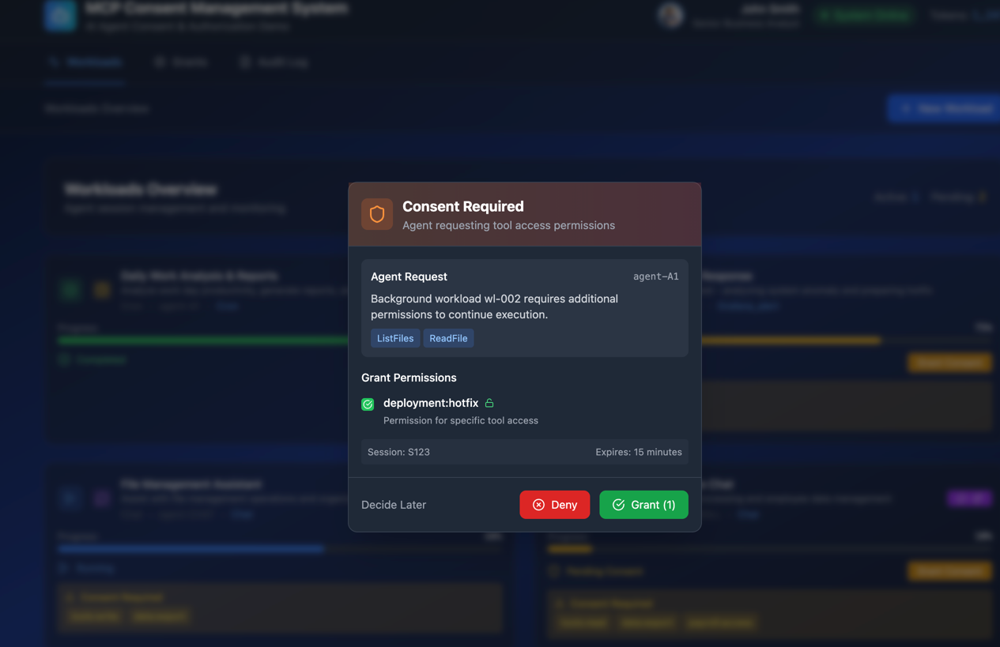

# Agent Grant Management System

A comprehensive OAuth 2.0 Grant Management system for AI agent authorization, featuring both a beautiful React frontend and a robust Express.js backend with SQLite database integration. This system implements the OAuth 2.0 Grant Management specification for managing AI agent permissions, consent workflows, and authorization grants.

## Live Deployment

- **Consent in Chat:** https://grant-management.c-127c9ef.stage.kyma.ondemand.com/workloads/S125/chat
- **[Async] Consent in Cron Agent:** https://grant-management.c-127c9ef.stage.kyma.ondemand.com/workloads
- **Grant Management:** https://grant-management.c-127c9ef.stage.kyma.ondemand.com/grants

## Overview

This project implements the OAuth 2.0 Grant Management extension as specified in [FAPI Grant Management](https://openid.net/specs/fapi-grant-management-01.html), allowing clients to explicitly manage their grants with the authorization server. The system provides both a modern web interface and a complete REST API for grant management operations.



## Features

### Frontend Features
- **Grant Management Dashboard**: View and manage all active grants with detailed permission breakdowns
- **Consent Management**: Interactive consent prompts for new permission requests  
- **Workload Tracking**: Monitor ongoing agent workloads and their resource usage
- **Audit Logging**: Complete audit trail of all grant changes and agent activities
- **Cron Job Management**: Schedule and monitor automated agent tasks
- **Real-time Updates**: Live status updates and notifications

### Backend Features  
- **OAuth 2.0 Grant Management API**: Full REST API implementing OAuth 2.0 Grant Management specification
- **SQLite Database**: Persistent storage for grants, consent requests, session tokens, and audit logs
- **Consent Screen Routes**: Direct URLs for agents to present consent requests to users
- **OpenAPI Documentation**: Complete API documentation with Swagger UI
- **Audit Trail**: Comprehensive logging of all grant management activities
- **Database Management**: Automated cleanup and maintenance tasks

## Technology Stack

### Frontend
- **Framework**: React 18 with TypeScript
- **Styling**: Tailwind CSS with beautiful gradients and animations
- **Icons**: Lucide React for consistent iconography
- **Routing**: React Router DOM for navigation
- **Build Tool**: Vite for fast development and building

### Backend
- **Framework**: Express.js with ES modules
- **Database**: SQLite with better-sqlite3 for high performance
- **Documentation**: Swagger/OpenAPI 3.0 with interactive UI
- **API Standards**: OAuth 2.0 Grant Management specification compliance
- **Security**: JWT token authentication and CORS support

## Getting Started

### Prerequisites
- Node.js 16+ and npm
- Git

### Installation

1. **Clone the Repository**
   ```bash
   git clone <repository-url>
   cd agent-grants
   ```

2. **Install Dependencies**
   ```bash
   npm install
   ```

3. **Development Mode (Frontend + Backend)**
   ```bash
   npm run dev:full
   ```
   This starts both the React frontend (port 5173) and Express backend (port 3001).

4. **Individual Services**
   ```bash
   # Frontend only
   npm run dev
   
   # Backend only  
   npm run server
   ```

5. **Build for Production**
   ```bash
   npm run build
   ```

### API Documentation

The Grant Management API is fully documented with OpenAPI 3.0. When the backend is running, visit:

- **API Documentation**: http://localhost:3001/api-docs
- **Health Check**: http://localhost:3001/health

## Supported Use Cases

- **Revoking a grant**: Clients can explicitly revoke grants that are no longer needed
- **Querying grant details**: Clients can retrieve the current status and details of a grant
- **Replacing grant details**: Clients can replace existing privileges with new ones while keeping the same grant ID
- **Updating grant details**: Clients can add privileges to an existing grant without recreating it
- **Managing concurrent grants**: Clients can maintain multiple independent grants for different purposes
- **Obtaining new tokens for existing grants**: Clients can get fresh tokens for a specific grant

## Grant Management API

The API implements the OAuth 2.0 Grant Management specification and provides the following endpoints:

### Core Grant Operations
- `GET /grants` - List all grants for authenticated client
- `GET /grants/{grantId}` - Get specific grant details
- `POST /grants` - Create a new grant
- `PUT /grants/{grantId}` - Update an existing grant  
- `DELETE /grants/{grantId}` - Revoke a grant

### Consent Management
- `GET /consent-requests` - Get pending consent requests
- `POST /consent-requests` - Create a new consent request
- `GET /consent/{requestId}` - Display consent screen for users
- `POST /consent/{requestId}/respond` - Process user consent response

### Audit & Monitoring
- `GET /audit` - Retrieve audit logs with filtering options

## Database Schema

The SQLite database includes the following tables:

- **grants**: OAuth grant storage with scopes, status, and metadata
- **consent_requests**: Pending consent requests from agents  
- **session_tokens**: Active session tokens and usage tracking
- **audit_log**: Comprehensive audit trail of all activities

## Project Structure

```
├── server/                 # Backend Express.js application
│   ├── index.js           # Main server file with API routes
│   └── database.js        # SQLite database layer and operations
├── src/                   # Frontend React application  
│   ├── components/        # Reusable UI components
│   ├── pages/            # Main page components
│   ├── services/         # API service layer
│   │   └── api.ts        # Grant Management API client
│   └── App.tsx           # Main application component
├── data/                 # SQLite database files (auto-created)
└── docs/                 # Documentation and specifications
```

## Key Features Deep Dive

### OAuth 2.0 Grant Management
Implements the full OAuth 2.0 Grant Management specification:
- Grant lifecycle management (create, query, update, revoke)
- Session-based grant organization
- Scope-based permissions with detailed descriptions
- Grant expiration and status tracking

### Consent Screen Integration
- Direct URLs for agents to present consent requests: `/consent/{requestId}`
- Beautiful, responsive consent screens with detailed permission explanations
- User-friendly approve/deny workflow
- Automatic grant creation upon approval

### Real-time Data Persistence  
- All data persists to SQLite database
- Automatic database initialization and schema management
- Performance optimized with prepared statements and indexing
- Automated cleanup of expired tokens and old audit logs

### Agent Integration
Agents can integrate with the system by:
1. Creating consent requests via `POST /consent-requests`
2. Directing users to the consent screen URL
3. Polling for consent approval status
4. Using granted permissions in their operations

## API Usage Examples

### Creating a Consent Request
```javascript
const response = await fetch('http://localhost:3001/consent-requests', {
  method: 'POST',
  headers: {
    'Content-Type': 'application/json',
    'Authorization': 'Bearer your-token'
  },
  body: JSON.stringify({
    agent_id: 'agent-123',
    session_id: 'session-456', 
    requested_scopes: ['tools:read', 'tools:write'],
    tools: ['ListFiles', 'CreateFile', 'UpdateFile'],
    workload_id: 'workload-789',
    reason: 'Need file access to complete data analysis task'
  })
});

const { authorization_link } = await response.json();
// Direct user to: http://localhost:3001/consent/request-id
```

### Checking Grant Status
```javascript
const grants = await fetch('http://localhost:3001/grants?session_id=session-456', {
  headers: { 'Authorization': 'Bearer your-token' }
}).then(r => r.json());

console.log('Active grants:', grants.filter(g => g.status === 'active'));
```

## Authorization Flow Extensions

The specification extends the OAuth 2.0 authorization flow with:

- New authorization request parameters: `grant_id` and `grant_management_action`
- New token response parameter: `grant_id`
- Grant management actions: `create`, `update`, and `replace`

## API Authorization

Access to the Grant Management API requires an access token with appropriate scopes:
- `grant_management_query`: For querying grant status
- `grant_management_revoke`: For revoking grants

## Security Considerations

- JWT token authentication for API access
- CORS configuration for cross-origin requests
- Grant isolation by client_id to prevent unauthorized access
- Audit logging of all sensitive operations
- Automatic token expiration and cleanup
- Grant Management is restricted to confidential clients for security reasons
- Grant IDs are public identifiers, not secrets, and should be managed securely
- The API prevents bulk access to all grants for privacy protection
- The API doesn't expose tokens associated with grants to prevent token leakage

## Development & Deployment

### Environment Variables
- `PORT`: Backend server port (default: 3001)
- Database files are stored in `./data/` directory

### Docker Support
The project includes a Dockerfile for containerized deployment.

### Production Considerations
- Set up proper JWT token validation
- Configure CORS for production domains
- Set up database backups for the SQLite file
- Monitor audit logs for security events

## Metadata

Authorization servers supporting this API provide metadata including:
- `grant_management_actions_supported`: Actions supported by the server
- `grant_management_endpoint`: URL of the Grant Management API endpoint
- `grant_management_action_required`: Whether grant management actions are required in requests

## Contributing

1. Fork the repository
2. Create a feature branch
3. Make your changes
4. Add tests for new functionality  
5. Submit a pull request

## License

This project is licensed under the MIT License.