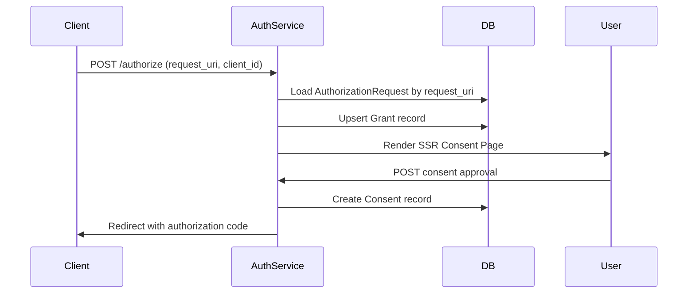

# Authorization Service: Actions and CAP Entities

## Overview

The **Authorization Service** (`sap.scai.grants.AuthorizationService`) implements an OAuth 2.0 Authorization Server with support for:

- **Rich Authorization Requests (RAR)** - RFC 9396
- **Pushed Authorization Requests (PAR)** - RFC 9126
- **Grant Management** - OAuth 2.0 Grant Management extension
- **On-Behalf-Of (OBO)** - Actor delegation patterns

This service is the **entry point** for OAuth authorization flows, handling consent UI, authorization code generation, and token issuance.

---

## Table of Contents

- [Overview](#overview)
- [Service Definition](#service-definition)
- [Core Actions](#core-actions)
  - [ `par` - Pushed Authorization Request](#1-par---pushed-authorization-request)
  - [`authorize` - Authorization Endpoint](#2-authorize---authorization-endpoint)
  - [`token` - Token Exchange Endpoint](#3-token---token-exchange-endpoint)
  - [`callback` - Default Redirect Handler](#4-callback---default-redirect-handler)
  - [ `metadata` - Authorization Server Metadata](#5-metadata---authorization-server-metadata)
- [CAP Entities](#cap-entities)
  - [`AuthorizationRequests`](#1-authorizationrequests)
  - [`Consents`](#2-consents)
- [Event Handlers](#event-handlers)
- [API Endpoints](#api-endpoints) 
- [Consumer Example](#example-flow)
   - [API Consumer](#example-flow)
   - [Cap Consumer](#cap-service-integration---consumer-example)
 - [Integration Tests](#api-integration-tests)
 - [Design Patterns](#design-patterns)
  - [REST Actions for OAuth Compliance](#1-rest-actions-for-oauth-compliance)
  - [Server-Side Rendering (SSR)](#2-server-side-rendering-ssr)
  - [Rich Authorization Requests (RAR)](#3-rich-authorization-requests-rar)
  - [Grant Management Integration](#4-grant-management-integration)
  - [PAR (Pushed Authorization Requests)](#4-par-pushed-authorization-requests)

- [Future Enhancements](#future-enhancements)
- [Related Documentation](#related-documentation)
- [References](#references)
  - [OAuth 2.0 Specifications](#oauth-20-specifications)
  - [Grant Management](#grant-management)
  - [CAP & SAP Technologies](#cap--sap-technologies)
  - [UI & Frontend](#ui--frontend)
  - [Testing & Development](#testing--development)

---

## Service Definition
https://github.com/agent-zon/grant-management/blob/4584b2eff852bea68caf502fc857902c71a7ee30/srv/authorization-service/authorization-service.cds?plain=11#L1-L95
)

### Why REST Protocol?

The service uses `@protocol: 'rest'` instead of OData because:

1. **OAuth 2.0 compliance** - Standard OAuth endpoints expect REST semantics
2. **Custom response formats** - Token responses, PAR responses use OAuth-specific JSON
3. **HTML rendering** - The `authorize` action returns server-rendered HTML
4. **Standard integration** - OAuth clients expect standard REST endpoints, not OData

---

### Core Actions

#### 1. `par` - Pushed Authorization Request

**Purpose**: Pre-register authorization parameters before redirecting user

**Signature**:

https://github.com/agent-zon/grant-management/blob/4584b2eff852bea68caf502fc857902c71a7ee30/srv/authorization-service/authorization-service.cds#L41-L57

**Why PAR?**

1. **Security** - Prevents authorization parameter tampering
2. **Large payloads** - RAR authorization_details can be large (e.g., tool lists)
3. **Privacy** - Sensitive data not exposed in browser URL
4. **Best practice** - Recommended by OAuth 2.0 Security BCP

**Implementation**:

https://github.com/agent-zon/grant-management/blob/aa7434b23a4baf11c5357284bf95aacccbb84c53/srv/authorization-service/handler.requests.tsx#L6-L39

Key steps in implementation:

1. Parse `authorization_details` JSON string to array
2. Generate or reuse `grant_id` using ULID
3. Store `AuthorizationRequest` with all OAuth parameters
4. Store both raw JSON and parsed `authorization_details` for querying
5. Set 90-second expiration for security
6. Return `request_uri` in URN format with request ID

---

#### 2. `authorize` - Authorization Endpoint

**Purpose**: Display consent UI and initiate authorization flow

**Signature**:

https://github.com/agent-zon/grant-management/blob/4584b2eff852bea68caf502fc857902c71a7ee30/srv/authorization-service/authorization-service.cds#L18-L25

**Flow**:



**Implementation**:

https://github.com/agent-zon/grant-management/blob/4584b2eff852bea68caf502fc857902c71a7ee30/srv/authorization-service/handler.authorize.tsx#L15-L245

Key steps in implementation:

1. Extract `request_uri` and parse request ID
2. Load `AuthorizationRequest` from database
3. Validate user subject matches authenticated user
4. Upsert `Grant` record (create or merge with existing grant)
5. Render server-side React consent form with HTMX
6. Display requested `authorization_details` and permissions

**Key Features**:

- **Server-Side Rendering (SSR)** - Returns full HTML page with React components
- **HTMX integration** - Form submission without full page reload
- **Grant lifecycle management** - Supports create/merge/replace operations
- **Rich Authorization Details** - Displays requested tools/permissions visually

---

#### 3. `token` - Token Exchange Endpoint

**Purpose**: Exchange authorization code for access token

**Signature**:
https://github.com/agent-zon/grant-management/blob/aa7434b23a4baf11c5357284bf95aacccbb84c53/srv/authorization-service/authorization-service.cds#L59-L82

> TODO: add authn

**Implementation**:

##### `authorization_code` with grant id

https://github.com/agent-zon/grant-management/blob/aa7434b23a4baf11c5357284bf95aacccbb84c53/srv/authorization-service/handler.token.tsx#L182-L223

###### Key steps in implementation:

1. Support multiple grant types: `authorization_code`, `refresh_token`, `token-exchange`, `user_token`
2. Integrate with SAP IAS via `@sap/xssec` IdentityService
3. Extract `grant_id` from JWT `sid` claim using `jwt-decode`
4. Fetch `authorization_details` from database by `consent_grant_id`
5. Return OAuth token response with Grant Management extensions
6. Include JWT access token from IAS
7. Mock mode fallback for local development without IAS

**Note**: See [04_TOKEN_APIS_AND_IAS_WRAPPING.md](./04_TOKEN_APIS_AND_IAS_WRAPPING.md) for detailed token issuance patterns.

---

#### 4. `callback` - Default Redirect Handler

**Purpose**: Handle authorization completion when no redirect_uri specified

**Signature**:
https://github.com/agent-zon/grant-management/blob/4584b2eff852bea68caf502fc857902c71a7ee30/srv/authorization-service/authorization-service.cds#L35-L38

**Use Case**:

When `redirect_uri = "urn:scai:grant:callback"`, the service renders a success page instead of redirecting.

https://github.com/agent-zon/grant-management/blob/aa7434b23a4baf11c5357284bf95aacccbb84c53/srv/authorization-service/handler.callback.tsx#L1-L65

The callback handler:

1. Retrieves grant by `grant_id`
2. Renders server-side React success page
3. Displays grant details and navigation to Grant Management UI

---

#### 5. `metadata` - Authorization Server Metadata

**Purpose**: RFC 8414 - OAuth 2.0 Authorization Server Metadata

**Returns**:

```json
{
  "issuer": "https://host",
  "authorization_endpoint": "https://host/oauth-server/authorize",
  "token_endpoint": "https://host/oauth-server/token",
  "pushed_authorization_request_endpoint": "https://host/oauth-server/par",
  "authorization_details_types_supported": ["mcp", "fs", "database", "api"],
  "grant_types_supported": ["authorization_code"],
  "response_types_supported": ["code"],
  "code_challenge_methods_supported": ["S256"]
}
```

---

### CAP Entities

#### 1. `AuthorizationRequests`

**Purpose**: Store PAR parameters and track authorization state

**Schema**:

```cap-cds
entity AuthorizationRequests: cuid, managed {
  // OAuth parameters
  client_id: String;
  redirect_uri: String;
  request_uri: String;         // urn:ietf:params:oauth:request_uri:...
  scope: String;               // Space-separated scopes
  state: String;
  code_challenge: String;      // PKCE
  code_challenge_method: String; // S256

  // Rich Authorization Requests (RAR)
  authorization_details: String; // JSON array
  access: array of AuthorizationDetailRequest; // Parsed

  // Grant Management
  grant_management_action: String; // create/merge/replace

  // On-Behalf-Of (OBO)
  requested_actor: String;     // urn:agent:finance-v1
  subject_token_type: String;
  subject_token: String;
  subject: User;

  // Lifecycle
  expires_at: String;
  expires_in: Integer;
  status: String;              // pending/used/expired
  risk_level: String;          // low/medium/high

  // Associations
  grant: Association to Grants;
  consent: Association to Consents;
}
```

**Key Design Decisions**:

1. **Dual storage of authorization_details**:
   - `authorization_details` (String) - Original JSON from client
   - `access` (array) - Parsed for CDS querying and UI rendering

2. **request_uri as primary identifier** - Used in authorize flow

3. **Short expiration** - 90 seconds, forces clients to use PAR immediately

---

#### 2. `Consents`

**Purpose**: Record user consent decisions

**Schema**:

```cap-cds

entity Consents: cuid, managed {
  key grant_id: String;
  grant: Association to Grants;
  request: Association to AuthorizationRequests;

  // Consent data
  client_id: String;
  scope: String;
  subject: User;
  actor: String;

  // Composition
  authorization_details: Composition of many AuthorizationDetails;

  // History tracking
  previous_consent: Association to Consents;
  duration: Timespan;

  // Calculated
  redirect_uri: String = request.redirect_uri;
}
```

**Why Composition for authorization_details?**

- **Data integrity** - Authorization details belong to consent
- **Cascade delete** - Deleting consent removes authorization details
- **Querying** - Easy to fetch all details with `$expand=authorization_details`

---

## Event Handlers

#### 📄 Consent Handler

The `on("CREATE", Consents)` handler:

1. Creates consent record with authorization details
2. Checks `redirect_uri` for special handling
3. If `redirect_uri = "urn:scai:grant:callback"`, renders success page
4. Otherwise, redirects to client's `redirect_uri` with authorization code
5. Authorization code = `request_ID` for token exchange


https://github.com/agent-zon/grant-management/blob/4584b2eff852bea68caf502fc857902c71a7ee30/srv/authorization-service/authorization-service.tsx#L64

https://github.com/agent-zon/grant-management/blob/4584b2eff852bea68caf502fc857902c71a7ee30/srv/authorization-service/handler.consent.tsx#L22-L60

---
 
## API Endpoints

| Endpoint                         | Method   | Purpose                    |
| -------------------------------- | -------- | -------------------------- |
| `/oauth-server/par`              | POST     | Push authorization request |
| `/oauth-server/authorize`        | GET/POST | Display consent UI         |
| `/oauth-server/authorize_dialog` | GET      | Alternative consent dialog |
| `/oauth-server/callback`         | GET      | Handle default redirect    |
| `/oauth-server/token`            | POST     | Exchange code for token    |
| `/oauth-server/metadata`         | GET      | Server metadata (RFC 8414) |

---

## Example Flow

### Complete Authorization Flow

```bash
# 1. Client pushes authorization request (PAR)
POST /oauth-server/par
{
  "response_type": "code",
  "client_id": "mcp-client",
  "redirect_uri": "https://client.app/callback",
  "scope": "filesystem_read filesystem_write",
  "code_challenge": "E9Melhoa2OwvFrEMTJguCHaoeK1t8URWbuGJSstw-cM",
  "code_challenge_method": "S256",
  "authorization_details": "[{\"type\":\"fs\",\"locations\":[\"/workspace\"]}]"
}

# Response:
{
  "request_uri": "urn:ietf:params:oauth:request_uri:01HXG...",
  "expires_in": 90
}

# 2. Client redirects user to authorize endpoint
GET /oauth-server/authorize?request_uri=urn:...&client_id=mcp-client
# → User sees SSR consent page

# 3. User approves consent
POST /oauth-server/AuthorizationRequests/{id}/consent
{
  "grant_id": "grant_01HXG...",
  "subject": "user@example.com",
  "scope": "filesystem_read filesystem_write"
}

# → Redirect: https://client.app/callback?code=01HXG...

# 4. Client exchanges code for token
POST /oauth-server/token
{
  "grant_type": "authorization_code",
  "code": "01HXG...",
  "code_verifier": "dBjftJeZ4CVP-mB92K27uhbUJU1p1r_wW1gFWFOEjXk",
  "redirect_uri": "https://client.app/callback",
  "client_id": "mcp-client"
}

# Response:
{
  "access_token": "at_01HXG...:grant_01HXG...",
  "token_type": "Bearer",
  "expires_in": 3600,
  "scope": "filesystem_read filesystem_write",
  "grant_id": "grant_01HXG...",
  "authorization_details": [
    {
      "type": "fs",
      "locations": ["/workspace"],
      "permissions": { "read": true, "write": true }
    }
  ]
}
```

---
 

## CAP Service Integration - Consumer Example

### Overview

CAP services can consume the Authorization Service to implement OAuth flows. This section shows how to integrate authorization into your service using the `demo-service.tsx` pattern.

### Connecting to Authorization Service

```typescript
// srv/your-service/your-service.tsx
import cds from "@sap/cds";
import AuthorizationService from "#cds-models/sap/scai/grants/AuthorizationService";

export default class YourService extends cds.ApplicationService {
  async init() {
    // Connect to authorization service
    const authorizationService = await cds.connect.to(AuthorizationService);

    return super.init();
  }
}
```

### Initiating Authorization Request

**Use case**: Service needs to request user authorization for specific permissions

```typescript
// srv/demo-service/demo-service.tsx (lines 624-706)
export default class DemoService extends cds.ApplicationService {
  public async request() {
    // 1. Connect to Authorization Service
    const authorizationService = await cds.connect.to(AuthorizationService);

    // 2. Prepare authorization request
    const request = {
      response_type: "code",
      client_id: "demo-client-app",
      redirect_uri: new URL(
        "/demo/callback",
        cds.context?.http?.req.headers.referer
      ).href,
      grant_management_action: "create",
      grant_id: cds.context?.user?.authInfo?.token?.payload["sid"],
      authorization_details: JSON.stringify([
        {
          type: "mcp",
          server: "analytics-server",
          tools: { analyze: {}, report: {} },
          locations: ["/data/analytics"],
        },
        {
          type: "fs",
          roots: ["/workspace/reports"],
          permissions_read: true,
          permissions_write: true,
        },
      ]),
      requested_actor: "urn:agent:analytics-bot-v1",
      scope: "openid profile analytics",
      subject: cds.context?.user?.id,
      subject_token_type: "urn:ietf:params:oauth:token-type:jwt",
    };

    // 3. Call PAR endpoint
    const response = await authorizationService.par(request);

    // 4. Get authorization server URL
    const authServerUrl = authorizationService.baseUrl || "/oauth-server";

    // 5. Redirect user to authorization endpoint
    return {
      authorization_url: `${authServerUrl}/authorize`,
      request_uri: response.request_uri,
      expires_in: response.expires_in,
    };
  }
}
```

**Key components**:

- **`grant_management_action`**: `"create"` (new grant) or `"merge"` (add permissions)
- **`grant_id`**: Reuse existing grant ID or let system generate new one
- **`authorization_details`**: Rich Authorization Request details (RFC 9396)
- **`requested_actor`**: On-behalf-of actor (agent/service identity)
- **`subject`**: User identity from CDS context

### Handling Authorization Callback

**Use case**: Exchange authorization code for access token

```typescript
// srv/demo-service/demo-service.tsx (lines 736-826)
export default class DemoService extends cds.ApplicationService {
  public async callback(code, code_verifier, redirect_uri) {
    // 1. Connect to Authorization Service
    const authorizationService = await cds.connect.to(AuthorizationService);

    // 2. Exchange code for token
    const tokenResponse = await authorizationService.token({
      grant_type: "authorization_code",
      client_id: "demo-client-app",
      code: code,
      code_verifier: code_verifier,
      redirect_uri: redirect_uri,
    });

    // 3. Handle response
    const {
      access_token,
      token_type,
      expires_in,
      grant_id,
      authorization_details,
      scope,
      error,
    } = tokenResponse;

    if (error) {
      console.error("Authorization failed:", error);
      return { error };
    }

    // 4. Store token and grant_id for future use
    console.log("✅ Authorization successful", {
      grant_id,
      scope,
      authorization_details: authorization_details.length,
    });

    return {
      access_token, // JWT from IAS
      token_type, // "Bearer"
      expires_in, // 3600 (1 hour)
      grant_id, // "gnt_01HXG..."
      authorization_details, // Array of granted permissions
      scope, // Space-separated scopes
    };
  }
}
```

### Permission Elevation (Grant Merge)

**Use case**: Request additional permissions for existing grant

```typescript
// srv/demo-service/demo-service.tsx (lines 867-915)
export default class DemoService extends cds.ApplicationService {
  public async elevate(grant_id) {
    const authorizationService = await cds.connect.to(AuthorizationService);

    // 1. Prepare merge request with additional permissions
    const request = {
      response_type: "code",
      client_id: "demo-client-app",
      redirect_uri: new URL(
        "/demo/callback",
        cds.context?.http?.req.headers.referer
      ).href,
      grant_management_action: "merge", // ← Merge with existing grant
      grant_id: grant_id, // ← Existing grant ID
      authorization_details: JSON.stringify([
        {
          type: "database",
          servers: ["production-db"],
          actions: ["read", "write", "execute"],
          tables: ["customers", "orders"],
        },
      ]),
      requested_actor: "urn:agent:deployment-bot-v1",
      scope: "database_admin",
      subject: cds.context?.user?.id,
    };

    // 2. Create new authorization request (will merge on consent)
    const response = await authorizationService.par(request);

    // 3. Return authorization URL for user consent
    const authServerUrl = authorizationService.baseUrl || "/oauth-server";

    return {
      authorization_url: `${authServerUrl}/authorize`,
      request_uri: response.request_uri,
      message: "Additional permissions requested. User consent required.",
    };
  }
}
```

### Authorization Details Examples

**MCP Tools**:

```typescript
{
  type: "mcp",
  server: "filesystem-server",
  transport: "stdio",
  tools: {
    read_file: {},
    write_file: {},
    list_directory: {}
  },
  locations: ["/workspace", "/data"]
}
```

**File System Access**:

```typescript
{
  type: "fs",
  roots: ["/workspace/reports"],
  permissions_read: true,
  permissions_write: true,
  permissions_execute: false,
  permissions_list: true
}
```

**API Access**:

```typescript
{
  type: "api",
  urls: ["https://api.example.com/v1/*"],
  protocols: ["https"],
  methods: ["GET", "POST", "PUT"]
}
```

**Database Access**:

```typescript
{
  type: "database",
  servers: ["production-db"],
  actions: ["read", "write"],
  tables: ["customers", "orders", "products"]
}
```
### Best Practices

#### Store grant_id for permission management

```typescript
// Save grant_id in your data model for later revocation
await this.update(UserSessions)
  .set({ grant_id: token.grant_id })
  .where({ user_id: req.user.id });
```

#### Handle errors gracefully

```typescript
try {
  const token = await authService.token({ ... });
} catch (error) {
  if (error.code === "invalid_grant") {
    // Restart authorization flow
  }
  throw error;
}
```

#### Use grant merging for progressive authorization

```typescript
// Start with minimal permissions
const initialGrant = await requestAuthorization({
  scope: "read",
  authorization_details: [{ type: "fs", permissions_read: true }],
});

// Later, request additional permissions
const elevatedGrant = await requestAuthorization({
  grant_management_action: "merge",
  grant_id: initialGrant.grant_id,
  scope: "read write",
  authorization_details: [{ type: "fs", permissions_write: true }],
});
```

#### Pass user context properly

```typescript
const request = {
  // ... other fields
  subject: cds.context?.user?.id, // Current user
  subject_token: cds.context?.user?.authInfo?.token?.jwt, // User's JWT
};
```

---

### API Integration Tests
#### run with

```sh
 npx cds bind --profile hybrid --exec -- npm run test:oauth:basic
```

https://github.com/agent-zon/grant-management/blob/aa7434b23a4baf11c5357284bf95aacccbb84c53/test/oauth-basic-flow.test.ts#L1-L313

---

## Design Patterns

### 1. REST Actions for OAuth Compliance

```cds
@protocol: 'rest'
action authorize(...) returns String;
```

- OAuth clients expect standard REST endpoints
- Token responses have specific JSON structure
- HTML rendering for consent pages

### 2. Server-Side Rendering (SSR)

```typescript
return htmlTemplate(
  renderToString(<ConsentPage {...props} />)
);
```

**Benefits**:

- No client-side JavaScript required
- Fast initial page load
- SEO-friendly (if public pages added)
- HTMX for progressive enhancement

### 3. Rich Authorization Requests (RAR)

```json
{
  "authorization_details": [
    {
      "type": "mcp",
      "server": "filesystem",
      "tools": { "read_file": true, "write_file": false },
      "locations": ["/workspace"]
    }
  ]
}
```

**Advantages**:

- Fine-grained permissions
- Tool-specific authorization
- Better consent UI
- Extensible for new resource types

### 4. Grant Management Integration

```typescript
// Token response includes grant_id
{
  "access_token": "at_...",
  "grant_id": "grant_01HXG..."  // ← Enables grant query/revoke
}
```

**Enables**:

- Query grant status via Grant Management API
- Revoke grants programmatically
- Merge/update permissions without re-consent

### 4. PAR (Pushed Authorization Requests)

- **Prevents parameter tampering**
- **Short expiration (90s)** - Reduces attack window
- **Server-side validation** before user sees consent

 
###  User Authentication

```typescript
subject: User; // From cds.context.user
```

- Relies on upstream authentication (IAS, XSUAA)
- Authorization Service focuses on **authorization**, not **authentication**

### 3. Destination Service (Future)

- Token exchange with destination service
- Inject logging/monitoring
- Wrap IAS OAuth flows

---

## Future Enhancements

- Device / CIBA authorization grant - RFC 8628
- SETs (Security Event Tokens)
- Token lifecycle events

---

## Related Documentation

- [02_GRANT_MANAGEMENT_SERVICE.md](./02_GRANT_MANAGEMENT_SERVICE.md) - Grant query/revoke APIs
- [03_SSR_AND_HTMX.md](./03_SSR_AND_HTMX.md) - Server-side rendering patterns
- [04_TOKEN_APIS_AND_IAS_WRAPPING.md](./04_TOKEN_APIS_AND_IAS_WRAPPING.md) - Token exchange details
- [05_DEBUGGING_AND_LOGGING.md](./05_DEBUGGING_AND_LOGGING.md) - Debugging patterns

---

## References

### OAuth 2.0 Specifications

- **OAuth 2.0 Core** - [RFC 6749](https://datatracker.ietf.org/doc/html/rfc6749) - The OAuth 2.0 Authorization Framework
- **PKCE** - [RFC 7636](https://datatracker.ietf.org/doc/html/rfc7636) - Proof Key for Code Exchange
- **PAR** - [RFC 9126](https://datatracker.ietf.org/doc/html/rfc9126) - Pushed Authorization Requests
- **RAR** - [RFC 9396](https://datatracker.ietf.org/doc/html/rfc9396) - Rich Authorization Requests
- **Authorization Server Metadata** - [RFC 8414](https://datatracker.ietf.org/doc/html/rfc8414) - OAuth 2.0 Authorization Server Metadata
- **Token Exchange** - [RFC 8693](https://datatracker.ietf.org/doc/html/rfc8693) - OAuth 2.0 Token Exchange
- **JWT** - [RFC 7519](https://datatracker.ietf.org/doc/html/rfc7519) - JSON Web Token

### Grant Management

- **OAuth 2.0 Grant Management** - [Draft Specification](https://datatracker.ietf.org/doc/html/draft-ietf-oauth-grant-management) - OAuth 2.0 Grant Management for OAuth 2.0
- **Security Event Tokens (SET)** - [RFC 8417](https://datatracker.ietf.org/doc/html/rfc8417) - Security Event Token (SET)
- **OAuth Event Types** - [Draft](https://datatracker.ietf.org/doc/html/draft-ietf-secevent-oauth-event-types) - OAuth Event Types 1.0

### CAP & SAP Technologies

- **SAP Cloud Application Programming Model** - [cap.cloud.sap](https://cap.cloud.sap/)
- **CDS (Core Data Services)** - [cap.cloud.sap/docs/cds](https://cap.cloud.sap/docs/cds/)
- **SAP Identity Authentication Service (IAS)** - [help.sap.com](https://help.sap.com/docs/identity-authentication)
- **@sap/xssec** - [npm package](https://www.npmjs.com/package/@sap/xssec) - SAP Security library
- **@sap/cds** - [npm package](https://www.npmjs.com/package/@sap/cds) - SAP Cloud Application Programming Model

### UI & Frontend

- **HTMX** - [htmx.org](https://htmx.org/) - High-power tools for HTML
- **React** - [react.dev](https://react.dev/) - JavaScript library for user interfaces
- **Tailwind CSS** - [tailwindcss.com](https://tailwindcss.com/) - Utility-first CSS framework
- **Server-Side Rendering (SSR)** - React SSR with Express patterns

### Testing & Development

- **jest** - [jestjs.io](https://jestjs.io/) - JavaScript testing framework
- **ulid** - [github.com/ulid/spec](https://github.com/ulid/spec) - Universally Unique Lexicographically Sortable Identifier
- **jwt-decode** - [npm package](https://www.npmjs.com/package/jwt-decode) - JWT token decoder

