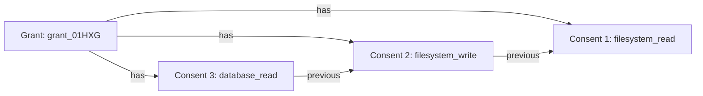

# Grant Management Service: Actions and CAP Entities

**Created**: 2025-11-30
**Last Updated**: 2025-11-30
**Category**: [ARCHITECTURE] [OAUTH] [GRANT_MANAGEMENT]
**Timeline**: 02 of 05 - Grant Management Documentation

## Overview

The **Grant Management Service** (`sap.scai.grants.GrantsManagementService`) implements the **OAuth 2.0 Grant Management** extension, providing APIs and UI for:

- **Query grant status** - View permissions, scopes, authorization details
- **Revoke grants** - User-initiated or programmatic revocation
- **Grant lifecycle tracking** - Creation, modification, expiration
- **User dashboard** - HTML UI for managing consents

This service is the **read/revoke** interface for grants created by the Authorization Service.

---

## Service Definition

```cds
// srv/grant-management/grant-management.cds
@path: '/grants-management'
@protocol: 'rest'
@requires: ['authenticated-user', 'system-user']
@impl: './grant-management.tsx'
service GrantsManagementService {
    entity Grants as projection on grants.Grants;
    entity AuthorizationDetails as projection on grants.AuthorizationDetails;
    
    @cds.redirection.target
    entity Consents as projection on grants.Consents;
}
```

### Key Design Decisions

1. **REST protocol** - Content negotiation (HTML vs JSON)
2. **Authentication required** - All endpoints require user session
3. **Projection entities** - Expose DB models with service-specific logic
4. **@cds.redirection.target** - Enables seamless navigation from authorization flow

---

## Service Actions (HTTP Methods)

Unlike traditional CDS services that use OData operations, Grant Management uses **HTTP method overloading** via custom handlers:

| HTTP Method | Entity | Purpose | Handler |
|-------------|--------|---------|---------|
| `GET` | `Grants` (collection) | List all grants | `LIST` |
| `GET` | `Grants/{id}` | View grant details | `GET` |
| `DELETE` | `Grants/{id}` | Revoke grant | `DELETE` |
| `UPDATE` | `Grants/{id}` | Merge/update grant | `POST` |

---

## Handler Implementation

### 1. LIST - Query Grants Collection

**Purpose**: Display user's grants as HTML dashboard or JSON array

**Implementation**:

```typescript
// srv/grant-management/handler.list.tsx
export async function LIST(req, next) {
  console.log("🔍 Listing grants");
  
  const response = await next(req);
  
  if (isGrants(response)) {
    const grants = await getGrants(this, response);
    
    // Content negotiation: HTML vs JSON
    if (req?.http?.req.accepts("html")) {
      return render(req, <GrantsDashboard grants={grants} />);
    }
    
    return grants;
  }
  
  return response;
}
```

**Key Features**:

- **Content negotiation** - Browser gets HTML, API clients get JSON
- **Server-side rendering** - Full dashboard rendered on server
- **Consent aggregation** - Groups consents by grant_id
- **Authorization details expansion** - Includes tool permissions

**Grant Aggregation Logic**:

```typescript
async function getGrants(srv, data) {
  // Fetch all consents
  const consentRecords = await srv.read(Consents);
  
  // Fetch authorization details
  const authorization_details = await srv.run(
    cds.ql.SELECT.from(AuthorizationDetails)
  );
  
  // Fetch client_id mapping from AuthorizationRequests
  const authRequests = await cds.run(
    cds.ql.SELECT.from("sap.scai.grants.AuthorizationRequests")
      .columns("ID", "client_id", "grant_id")
  );
  
  // Build grant_id → client_id map
  const grantToClientMap = new Map();
  authRequests.forEach(req => {
    if (req.grant_id && req.client_id) {
      grantToClientMap.set(req.grant_id, req.client_id);
    }
  });
  
  // Aggregate consents by grant_id
  const grants = consentRecords.reduce((acc, consent) => {
    const consents = [...(acc[consent.grant_id]?.consents || []), consent];
    const grant = data?.find(g => g.id === consent.grant_id);
    
    // Collect unique client_ids, actors, subjects
    const client_ids = consents
      .map(c => c.client_id)
      .filter(Boolean)
      .filter(unique);
    
    const finalClientIds = client_ids.length > 0
      ? client_ids
      : [grant?.client_id || grantToClientMap.get(consent.grant_id) || "unknown"];
    
    acc[consent.grant_id] = {
      consents: consents,
      authorization_details: [
        ...(acc[consent.grant_id]?.authorization_details || []),
        ...authorization_details.filter(
          detail => detail.consent_grant_id === consent.grant_id
        ),
      ],
      scope: consents.map(c => c.scope).filter(unique).join(" "),
      createdAt: consent[0]?.createdAt,
      ...grant,
      id: consent.grant_id,
      client_id: finalClientIds,
    };
    
    return acc;
  }, {});
  
  return Object.values(grants).reverse();
}
```

**Why This Complexity?**

The aggregation logic addresses a **data model design** where:

1. **Grants are compositions** - A grant is the sum of its consents
2. **Multiple consents per grant** - Merge operations create additional consents
3. **Client_id resolution** - Must resolve from multiple sources (consent, grant, authorization request)
4. **Authorization details** - Scattered across multiple consent records

---

### 2. GET - Query Single Grant

**Purpose**: Display detailed grant information

**Implementation**:

```typescript
// srv/grant-management/handler.edit.tsx
export async function GET(req, next) {
  const grant = await next(req);
  
  if (req?.http?.req.accepts("html")) {
    return render(req, <GrantDetailPage grant={grant} />);
  }
  
  return grant;
}
```

**HTML Response** (Browser):

```html
<div class="grant-detail">
  <h1>Grant Details</h1>
  <div class="grant-info">
    <p><strong>Grant ID:</strong> grant_01HXG...</p>
    <p><strong>Status:</strong> active</p>
    <p><strong>Scope:</strong> filesystem_read filesystem_write</p>
  </div>
  
  <div class="authorization-details">
    <h2>Authorized Tools</h2>
    <div class="tool">
      <span class="tool-name">read_file</span>
      <span class="location">/workspace</span>
    </div>
  </div>
  
  <form hx-delete="/grants-management/Grants/{id}" hx-swap="body">
    <button type="submit">Revoke Grant</button>
  </form>
</div>
```

**JSON Response** (API):

```json
{
  "id": "grant_01HXG...",
  "status": "active",
  "scope": "filesystem_read filesystem_write",
  "client_id": ["mcp-client"],
  "actor": "urn:agent:finance-v1",
  "subject": ["user@example.com"],
  "risk_level": "medium",
  "createdAt": "2025-11-30T12:00:00Z",
  "authorization_details": [
    {
      "type": "fs",
      "locations": ["/workspace"],
      "permissions": { "read": true, "write": true }
    }
  ],
  "consents": [
    {
      "id": "consent_01HXG...",
      "createdAt": "2025-11-30T12:00:00Z",
      "scope": "filesystem_read filesystem_write"
    }
  ]
}
```

---

### 3. DELETE - Revoke Grant

**Purpose**: Revoke grant and invalidate associated tokens

**Implementation**:

```typescript
// srv/grant-management/handler.revoke.tsx
export async function DELETE(req, next) {
  const grant_id = req.params[0];  // Extract from URL
  
  console.log("🚫 Revoking grant:", grant_id);
  
  // Update grant status
  await cds.run(
    cds.ql.UPDATE(Grants)
      .set({
        status: "revoked",
        revoked_at: new Date().toISOString(),
        revoked_by: cds.context.user.id
      })
      .where({ id: grant_id })
  );
  
  // TODO: Emit Security Event Token (SET) for token revocation
  // TODO: Invalidate refresh tokens in token store
  
  // Redirect to grants list with success message
  if (req?.http?.req.accepts("html")) {
    return render(req, <GrantsListWithSuccessMessage />);
  }
  
  return { status: "revoked" };
}
```

**HTMX Form** (in UI):

```html
<form 
  hx-delete="/grants-management/Grants/grant_01HXG..." 
  hx-swap="body"
  hx-confirm="Are you sure you want to revoke this grant?"
>
  <input type="hidden" name="_method" value="DELETE" />
  <button type="submit" class="btn-danger">
    🚫 Revoke Grant
  </button>
</form>
```

**Why HTMX?**

- **No full page reload** - Better UX
- **Progressive enhancement** - Works without JavaScript (falls back to POST)
- **Simple** - No React hydration, no client-side state management

---

### 4. POST/UPDATE - Merge/Update Grant

**Purpose**: Add permissions to existing grant (future enhancement)

**Implementation** (placeholder):

```typescript
// srv/grant-management/handler.edit.tsx
export async function POST(req, next) {
  // Future: Implement grant merge/update
  // This would trigger a new authorization flow with grant_management_action=merge
  return req.error(501, "Grant update not yet implemented");
}
```

**Future Flow**:

```bash
# User clicks "Add Permissions" in UI
POST /grants-management/Grants/{id}
{
  "additional_scopes": ["database_read"],
  "authorization_details": [
    { "type": "database", "databases": ["app_db"] }
  ]
}

# → Initiates authorization flow with grant_management_action=merge
# → User sees consent UI showing existing + new permissions
# → On approval, new consent record added to same grant
```

---

## CAP Entities

### 1. `Grants`

**Purpose**: Primary grant record tracking authorization lifecycle

**Schema**:

```cds
entity Grants: managed {
  key id: String;              // grant_01HXG... (ULID)
  client_id: String;
  risk_level: String;          // low/medium/high
  status: String enum { 
    active; 
    revoked; 
  } default 'active';
  revoked_at: DateTime;
  revoked_by: User;
  subject: User;               // Who granted consent
  actor: String;               // OBO actor (if applicable)
  scope: String;               // Space-separated scopes
  
  // Compositions
  consents: Composition of many Consents on consents.grant_id = $self.id;
  requests: Composition of many AuthorizationRequests on requests.grant = $self;
  authorization_details: Composition of many AuthorizationDetails 
    on authorization_details.consent.grant_id = $self.id;
}
```

**Key Design Decisions**:

1. **String primary key** - Not UUID, uses ULID for sortable IDs
2. **Composition relationships** - Cascade delete behavior
3. **Status enum** - Only active/revoked (expired handled via queries)
4. **Scope denormalization** - Aggregated from consents for performance

**Managed Aspect**:

```cds
aspect managed {
  createdAt: Timestamp;
  createdBy: User;
  modifiedAt: Timestamp;
  modifiedBy: User;
}
```

- **Automatic tracking** - CDS fills these fields
- **Audit trail** - Who created/modified and when

---

### 2. `Consents`

**Purpose**: Record individual consent decisions (supports grant merging)

**Schema**:

```cds
entity Consents: cuid, managed {
  key grant_id: String;
  grant: Association to Grants on grant.id = $self.grant_id;
  request: Association to AuthorizationRequests;
  
  // Consent data
  client_id: String = request.client_id;  // Calculated
  scope: String = request.scope;          // Calculated
  subject: User;
  actor: String = request.requested_actor;
  
  // Composition
  authorization_details: Composition of many AuthorizationDetails 
    on authorization_details.consent = $self;
  
  // History
  previous_consent: Association to Consents;
  duration: Timespan;
  
  // Calculated
  redirect_uri: String = request.redirect_uri;
}
```

**Why Multiple Consents per Grant?**

Grant merging creates multiple consent records:



**Benefits**:

- **Audit trail** - See when each permission was granted
- **Selective revocation** - Can revoke individual consents (future)
- **Grant evolution** - Track how grant changed over time

---

### 3. `AuthorizationDetails`

**Purpose**: Store fine-grained permissions (RAR)

**Schema**:

```cds
entity AuthorizationDetails: cuid, managed {
  consent: Association to Consents;
  
  // Common fields (all types)
  type: String;                // mcp, fs, database, api
  locations: array of String;  // URLs, paths, endpoints
  actions: array of String;    // read, write, execute, list
  identifier: String;          // Resource identifier
  privileges: array of String; // High-level privileges
  resources: array of String;  // Resource names
  
  // Type-specific aspects
  // ... (MCP, FileSystem, Database, API fields)
}
```

**Type-Specific Fields**:

#### MCP Tools:

```cds
aspect AuthorizationDetailMcpTools {
  server: String;              // MCP server name
  transport: String;           // stdio, sse, websocket
  tools: Map;                  // { "read_file": true, "write_file": false }
}
```

#### FileSystem:

```cds
aspect AuthorizationDetailFileSystem {
  roots: array of String;      // ["/workspace", "/tmp"]
  permissions: {
    read: Boolean;
    write: Boolean;
    execute: Boolean;
    delete: Boolean;
    list: Boolean;
    create: Boolean;
  };
}
```

#### Database:

```cds
aspect AuthorizationDetailDatabase {
  databases: array of String;  // ["app_db", "analytics_db"]
  schemas: array of String;    // ["public", "reporting"]
  tables: array of String;     // ["users", "transactions"]
}
```

#### API:

```cds
aspect AuthorizationDetailApi {
  urls: array of String;       // ["https://api.example.com/v1/*"]
  protocols: array of String;  // ["https", "grpc"]
}
```

**Why Aspects?**

- **Extensibility** - Easy to add new resource types
- **Type safety** - CDS validates structure
- **Querying** - Can filter by type-specific fields

---

## Expand Middleware

The service automatically expands related entities for rich responses:

```typescript
// srv/grant-management/grant-management.tsx
export default class Service extends cds.ApplicationService {
  init() {
    this.on("GET", Grants, this.Expand);
    return super.init();
  }
  
  private async Expand(req, next) {
    req.data["$expand"] = [
      ...(req.data["$expand"]?.split(",") || []),
      "authorization_details",
      "consents",
    ].filter(unique).join(",");
    
    return next(req);
  }
}
```

**Result**:

Every grant query automatically includes:
- All consents
- All authorization details
- Full permission tree

**Why Auto-Expand?**

- **Performance** - Single query instead of N+1
- **Consistency** - UI always has complete data
- **Developer experience** - No need to manually specify $expand

---

## UI Components (SSR)

### Grants Dashboard

**Route**: `/grants-management/Grants`

**Features**:

- **Statistics cards** - Active, total, expired, revoked counts
- **Grant list** - Sortable, filterable
- **Quick actions** - View, revoke buttons
- **Risk indicators** - Color-coded risk levels
- **Live monitoring badge** - Shows real-time status

**Implementation**:

```tsx
// srv/grant-management/handler.list.tsx
return render(req, (
  <div className="min-h-screen bg-gray-950 text-white">
    {/* Header */}
    <div className="container mx-auto px-4 py-8">
      <h1 className="text-2xl font-bold">Grant Management Dashboard</h1>
      
      {/* Statistics */}
      <div className="grid grid-cols-4 gap-4">
        <StatCard icon="✅" label="Active Grants" value={activeGrants.length} />
        <StatCard icon="🔑" label="Total Grants" value={totalGrants} />
        <StatCard icon="⏰" label="Expired" value={expiredCount} />
        <StatCard icon="🚫" label="Revoked" value={revokedCount} />
      </div>
      
      {/* Grants List */}
      <div className="space-y-4">
        {grants.map(grant => (
          <GrantCard key={grant.id} grant={grant} />
        ))}
      </div>
    </div>
  </div>
));
```

### Grant Detail Page

**Route**: `/grants-management/Grants/{id}`

**Features**:

- **Grant metadata** - ID, status, timestamps
- **Scope display** - All granted scopes
- **Authorization details** - Expandable permission tree
- **Action buttons** - Revoke, edit (future)
- **Consent history** - Timeline of consent events

---

## OAuth 2.0 Grant Management Compliance

### Metadata Response

**Endpoint**: `GET /oauth-server/metadata`

```json
{
  "grant_management_actions_supported": [
    "query",
    "revoke",
    "update",
    "replace",
    "create"
  ],
  "grant_management_endpoint": "https://host/grants-management",
  "grant_management_action_required": false
}
```

### Query Grant

**Endpoint**: `GET /grants-management/Grants/{grant_id}`

**Response**:

```json
{
  "grant_id": "grant_01HXG...",
  "status": "active",
  "authorization_details": [...],
  "scope": "filesystem_read filesystem_write",
  "created_at": "2025-11-30T12:00:00Z",
  "expires_at": null,
  "last_used": "2025-11-30T14:30:00Z"
}
```

### Revoke Grant

**Endpoint**: `DELETE /grants-management/Grants/{grant_id}`

**Response**: `204 No Content`

**Side Effects**:

1. Update grant status to "revoked"
2. Emit Security Event Token (SET) - token-revoked event
3. Invalidate refresh tokens (future)
4. Optionally revoke active access tokens (future)

---

## Security Considerations

### 1. Authorization Checks

```typescript
// Service requires authentication
@requires: ['authenticated-user', 'system-user']
```

**Row-level security** (future):

```cds
// Users can only see their own grants
entity Grants @(restrict: [
  { grant: 'READ', where: 'subject = $user' }
])
```

### 2. CSRF Protection

HTMX forms include CSRF tokens:

```html
<form hx-delete="..." hx-headers='{"X-CSRF-Token": "..."}'>
```

### 3. Rate Limiting

Future enhancement:

```typescript
// Limit revocation attempts
if (revocationAttempts > 10) {
  throw new Error("Rate limit exceeded");
}
```

---

## Performance Optimizations

### 1. Consent Aggregation

**Problem**: Fetching grants requires joining consents + authorization details

**Solution**: Service-layer aggregation with caching

```typescript
// Cache grant aggregations for 60 seconds
const cachedGrants = cache.get(`grants:${userId}`);
if (cachedGrants) return cachedGrants;

const grants = await getGrants(this, response);
cache.set(`grants:${userId}`, grants, 60);
return grants;
```

### 2. Database Indexes

```sql
-- Optimize grant queries by subject
CREATE INDEX idx_grants_subject ON grants(subject);

-- Optimize consent lookup by grant_id
CREATE INDEX idx_consents_grant_id ON consents(grant_id);

-- Optimize authorization details lookup
CREATE INDEX idx_auth_details_consent ON authorization_details(consent_grant_id);
```

### 3. Selective Expansion

**Current**: Auto-expand all relations

**Future**: Smart expansion based on client needs

```typescript
// Only expand authorization_details for detailed views
if (req.path.includes("/Grants/")) {
  req.data["$expand"] = "authorization_details,consents";
} else {
  req.data["$expand"] = ""; // List view doesn't need details
}
```

---

## Future Enhancements

### 1. Security Event Tokens (SETs)

**Emit token revocation events**:

```json
{
  "iss": "https://host",
  "iat": 1732982400,
  "jti": "evt_01HXG...",
  "aud": "mcp-client",
  "events": {
    "https://schemas.openid.net/secevent/oauth/event-type/token-revoked": {
      "subject": {
        "subject_type": "oauth_token",
        "token_type": "refresh_token",
        "token_identifier_alg": "hash_sha256",
        "token": "sha256_hash_of_token"
      },
      "reason": "user_revoked"
    }
  }
}
```

### 2. Token Store Integration

**Track active tokens**:

```cds
entity AccessTokens {
  key id: String;
  grant: Association to Grants;
  token_hash: String;
  expires_at: DateTime;
  revoked: Boolean;
}

entity RefreshTokens {
  key id: String;
  grant: Association to Grants;
  token_hash: String;
  expires_at: DateTime;
  revoked: Boolean;
}
```

### 3. Selective Consent Revocation

**Revoke individual consents**:

```bash
DELETE /grants-management/Grants/{grant_id}/consents/{consent_id}
```

### 4. Grant Expiration

**Auto-expire grants**:

```typescript
// Background job
setInterval(async () => {
  await cds.run(
    cds.ql.UPDATE(Grants)
      .set({ status: "expired" })
      .where({ 
        status: "active",
        expires_at: { "<": new Date() }
      })
  );
}, 60000); // Check every minute
```

---

## Testing Considerations

### Unit Tests

```typescript
// test/grant-management.test.ts
describe("Grant Management Service", () => {
  test("should list grants for authenticated user", async () => {
    const grants = await GET("/grants-management/Grants", {
      headers: { Authorization: "Bearer token" }
    });
    
    expect(grants).toBeInstanceOf(Array);
    expect(grants[0]).toHaveProperty("grant_id");
  });
  
  test("should revoke grant", async () => {
    const response = await DELETE("/grants-management/Grants/grant_01HXG...");
    expect(response.status).toBe(204);
    
    const grant = await GET("/grants-management/Grants/grant_01HXG...");
    expect(grant.status).toBe("revoked");
  });
});
```

### Integration Tests

```typescript
// test/mcp-consent.test.ts
test("should complete full OAuth + grant management flow", async () => {
  // 1. PAR + authorize + consent
  const { grant_id } = await completeAuthFlow();
  
  // 2. Query grant
  const grant = await GET(`/grants-management/Grants/${grant_id}`);
  expect(grant.status).toBe("active");
  
  // 3. Revoke grant
  await DELETE(`/grants-management/Grants/${grant_id}`);
  
  // 4. Verify revocation
  const revokedGrant = await GET(`/grants-management/Grants/${grant_id}`);
  expect(revokedGrant.status).toBe("revoked");
});
```

---

## Related Documentation

- [01_AUTHORIZATION_SERVICE.md](./01_AUTHORIZATION_SERVICE.md) - OAuth flows that create grants
- [03_SSR_AND_HTMX.md](./03_SSR_AND_HTMX.md) - UI rendering patterns
- [04_TOKEN_APIS_AND_IAS_WRAPPING.md](./04_TOKEN_APIS_AND_IAS_WRAPPING.md) - Token management
- [05_DEBUGGING_AND_LOGGING.md](./05_DEBUGGING_AND_LOGGING.md) - Debugging techniques

---

## References

- **OAuth 2.0 Grant Management** - Draft specification
- **Security Event Tokens (SET)** - RFC 8417
- **OAuth Event Types** - OAuth Event Types 1.0
- **CAP Composition** - SAP CAP documentation
- **HTMX** - htmx.org documentation
