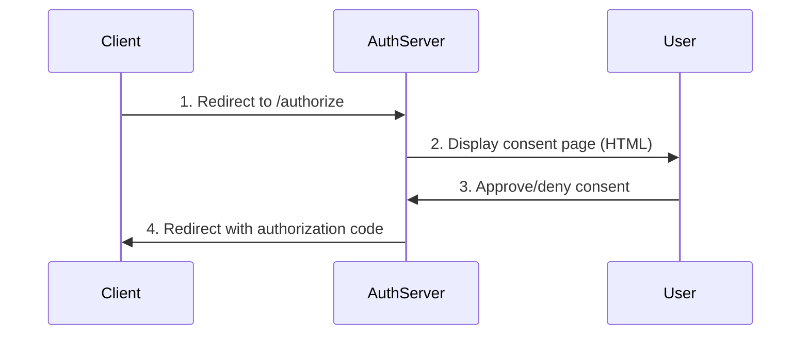

# Server-Side Rendering (SSR) and HTMX: Why and How

**Created**: 2025-11-30
**Last Updated**: 2025-11-30
**Category**: [ARCHITECTURE] [UI] [SSR]
**Timeline**: 03 of 05 - SSR Implementation Documentation

## Overview

The grant management system uses **Server-Side Rendering (SSR)** with **React** and **HTMX** for its user interfaces instead of traditional Single-Page Application (SPA) architectures like React Router or Next.js.

This document explains:

- **Why SSR?** - Design rationale and benefits
- **How SSR works** - Implementation patterns
- **HTMX integration** - Progressive enhancement strategy
- **Simplification benefits** - Reduced complexity vs SPA

---

## Why Server-Side Rendering?

### 1. OAuth UI Requirements

OAuth authorization flows have specific UI requirements:



**Key Constraints**:

- **No client-side state** - User may come from any client, any device
- **Single interaction** - User sees page, makes decision, leaves
- **Security** - CSRF protection, session management on server
- **Standards compliance** - OAuth spec expects server-rendered HTML

**SSR Benefits**:

✅ **Instant page load** - No JavaScript bundle download/parse/execute  
✅ **No hydration mismatch** - Server HTML matches client expectations  
✅ **Works without JavaScript** - Consent forms are plain HTML forms  
✅ **SEO-friendly** - Not critical here, but good practice  
✅ **Security** - Sensitive data never exposed in client bundles  

❌ **SPA would add complexity**:

- Client-side routing (unnecessary for single-page flows)
- State management (Redux/Zustand for one form?)
- Hydration overhead (React reconciliation on client)
- Code splitting (for 1-2 pages?)

---

### 2. Grant Management Dashboard

The grant management UI is a **read-heavy, low-interaction** interface:

**Typical user flow**:

```
1. User navigates to /grants-management/Grants
2. See list of grants (20-100 items)
3. Click "View" on one grant → see details
4. Click "Revoke" → grant revoked, return to list
```

**Interaction frequency**: Minutes to hours between actions

**SSR Benefits**:

✅ **Fast initial load** - No large JavaScript bundle  
✅ **Reliable** - Works on slow connections, old browsers  
✅ **Simple** - No client-side state synchronization  
✅ **Progressive enhancement** - HTMX adds smoothness, not requirement  

---

### 3. Operational Simplicity

**Deployment**:

- **One service** - CDS server handles both API and UI
- **No static hosting** - No CDN, no build artifacts deployment
- **No CORS** - Same origin for API and UI
- **Session management** - Server-side sessions work naturally

**Development**:

- **One codebase** - TypeScript/TSX for both backend and frontend
- **No API contracts** - Direct CDS entity access
- **Hot reload** - Change TSX, refresh browser, done
- **Debugging** - Server-side logging for UI rendering

---

## How SSR Works: Implementation

### Architecture

```
┌─────────────────────────────────────────────────────────────┐
│  Browser                                                     │
│  ┌────────────────────────────────────────────────────────┐ │
│  │  HTML (rendered by server)                             │ │
│  │  <div id="root">                                       │ │
│  │    <div class="grant-card">...</div>                   │ │
│  │  </div>                                                │ │
│  │                                                        │ │
│  │  <script src="htmx.org"></script>  ← Progressive      │ │
│  │  <script src="tailwind-browser"></script>  enhancement│ │
│  └────────────────────────────────────────────────────────┘ │
└─────────────────────────────────────────────────────────────┘
                            ▲
                            │ HTTP Request
                            │
┌───────────────────────────┼─────────────────────────────────┐
│  CDS Service              │                                 │
│                           │                                 │
│  ┌────────────────────────▼──────────────────────────────┐ │
│  │  Handler (handler.list.tsx)                          │ │
│  │                                                       │ │
│  │  1. Fetch data: grants = await srv.read(Grants)      │ │
│  │  2. Render JSX: <GrantsDashboard grants={grants} />  │ │
│  │  3. Convert to HTML: renderToString(jsx)             │ │
│  │  4. Wrap in template: htmlTemplate(html)             │ │
│  │  5. Send response: res.send(fullHtml)                │ │
│  └───────────────────────────────────────────────────────┘ │
└─────────────────────────────────────────────────────────────┘
```

---

### Core Implementation: Render Utility

```typescript
// srv/render/index.tsx
import React from "react";
import { renderToString } from "react-dom/server";

export const htmlTemplate = (reactContent: string) => `
<!DOCTYPE html>
<html lang="en">
<head>
    <meta charset="UTF-8">
    <meta name="viewport" content="width=device-width, initial-scale=1.0">
    <title>🔑 Grant Management</title>
    
    <!-- Tailwind CSS via CDN (browser mode) -->
    <script src="https://cdn.jsdelivr.net/npm/@tailwindcss/browser@4"></script>
    
    <!-- HTMX for progressive enhancement -->
    <script src="https://unpkg.com/htmx.org@2.0.7"></script>
    <script src="https://unpkg.com/htmx-ext-form-json"></script>
    
    <style>
        body { font-family: 'Inter', system-ui, sans-serif; }
    </style>
</head>
<body>
    <div id="root">${reactContent}</div>
</body>
</html>
`;

// Helper function for handlers
export function render(req: cds.Request, component: React.ReactNode) {
  req?.http?.res.setHeader("Content-Type", "text/html");
  return req?.http?.res.send(
    htmlTemplate(renderToString(component))
  );
}
```

**Key Design Decisions**:

1. **Tailwind Browser Mode**
   - No build step for CSS
   - Parses classes at runtime
   - Trade-off: Slightly slower vs zero build complexity

2. **HTMX from CDN**
   - Progressive enhancement
   - Works without HTMX (forms submit normally)
   - No npm dependencies for frontend

3. **No React on Client**
   - Server renders to static HTML
   - No `ReactDOM.hydrate()`
   - No client-side reconciliation

---

### Example: Authorization Consent Page

```typescript
// srv/authorization-service/handler.authorize.tsx
import { renderToString } from "react-dom/server";
import { htmlTemplate } from "#cds-ssr";

export default async function authorize(req) {
  const { request_uri } = req.data;
  const id = request_uri.split(":").pop();
  
  // 1. Fetch data
  const request = await this.read(AuthorizationRequests, id);
  const grant = await grantManagement.upsert(...).into(Grants);
  
  // 2. Render React component to string
  const html = renderToString(
    <div className="min-h-screen bg-gray-950 text-white">
      <div className="container mx-auto px-4 py-8">
        <h1 className="text-2xl font-bold">
          Rich Authorization Request
        </h1>
        
        {/* HTMX-enhanced form */}
        <form
          hx-ext="form-json"
          hx-swap="outerHTML"
          hx-post={`AuthorizationRequests/${id}/consent`}
          className="space-y-6"
        >
          <input type="hidden" name="grant_id" value={grant.id} />
          <input type="hidden" name="subject" value={cds.context.user.id} />
          
          {/* Display authorization details */}
          {request.access?.map((detail, index) => (
            <AuthorizationDetailsComponent 
              {...detail} 
              key={index} 
            />
          ))}
          
          {/* Action buttons */}
          <button type="submit" className="bg-green-600 hover:bg-green-700">
            🔓 Grant Consent
          </button>
        </form>
      </div>
    </div>
  );
  
  // 3. Send wrapped HTML
  req.http.res.setHeader("Content-Type", "text/html");
  req.http.res.send(htmlTemplate(html));
}
```

**What Happens**:

1. **Browser requests** `/oauth-server/authorize?request_uri=...`
2. **Handler fetches data** from database (AuthorizationRequest, Grant)
3. **React renders JSX to HTML** via `renderToString()`
4. **HTML wrapped in template** with Tailwind/HTMX scripts
5. **Full HTML sent to browser** - ready to display
6. **User interacts** - HTMX intercepts form submission
7. **HTMX submits JSON** via AJAX to `/AuthorizationRequests/{id}/consent`
8. **Handler processes consent** and returns redirect or success page

---

### Example: Grant Management Dashboard

```typescript
// srv/grant-management/handler.list.tsx
import { render } from "#cds-ssr";

export async function LIST(req, next) {
  const response = await next(req);
  
  if (isGrants(response)) {
    const grants = await getGrants(this, response);
    
    // Content negotiation
    if (req?.http?.req.accepts("html")) {
      return render(req, <GrantsDashboard grants={grants} />);
    }
    
    // API clients get JSON
    return grants;
  }
  
  return response;
}

// React component (rendered server-side only)
function GrantsDashboard({ grants }) {
  return (
    <div className="min-h-screen bg-gray-950 text-white">
      <div className="container mx-auto px-4 py-8">
        <h1 className="text-2xl font-bold">Grant Management Dashboard</h1>
        
        {/* Statistics */}
        <div className="grid grid-cols-4 gap-4">
          <StatCard 
            icon="✅" 
            label="Active Grants" 
            value={grants.filter(g => g.status === 'active').length} 
          />
          {/* ... more stats ... */}
        </div>
        
        {/* Grant list */}
        <div className="space-y-4">
          {grants.map(grant => (
            <div key={grant.id} className="bg-gray-700 rounded-lg p-4">
              <div className="flex justify-between">
                <div>
                  <p className="font-medium">{grant.scope}</p>
                  <p className="text-xs text-gray-400">
                    Grant ID: {grant.id}
                  </p>
                </div>
                
                <div className="flex space-x-2">
                  <a 
                    href={`Grants/${grant.id}`}
                    className="text-blue-400 hover:text-blue-300"
                  >
                    View
                  </a>
                  
                  {grant.status === 'active' && (
                    <form
                      action={`Grants/${grant.id}`}
                      method="POST"
                      hx-swap="outerHTML"
                      hx-target="body"
                    >
                      <input type="hidden" name="_method" value="DELETE" />
                      <button 
                        type="submit"
                        className="text-red-400 hover:text-red-300"
                      >
                        Revoke
                      </button>
                    </form>
                  )}
                </div>
              </div>
            </div>
          ))}
        </div>
      </div>
    </div>
  );
}
```

**Content Negotiation**:

```typescript
// Browser request
GET /grants-management/Grants
Accept: text/html

→ Returns: Full HTML page

// API request
GET /grants-management/Grants
Accept: application/json

→ Returns: JSON array of grants
```

**Why This Pattern?**

- **Same handler, dual output** - Avoid code duplication
- **One endpoint** - No separate `/api/grants` and `/ui/grants`
- **Automatic** - `req.http.req.accepts("html")` detects browser requests

---

## HTMX: Progressive Enhancement

### What is HTMX?

HTMX is a library that enables **AJAX, CSS Transitions, WebSockets, and Server Sent Events** directly in HTML via attributes.

**Core concept**: Extend HTML instead of replacing it

```html
<!-- Traditional form (works without JavaScript) -->
<form action="/submit" method="POST">
  <button type="submit">Submit</button>
</form>

<!-- HTMX-enhanced form (AJAX submission, no page reload) -->
<form 
  action="/submit" 
  method="POST"
  hx-post="/submit"
  hx-swap="outerHTML"
>
  <button type="submit">Submit</button>
</form>
```

**If JavaScript disabled**: Form submits normally (POST /submit)  
**If HTMX enabled**: AJAX request, swap response into DOM

---

### HTMX Patterns in Grant Management

#### 1. Form Submission (Consent)

```html
<form
  hx-ext="form-json"
  hx-swap="outerHTML"
  hx-post="AuthorizationRequests/{id}/consent"
>
  <input type="hidden" name="grant_id" value="{grant_id}" />
  <input type="hidden" name="subject" value="{user_id}" />
  
  <button type="submit">Grant Consent</button>
</form>
```

**What happens**:

1. User clicks "Grant Consent"
2. HTMX intercepts submit event
3. Serializes form data to JSON
4. POSTs to `/AuthorizationRequests/{id}/consent`
5. Server returns redirect or success HTML
6. HTMX replaces form with response

**Progressive enhancement**:

- **With JavaScript**: Smooth AJAX submission
- **Without JavaScript**: Traditional POST, full page reload

---

#### 2. Grant Revocation

```html
<form
  action="Grants/{grant_id}"
  method="POST"
  hx-delete="Grants/{grant_id}"
  hx-swap="outerHTML"
  hx-target="body"
  hx-confirm="Are you sure you want to revoke this grant?"
>
  <input type="hidden" name="_method" value="DELETE" />
  <button type="submit">Revoke</button>
</form>
```

**What happens**:

1. User clicks "Revoke"
2. HTMX shows confirmation dialog
3. If confirmed, sends DELETE request
4. Server updates grant status to "revoked"
5. Server returns updated grants list
6. HTMX swaps entire page body with new HTML

**Why `hx-target="body"`?**

- Refreshes entire page after revocation
- Shows updated grant list with success message
- Simpler than partial DOM updates

---

#### 3. HTTP Method Override

```html
<input type="hidden" name="_method" value="DELETE" />
```

**Why needed?**

- HTML forms only support GET and POST
- RESTful APIs need PUT, DELETE, PATCH
- `_method` field tells CAP to treat POST as DELETE

**CAP handling**:

```typescript
// CDS automatically handles _method parameter
if (req.data._method === "DELETE") {
  // Route to DELETE handler
}
```

---

### HTMX Extensions Used

#### 1. `form-json`

```html
<script src="https://unpkg.com/htmx-ext-form-json"></script>

<form hx-ext="form-json" hx-post="/submit">
  <input name="grant_id" value="grant_123" />
  <input name="scope" value="read write" />
</form>
```

**Without extension**: `grant_id=grant_123&scope=read+write`  
**With extension**: `{"grant_id":"grant_123","scope":"read write"}`

**Why needed?**

- CDS handlers expect JSON payloads
- Easier to parse complex data structures
- Consistent with API clients

---

## Simplification vs SPA

### Complexity Comparison

| Aspect | SSR + HTMX | React SPA |
|--------|------------|-----------|
| **Build System** | None | Webpack/Vite config |
| **Dependencies** | 0 npm packages | 50+ packages |
| **Bundle Size** | ~10KB (HTMX) | 200-500KB (React + Router + State) |
| **State Management** | Server session | Redux/Zustand/Context |
| **Routing** | Server routes | React Router |
| **Data Fetching** | Direct CDS | fetch/axios + hooks |
| **Forms** | HTML forms | Formik/React Hook Form |
| **Deployment** | 1 service | 2 services (API + static) |
| **CORS** | Not needed | Required |
| **SEO** | Built-in | SSR/SSG required |
| **Time to Interactive** | Instant | 2-5 seconds |

---

### Code Comparison: Grant List Page

#### SSR + HTMX (Current)

```typescript
// srv/grant-management/handler.list.tsx
export async function LIST(req, next) {
  const grants = await getGrants(this, await next(req));
  
  if (req.http.req.accepts("html")) {
    return render(req, <GrantsDashboard grants={grants} />);
  }
  
  return grants;
}

function GrantsDashboard({ grants }) {
  return (
    <div>
      {grants.map(grant => (
        <div key={grant.id}>
          <p>{grant.scope}</p>
          <form hx-delete={`Grants/${grant.id}`}>
            <button>Revoke</button>
          </form>
        </div>
      ))}
    </div>
  );
}
```

**Total**: ~30 lines, no build step, no client dependencies

---

#### React SPA (Alternative)

```typescript
// frontend/src/App.tsx
import { BrowserRouter, Routes, Route } from 'react-router-dom';
import { QueryClient, QueryClientProvider } from '@tanstack/react-query';

const queryClient = new QueryClient();

function App() {
  return (
    <QueryClientProvider client={queryClient}>
      <BrowserRouter>
        <Routes>
          <Route path="/grants" element={<GrantsList />} />
        </Routes>
      </BrowserRouter>
    </QueryClientProvider>
  );
}

// frontend/src/pages/GrantsList.tsx
import { useQuery, useMutation } from '@tanstack/react-query';
import { useNavigate } from 'react-router-dom';

function GrantsList() {
  const navigate = useNavigate();
  
  const { data: grants, isLoading } = useQuery({
    queryKey: ['grants'],
    queryFn: async () => {
      const res = await fetch('/api/grants');
      return res.json();
    }
  });
  
  const revokeMutation = useMutation({
    mutationFn: async (grantId) => {
      await fetch(`/api/grants/${grantId}`, { method: 'DELETE' });
    },
    onSuccess: () => {
      queryClient.invalidateQueries(['grants']);
    }
  });
  
  if (isLoading) return <div>Loading...</div>;
  
  return (
    <div>
      {grants.map(grant => (
        <div key={grant.id}>
          <p>{grant.scope}</p>
          <button onClick={() => revokeMutation.mutate(grant.id)}>
            Revoke
          </button>
        </div>
      ))}
    </div>
  );
}

// package.json
{
  "dependencies": {
    "react": "^18.0.0",
    "react-dom": "^18.0.0",
    "react-router-dom": "^6.0.0",
    "@tanstack/react-query": "^5.0.0"
  },
  "devDependencies": {
    "@vitejs/plugin-react": "^4.0.0",
    "vite": "^5.0.0",
    "typescript": "^5.0.0"
  }
}

// vite.config.ts
import { defineConfig } from 'vite';
import react from '@vitejs/plugin-react';

export default defineConfig({
  plugins: [react()],
  server: { proxy: { '/api': 'http://localhost:4004' } }
});
```

**Total**: ~150+ lines, 50+ dependencies, build step required

---

## Design Principles

### 1. Progressive Enhancement

**Start with HTML that works everywhere**:

```html
<!-- Base functionality: Standard HTML form -->
<form action="/submit" method="POST">
  <button type="submit">Submit</button>
</form>
```

**Add HTMX for better UX**:

```html
<form action="/submit" method="POST" hx-post="/submit">
  <button type="submit">Submit</button>
</form>
```

**Result**: Works with and without JavaScript

---

### 2. Server-Side State

**All state lives on the server**:

- User session (authentication)
- CSRF tokens (security)
- Grant data (authoritative source)

**Benefits**:

- No client-server state sync issues
- No stale data problems
- Simpler mental model

---

### 3. Direct Component-to-Endpoint Mapping

```typescript
// One file = One page = One endpoint
// srv/grant-management/handler.list.tsx

export async function LIST(req, next) {
  return render(req, <GrantsDashboard />);
}

function GrantsDashboard() { /* ... */ }
```

**Why?**

- `.cursor/rules/ssr.mdc`: "Each component and page is served with one file as direct implementation of the API"
- No separate `pages/`, `components/`, `api/` folders
- Handler + UI in same file = easy to reason about

---

### 4. Tailwind Browser Mode

```html
<script src="https://cdn.jsdelivr.net/npm/@tailwindcss/browser@4"></script>
```

**Trade-offs**:

✅ **No build step** - Write Tailwind, refresh browser  
✅ **No PostCSS config** - Zero configuration  
✅ **Fast iteration** - Change class, see result immediately  

❌ **Runtime parsing** - ~10-20ms overhead (acceptable for our use case)  
❌ **No tree-shaking** - Unused classes not removed (minimal impact)  

**When to switch to build mode?**

- If page load performance becomes critical (>100ms parsing time)
- If serving millions of requests (CDN caching helps)
- If need custom Tailwind plugins

---

## Common Patterns

### Pattern 1: Content Negotiation

```typescript
if (req?.http?.req.accepts("html")) {
  return render(req, <UIComponent />);
}
return jsonData;
```

**Use case**: Same endpoint serves UI and API

---

### Pattern 2: Form to JSON

```html
<form hx-ext="form-json" hx-post="/endpoint">
  <input name="grant_id" value="..." />
</form>
```

**Use case**: POST JSON to CDS handlers

---

### Pattern 3: Method Override

```html
<form method="POST">
  <input type="hidden" name="_method" value="DELETE" />
</form>
```

**Use case**: RESTful operations from HTML forms

---

### Pattern 4: Target Swapping

```html
<form hx-post="/submit" hx-target="#result" hx-swap="innerHTML">
```

**Use case**: Update specific page section instead of full reload

---

## Performance Considerations

### Server-Side Rendering Performance

**Benchmark** (typical grant list page):

- **Data fetching**: 20-50ms (database query)
- **React rendering**: 5-10ms (`renderToString`)
- **Template wrapping**: <1ms
- **Total**: 30-60ms

**Comparison** to SPA:

- **SPA**: 500-2000ms (bundle download + parse + execute + render + data fetch)
- **SSR**: 30-60ms (server renders everything)

**Caching strategies**:

```typescript
// Future enhancement: Cache rendered HTML
const cacheKey = `grants:${userId}:html`;
const cached = await redis.get(cacheKey);
if (cached) return cached;

const html = renderToString(<GrantsDashboard />);
await redis.set(cacheKey, html, 'EX', 60); // 60 seconds
return html;
```

---

### HTMX Performance

**Network overhead**: Minimal (~10KB library)  
**Memory overhead**: Negligible  
**CPU overhead**: Event listener attachment (~5ms on page load)  

**Comparison** to React:

- **React**: ~200KB bundle, hydration overhead
- **HTMX**: ~10KB, no hydration

---

## Limitations and Trade-offs

### When SSR + HTMX is NOT Ideal

1. **Real-time collaboration** - Multiple users editing same document
   - **Solution**: WebSockets + HTMX SSE extension (or switch to SPA)

2. **Complex client-side state** - Multi-step wizards with lots of local state
   - **Solution**: Store wizard state on server (session)

3. **Offline-first apps** - Need to work without network
   - **Solution**: Use SPA with service workers

4. **Rich interactions** - Drag-and-drop, canvas drawing, complex animations
   - **Solution**: Hybrid (SSR for shell, React for interactive components)

### When SSR + HTMX is IDEAL

1. ✅ **CRUD applications** - Grant management, admin panels
2. ✅ **OAuth flows** - Authorization, consent pages
3. ✅ **Dashboards** - Metrics, monitoring, reports
4. ✅ **Internal tools** - Low-interaction, high-reliability needs

---

## Future Enhancements

### 1. Partial Page Updates

**Current**: Full page swap on revocation

```html
<form hx-delete="..." hx-target="body" hx-swap="outerHTML">
```

**Future**: Update only grant card

```html
<form hx-delete="..." hx-target="#grant-{id}" hx-swap="outerHTML">
```

**Benefit**: Smoother UX, less bandwidth

---

### 2. Optimistic UI Updates

```html
<form 
  hx-delete="..."
  hx-target="#grant-{id}"
  hx-swap="outerHTML"
  hx-indicator="#spinner"
>
  <button>Revoke</button>
  <span id="spinner" class="htmx-indicator">Revoking...</span>
</form>
```

**Benefit**: Instant feedback

---

### 3. Streaming Responses

```typescript
// srv/grant-management/handler.list.tsx
export async function LIST(req, next) {
  // Send initial HTML
  res.write(htmlTemplate('<div id="grants">Loading...</div>'));
  
  // Stream grant cards as they're fetched
  const grants = await getGrants(this, await next(req));
  for (const grant of grants) {
    res.write(renderToString(<GrantCard grant={grant} />));
  }
  
  res.end();
}
```

**Benefit**: Perceived faster page load

---

## Related Documentation

- [01_AUTHORIZATION_SERVICE.md](./01_AUTHORIZATION_SERVICE.md) - OAuth flows using SSR
- [02_GRANT_MANAGEMENT_SERVICE.md](./02_GRANT_MANAGEMENT_SERVICE.md) - Grant UI implementation
- [04_TOKEN_APIS_AND_IAS_WRAPPING.md](./04_TOKEN_APIS_AND_IAS_WRAPPING.md) - API patterns
- [05_DEBUGGING_AND_LOGGING.md](./05_DEBUGGING_AND_LOGGING.md) - Debugging SSR

---

## References

- **HTMX Documentation** - htmx.org
- **React SSR** - react.dev/reference/react-dom/server
- **Progressive Enhancement** - developer.mozilla.org
- **Tailwind CSS Browser Mode** - tailwindcss.com/docs/browser-mode
- **Medium Article** - "Server side rendering with React and Express" by Roilan Salinas
