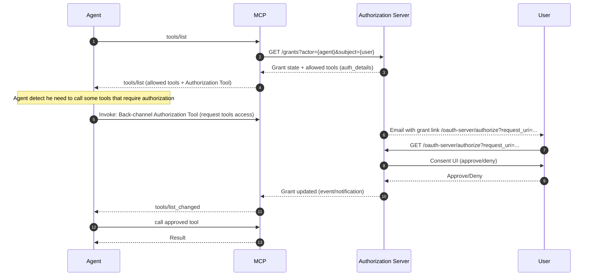

## MCP Server Implementation Example
🎥 [Watch the runtime agentic consensual flow demo](https://sap.sharepoint.com/:v:/r/teams/All-inonAI/Shared%20Documents/General/02%20Workstreams/06%20Build%202.0/Demos/Agent%20Identity%20%26%20Governance/01-runtime-agentic-consensual-flow.mov)

### Take me through the demo implementation 

In this demo, an agent asks MCP for tools. The MCP service dynamically enables or disables tools based on the current grant state, and provides an authorization tool for requesting additional permissions when needed.

## MCP Source Code

💻 **[MCP Service Implementation Example](https://github.tools.sap/AIAM/grant-management/tree/policy-eval/srv/mcp-service)** - *nodejs, CAP*

In the handler of the MCP service in the session initiation, before we connect the MCP session to the MCP server, we add a step to ask for grant details from grant management and then enable or disable tools according to the grant results.

#### Overall Handler Logic
Main MCP handler initialization

https://github.tools.sap/AIAM/grant-management/blob/31636617bf43942cce07703226a72372369790c6/srv/mcp-service/handler.mcp.tsx#L21-L36

#### Step-by-Step Implementation

##### 1. **Get grant details**
   
 Fetch grant state from authorization server, this is done once per session
 https://github.tools.sap/AIAM/grant-management/blob/31636617bf43942cce07703226a72372369790c6/srv/mcp-service/handler.grant.tsx#L18-L26

##### 2. **Enable or disable tools according to grant results**
Tool filtering based on authorization details
https://github.tools.sap/AIAM/grant-management/blob/e7da9272c2e1c2495a84a9afccd3ba94a02f90a2/srv/mcp-service/handler.mcp.tsx#L65-L80

##### 3. **Register for grant changes to apply updates on tool enablement**
   
https://github.tools.sap/AIAM/grant-management/blob/31636617bf43942cce07703226a72372369790c6/srv/mcp-service/handler.mcp.tsx#L38-L62

##### 4. **Add authorization tool that triggers authorization request with dynamic schema**

> **Note:** In this example, this is done via the MCP service itself, but should be provided as a dedicated tool of the authorization service.

The authorization tool includes the tools that require additional grant:
  https://github.tools.sap/AIAM/grant-management/blob/31636617bf43942cce07703226a72372369790c6/srv/mcp-service/tools.grant.tsx#L80-L108

The tool calls authorization and returns an authorization URL:
https://github.tools.sap/AIAM/grant-management/blob/31636617bf43942cce07703226a72372369790c6/srv/mcp-service/tools.grant.tsx#L124-L148

##### 5. **Agent communication channels**
   
   The agent can either show the authorization URL to the user with a HITL tool or use any channel/communication tools assigned to it (e.g., Task Center, Email, etc.).
   
   > We can should support custom tools to extend communication capabilities.

## Grant Management + MCP connection management (diagram)

Editable flow: open [`grant-connection-management.flow.excalidraw`](grant-connection-management.flow.excalidraw) in [excalidraw.com](https://excalidraw.com) (drag the file in). It shows **Phase 2** (MCP card tool catalogs, grant request with RAR / placeholders, user approval) feeding **Phase 1** (pre-login “forwarded to…” screen, `Grant Consent` → `/{system}/{protocol}/init` → downstream authorize URL with `redirect_uri` to `/{system}/{protocol}/callback` → token persistence on the aggregator).

The same flow can be built or adjusted in Cursor with the **Excalidraw MCP** server: call `read_diagram_guide`, then `clear_canvas` and `batch_create_elements` (use `startElementId` / `endElementId` on arrows). `import_scene` with `filePath` only works for files under the server’s allowed base directory (often `/app`); use `import_scene` with raw `data` JSON, or export from the MCP canvas via `export_scene`, if you need to sync with a repo path.
