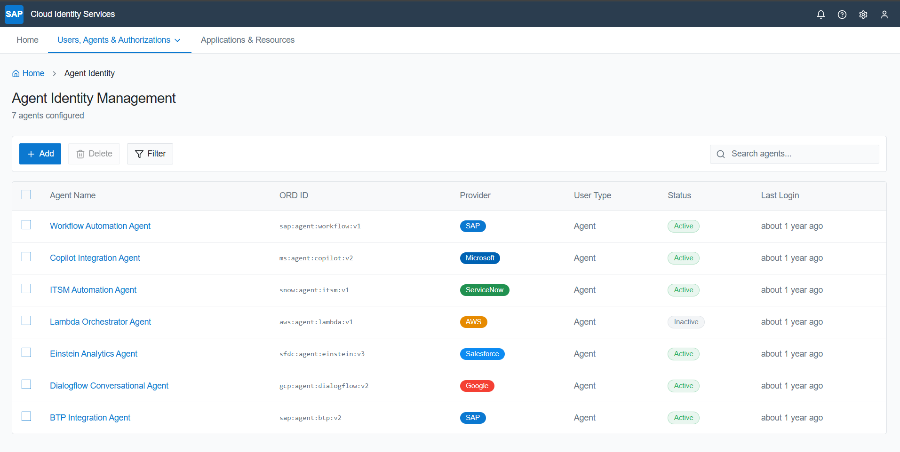
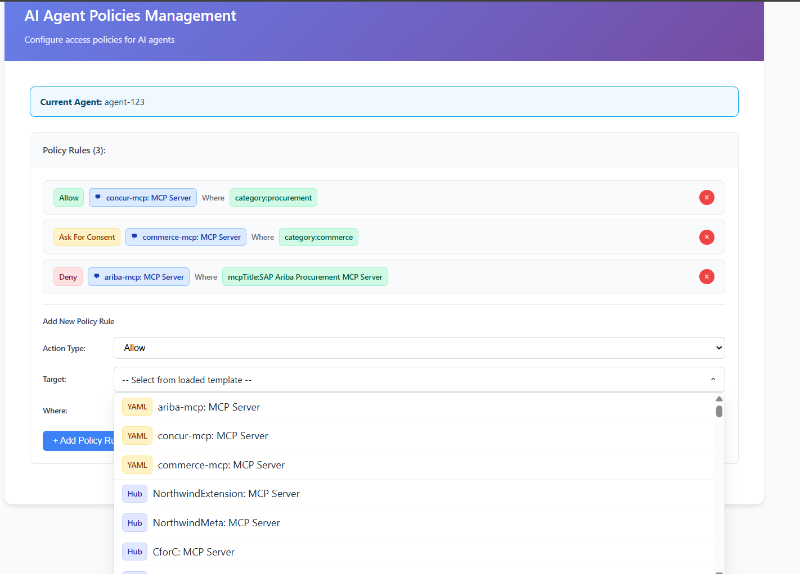
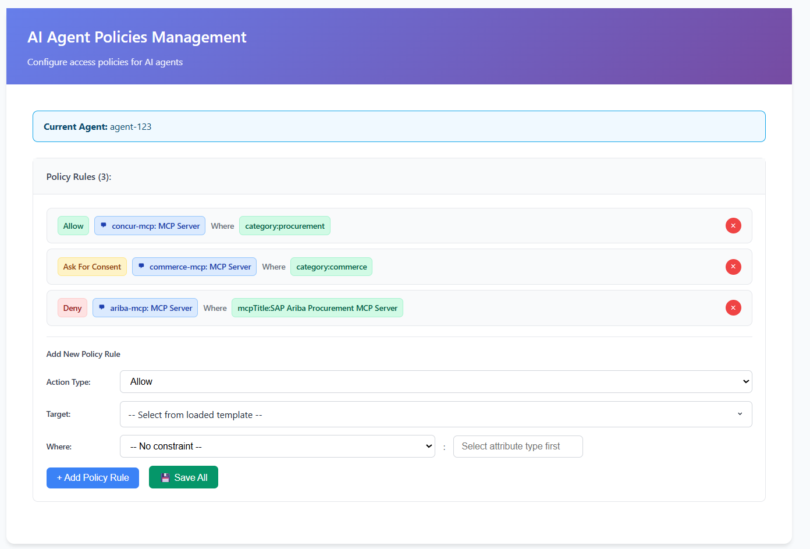
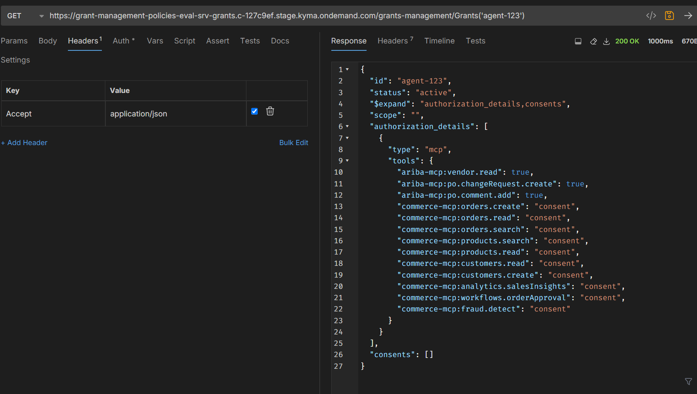

# Agent and Policy Lifecycle

## Overview

This document describes the complete lifecycle of agents and policies within the AI Agent Policies Management system. The lifecycle encompasses agent registration, policy creation through ODRL standards, Git-based storage, MCP Hub integration, and real-time governance.



---

## 🤖 Agent Lifecycle

### 1. Agent Discovery & Registration

**Trigger**: Administrator discovers agents from multiple sources
**Outcome**: Agent identity with capabilities and tools catalog

#### Process Flow:

1. **Multi-Source Discovery**
   - **Agent Manifest**: Direct YAML manifest files from Git repository
   - **MCP Hub**: Discovered agents from centralized MCP Hub registry
   - **Mixed Sources**: Agents with tools from both sources

2. **Identity Creation**
   - Unique Agent ID assigned
   - Capabilities extracted from manifests or MCP Hub
   - Tools inventory created from:
     - Agent Manifest YAML files
     - MCP Hub `toolsList` JSON properties
     - Combined tool sets from both sources

3. **Repository Structure Setup**
   ```
   AIAM/policies repository:
   ├── {agentId}/
   │   ├── policies.json (ODRL policies)
   │   └── mcps/
   │       ├── agent-manifest/ (Agent YAML files)
   │       └── mcp-hub/ (Generated MCP cards)
   ```

---

### 2. Agent Configuration & Tool Management

**Trigger**: Agent registered and tools discovered
**Outcome**: Comprehensive tool catalog with proper metadata

#### Process Flow:

1. **Tool Extraction & Processing**
   - Parse Agent Manifest YAML files for tool definitions
   - Extract tools from MCP Hub `toolsList` JSON strings
   - Apply SAP namespace conventions (`sap:` prefixed attributes)
   - Generate metadata (`sap/source`, `sap/riskLevel`, `sap/accessLevel`)

2. **MCP Hub Cards Generation**
   - Automatic generation when loading MCP Hub data
   - YAML cards created for each MCP with tools
   - Stored in Git: `{agentId}/mcps/mcp-hub/{mcpName}.yaml`
   - Committed automatically during policy save operations

3. **Source Badge Management**
   - Visual indicators in UI: **Agent Manifest** / **MCP Hub** badges
   - Color-coded similar to Allow/Consent/Deny tags
   - Source tracking for audit and governance



---

### 3. Policy Creation & Management

**Trigger**: Agent needs governance and access control
**Outcome**: ODRL-compliant policies stored in Git

#### Process Flow:

1. **Policy Authoring**
   - Web-based policy editor with intuitive UI
   - ODRL JSON structure with SAP extensions
   - Context-based constraints using `sap:` namespaced attributes
   - Support for permissions, prohibitions, and duties

2. **ODRL Policy Structure**
   ```json
   {
     "@context": [
       "http://www.w3.org/ns/odrl.jsonld",
       {
         "sap": "https://sap.com/odrl/extensions/",
         "target": { "@type": "@id" },
         "action": { "@type": "@id" }
       }
     ],
     "@type": "Set",
     "permission": [...],
     "prohibition": [...]
   }
   ```

3. **Git-Based Storage**
   - Policies stored as `{agentId}/policies.json`
   - Version control through Git commits
   - Atomic operations for policy updates
   - Commit messages for audit trail



---

### 4. Runtime Policy Evaluation

**Trigger**: Agent attempts to access tools or perform actions
**Outcome**: Real-time allow/deny decisions with constraints

#### Process Flow:

1. **Policy Retrieval**
   - Load agent policies from Git repository
   - Parse ODRL JSON structure
   - Prepare evaluation context with agent and action details

2. **Decision Engine Logic**
   ```javascript
   // Simplified evaluation logic
   function evaluatePolicy(agentId, tool, action, context) {
     const policies = loadPoliciesFromGit(agentId);
     
     // Check prohibitions first (deny overrides)
     for (const prohibition of policies.prohibition) {
       if (matches(prohibition, tool, action, context)) {
         return { decision: "DENY", reason: prohibition.constraint };
       }
     }
     
     // Check permissions
     for (const permission of policies.permission) {
       if (matches(permission, tool, action, context)) {
         return { 
           decision: "ALLOW", 
           constraints: permission.constraint || []
         };
       }
     }
     
     // Default deny
     return { decision: "DENY", reason: "No matching permission" };
   }
   ```

3. **Response Structure**
   - Decision: ALLOW/DENY
   - Constraints: Additional conditions if allowed
   - Audit trail: Log all decisions for compliance



---

## 📋 Policy Lifecycle Details

### 1. Policy Creation Workflow

#### UI-Driven Policy Creation:
1. **Agent Selection**: Choose agent from registry
2. **Tool Discovery**: Load tools from Agent Manifest and/or MCP Hub
3. **Rule Configuration**: 
   - Target: Specific tools or tool categories
   - Action: Allowed or denied actions
   - Constraints: Context-based conditions using SAP attributes
4. **ODRL Generation**: Automatic conversion to ODRL JSON
5. **Git Commit**: Atomic save to repository

#### Key Policy Types:
- **Tool Access Policies**: Control which tools agents can use
- **Action Policies**: Specify allowed/denied actions per tool
- **Context Policies**: Time, location, or condition-based restrictions
- **Data Policies**: Control data access and processing permissions

---

### 2. Policy Storage & Versioning

#### Git Repository Structure:
```
AIAM/policies/
├── agent-A532408/
│   ├── policies.json (ODRL policies)
│   └── mcps/
│       ├── agent-manifest/ (Original YAML files)
│       └── mcp-hub/ (Generated MCP cards)
├── agent-B123456/
│   └── policies.json
└── ...
```

#### Version Control Benefits:
- **Change Tracking**: Every policy update tracked with commit history
- **Rollback Capability**: Restore previous policy versions if needed
- **Audit Trail**: Complete history of who changed what and when
- **Branching**: Support for policy testing and staged deployments

---

### 3. MCP Hub Integration Lifecycle

#### Automatic Card Generation:
1. **Data Loading**: Fetch MCP registry with tools from Hub
2. **Tool Processing**: Parse `toolsList` JSON strings into tool objects
3. **YAML Generation**: Create standardized YAML cards
4. **Metadata Enhancement**: Add SAP-specific metadata and namespacing
5. **Git Storage**: Automatic commit to `{agentId}/mcps/mcp-hub/`

#### Integration Points:
- **Frontend**: Auto-generate cards when loading MCP Hub data
- **Backend**: `McpHubCardsHandler` manages generation and storage
- **Git Operations**: `GitHandler` manages repository operations
- **Policy Save**: Cards committed alongside policy updates

---

## 🔄 Integrated Lifecycle Flow

### End-to-End Agent and Policy Management:

```
┌─────────────────┐     ┌─────────────────┐     ┌─────────────────┐
│ Agent Discovery │────▶│ Tool Extraction │────▶│ Policy Creation │
│                 │     │                 │     │                 │
│ • Agent Manifest│     │ • Parse YAML    │     │ • ODRL Authoring│
│ • MCP Hub       │     │ • Extract JSON  │     │ • SAP Extensions│
│ • Mixed Sources │     │ • SAP Namespacing│     │ • Git Storage   │
└─────────────────┘     └─────────────────┘     └─────────────────┘
         │                        │                        │
         └────────────────────────┼────────────────────────┘
                                  ▼
                    ┌─────────────────┐
                    │ Runtime Engine  │
                    │                 │
                    │ • Policy Eval   │
                    │ • ODRL Logic    │
                    │ • Git Retrieval │
                    │ • Decision Log  │
                    └─────────────────┘
```

---

## 🛡️ Security & Governance

### Field Naming Conventions
- **SAP Namespace**: All attributes use `sap:` prefix
- **Metadata Standards**: Consistent `sap/source`, `sap/riskLevel`, `sap/accessLevel`
- **Tool Naming**: Fully qualified names (e.g., `mcp-name.tool-name`)

### Audit & Compliance
- **Git-Based Audit**: Complete change history in repository
- **Decision Logging**: All policy evaluations recorded
- **Source Tracking**: Clear attribution between Agent Manifest and MCP Hub tools
- **Test Coverage**: Comprehensive validation with field naming and integration tests

### Error Handling & Resilience
- **Graceful Degradation**: Default deny on policy evaluation failures
- **Fallback Policies**: Return safe defaults when Git unavailable
- **Validation**: ODRL schema validation before policy storage
- **Recovery**: Automatic retry mechanisms for transient failures

---

## 📊 Operational Excellence

### Performance Optimization
- **Caching**: Policy caching to reduce Git repository calls
- **Batch Operations**: Efficient MCP Hub card generation
- **Lazy Loading**: Load policies only when needed
- **Compression**: Optimized JSON storage in Git

### Monitoring & Observability
- **Policy Usage Analytics**: Track which policies are most/least used
- **Performance Metrics**: Evaluation response times and success rates
- **Health Checks**: Monitor Git connectivity and service availability
- **Alerting**: Notify on policy evaluation failures or repository issues

### Scalability Considerations
- **Horizontal Scaling**: Stateless evaluation engine design
- **Repository Distribution**: Support for multiple Git repositories
- **Load Balancing**: Distribute policy evaluation across instances
- **Capacity Planning**: Monitor repository size and access patterns

---

*This lifecycle documentation reflects the actual implementation within the policies-cap system, showing the complete flow from agent discovery through MCP Hub integration to policy evaluation and enforcement.*